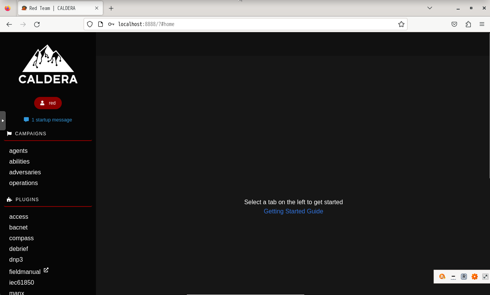
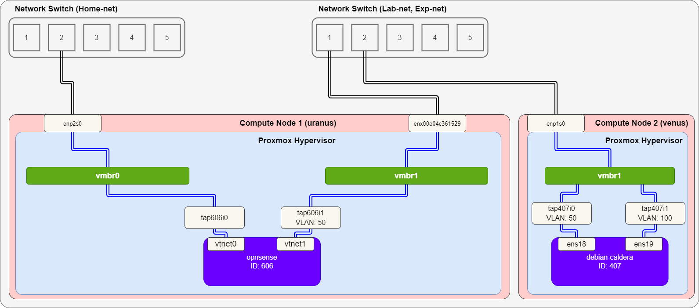
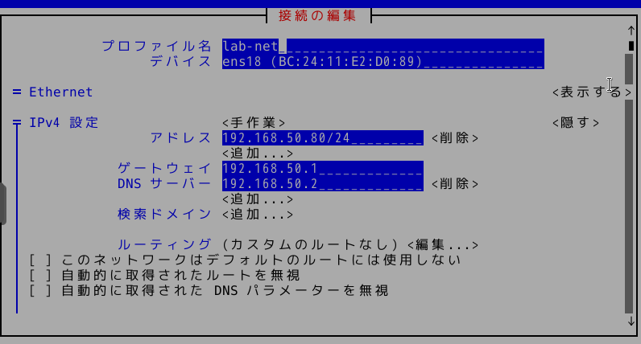
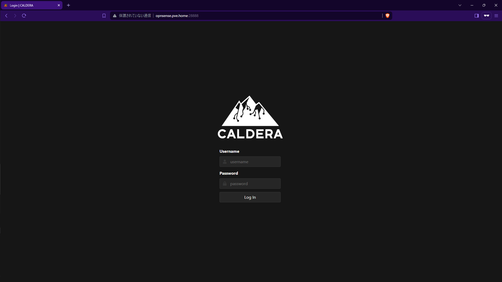

# CALDERA
MITRE の Caldera および plugins を導入する。今回は、CALDERA v4.2.0 をインストールする。

## 参考
- [CALDERA Docs](https://caldera.readthedocs.io/en/4.2.0/)

## インストール
### ダウンロード
デフォルトの plugins をダウンロードするために、`git` 経由でバージョンを指定してダウンロードする。

```
# git clone https://github.com/mitre/caldera.git --recursive --branch 4.2.0
```

### 依存関係のインストール
v4.2.0 では以下のパッケージを事前にインストールする。

- Python 3.7+
- GoLang 1.17+

#### Python のインストール

```
# apt install python3 python3-pip python3-venv
# mkdir /opt/venvs
# python3 -m venv /opt/venvs/caldera
# source /opt/venvs/caldera/bin/activate
# cd caldera
(caldera) # pip install --upgrade pip
(caldera) # pip install -r requirements.txt
```

#### GoLang のインストール
[Install GoLang](https://go.dev/doc/install) を参考にインストールする。

```
# wget https://go.dev/dl/go1.22.3.linux-amd64.tar.gz
# rm -rf /usr/local/go && tar -C /usr/local -xzf go1.22.3.linux-amd64.tar.gz
$ echo 'export PATH=/usr/local/go/bin:$PATH' >> ~/.bashrc
$ source ~/.bashrc
$ go version
```

### Plugins の導入
[MITRE Caldera™ for OT Plugins](https://github.com/mitre/caldera-ot) を導入する。`git` 経由でダウンロードする。

```
# git clone https://github.com/mitre/caldera-ot.git --recursive
```

ダウンロード後、plugins を `caldera/plugins` ディレクトリにコピーする。

```
# cp -r caldera-ot/bacnet/ caldera/plugins/
# cp -r caldera-ot/dnp3/ caldera/plugins/
# cp -r caldera-ot/modbus/ caldera/plugins/
# cp -r caldera-ot/profinet/ caldera/plugins/
# cp -r caldera-ot/iec61850/ caldera/plugins/
```

また、`conf/default.yml` にプラグイン名を追加する。

```yml
plugins:
- bacnet
- dnp3
- modbus
- profinet
- iec61850
```

### 本体の起動
```
(caldera) # python server.py --insecure
```



## VM起動時に CALDERA を起動するように設定
`crontab` を使う。

```
# crontab -e
```

末尾に以下を記載する。

```
@reboot cd /root/caldera && /opt/venvs/caldera/bin/python server.py --insecure
```

## OPNsense を使って自宅ネットワークからアクセスできるように設定
今回は、以下環境に Caldera を構築したものとする。



ただし、図中の Home-net はインターネット接続可能なネットワークで、Lab-net は実験用に構築した内部ネットワークである。

また、VM の 各 vNIC には以下のように IP アドレスを割り当てている。

|VM|vNIC|IPアドレス|
|---|---|---|
|`opnsense`|`vtnet0`|`192.168.10.75/24`|
|`opnsense`|`vtnet1`|`192.168.50.1/24`|
|`debian-caldera`|`ens18`|`192.168.50.80/24`|
|`debian-caldera`|`ens19`|`192.168.100.80/24`|

Caldera は直接 Home-net に接続していないような構成とする。この状況で、Caldera に Home-net からアクセスできるようにしたい。

まず、Caldera の VM の Lab-net で、ゲートウェイを OPNsense のアドレス (`192.168.50.1`) に設定する。




次に、OPNsense の Firewall > NAT > Port Forward でルールを追加する。今回は、以下のようにルールを設定する。

- Interface: WAN
- TCP/IP Version
- Protocol: TCP
- Source: WAN net
- Source port range
  - from: any
  - to: any
- Destination: WAN address
- Destination port range
  - from: (other) 28888
  - to: (other) 28888
- Redirect target IP: Single host or Network 192.168.50.80
- Ridirect target port: (other) 88888
- Pool Options: Default
- Description: Caldera
- NAT reflection: Enable
- Filter rule association: Add associated filter rule

上記のように設定すると、`http://<OPNsenseのアドレス>:28888` で CALDERA にアクセスできる。



---

[Application](../README.md)
