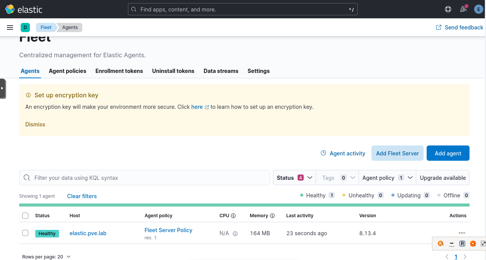
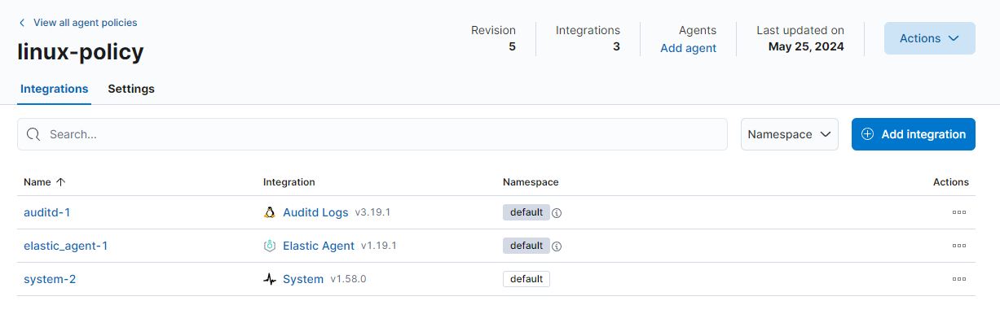
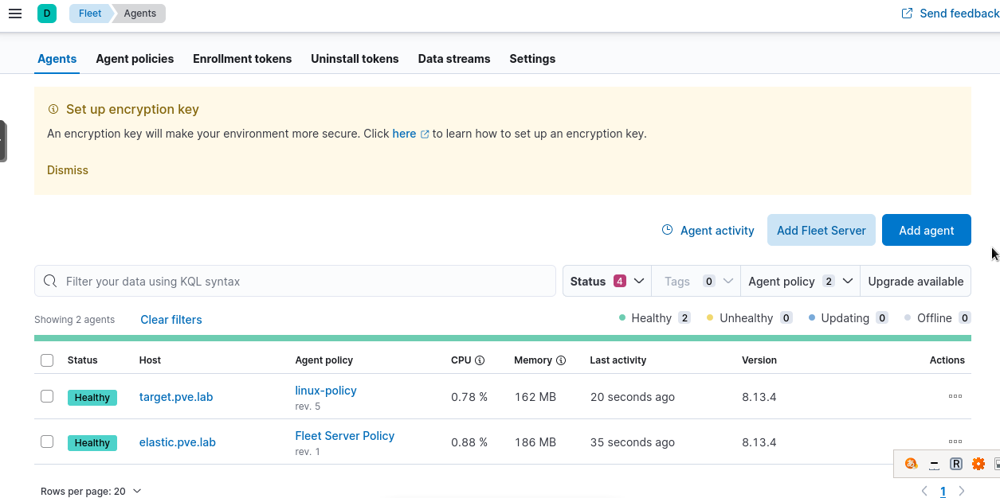
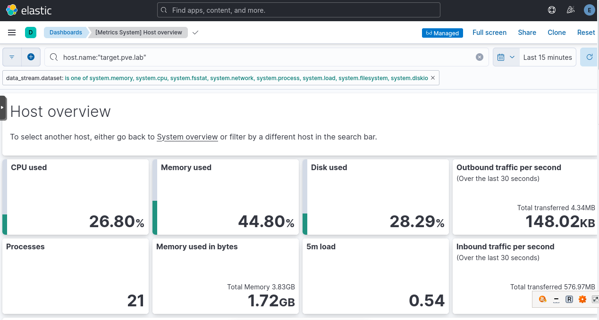
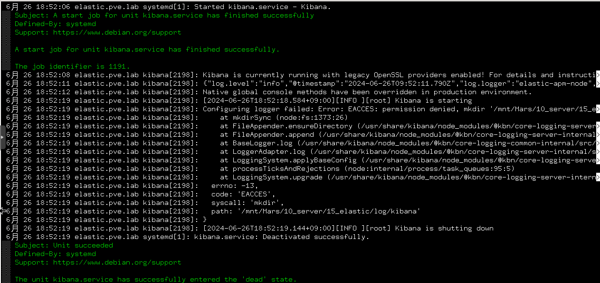
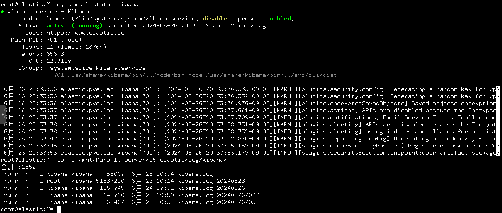

# Elasticsearch の導入
Elasticsearch と Kibana を導入する。

## 参考
- [Install Elasticsearch with Debian Package](https://www.elastic.co/guide/en/elasticsearch/reference/current/deb.html)
- [Install Kibana with Debian package](https://www.elastic.co/guide/en/kibana/current/deb.html)
- [SSL 証明書を作成する (自己署名)](https://www.server-world.info/query?os=Ubuntu_22.04&p=ssl&f=1)
- [Configure SSL](https://www.elastic.co/guide/en/beats/filebeat/current/configuration-ssl.html)
- [Configure the Kibana endpoint](https://www.elastic.co/guide/en/beats/filebeat/current/setup-kibana-endpoint.html)
- [Debian12.5 ; Suricata + Elastic Stackでログの可視化とモニタリング](https://korodes.com/debian12v5_10/)
- [[v8.5版] ElasticsearchとKibanaとElastic Agentの最速インストール手順 (試用環境として）](https://qiita.com/nobuhikosekiya/items/7441186795b3da998e2f)

## Elasticsearch
### 準備
ホスト名を変更する。ここでは、`elastic.pve.lab` というホスト名にする。

```
# hostnamectl set-hostname elastic.pve.lab
# reboot
```

### インストール
[Install Elasticsearch with Debian Package](https://www.elastic.co/guide/en/elasticsearch/reference/current/deb.html) を参考にインストールする。

```
# wget -qO - https://artifacts.elastic.co/GPG-KEY-elasticsearch | gpg --dearmor -o /usr/share/keyrings/elasticsearch-keyring.gpg
# apt-get install apt-transport-https
# echo "deb [signed-by=/usr/share/keyrings/elasticsearch-keyring.gpg] https://artifacts.elastic.co/packages/8.x/apt stable main" | tee /etc/apt/sources.list.d/elastic-8.x.list
# apt-get update && apt-get install elasticsearch
```

インストール後、初期パスワードが表示されるので記録しておく。

### 設定変更
`/etc/elasticsearch/elasticsearch.yml` を編集する。今回は以下のように設定する。

- 保存先を NAS の共有フォルダ上に変更
- 外部ホストから接続可能にする


```yml
path.data: /mnt/Mars/10_server/15_elastic/lib/elasticsearch
path.logs: /mnt/Mars/10_server/15_elastic/log/elasticsearch
network.host: 0.0.0.0
discovery.type: single-node
#cluster.initial_master_nodes: ["elastic.pve.lab"]
```

なお、`/mnt/Mars/10_server/15_elastic/lib/elasticsearch` や `/mnt/Mars/10_server/15_elastic/log/elasticsearch` は、デフォルトのディレクトリ `/var/lib/elasticsearch` や `/var/log/elasticsearch` と権限を合わせる必要がある。

```
# ls -l /var/lib/ | grep elasticsearch
drwxr-s---  2 elasticsearch elasticsearch 4096  5月  7 07:13 elasticsearch
# ls -l /var/log/ | grep elasticsearch
drwxr-s---  2 elasticsearch     elasticsearch     4096  5月 25 13:55 elasticsearch
```

よって、以下のように変更する。

```
# chown elasticsearch:elasticsearch /mnt/Mars/10_server/15_elastic/lib/elasticsearch
# chmod 2750 /mnt/Mars/10_server/15_elastic/lib/elasticsearch
# chown elasticsearch:elasticsearch /mnt/Mars/10_server/15_elastic/log/elasticsearch
# chmod 2750 /mnt/Mars/10_server/15_elastic/log/elasticsearch
```

### 起動
```
# systemctl daemon-reload
# systemctl start elasticsearch
# systemctl enable elasticsearch
```

### 起動確認
起動した状態で Elasticsearch にアクセスできるか確認する。

```
# curl -u elastic --cacert /etc/elasticsearch/certs/http_ca.crt https://127.0.0.1:9200
Enter host password for user 'elastic':
{
  "name" : "elastic.pve.lab",
  "cluster_name" : "elasticsearch",
  "cluster_uuid" : "e-NvtkySR9a54YD-Xj2-6A",
  "version" : {
    "number" : "8.13.4",
    "build_flavor" : "default",
    "build_type" : "deb",
    "build_hash" : "da95df118650b55a500dcc181889ac35c6d8da7c",
    "build_date" : "2024-05-06T22:04:45.107454559Z",
    "build_snapshot" : false,
    "lucene_version" : "9.10.0",
    "minimum_wire_compatibility_version" : "7.17.0",
    "minimum_index_compatibility_version" : "7.0.0"
  },
  "tagline" : "You Know, for Search"
}
```

## Kibana
### 準備
インストール前にSSL証明書を作成する。ここでは、自己署名を用いる。[SSL 証明書を作成する (自己署名)](https://www.server-world.info/query?os=Ubuntu_22.04&p=ssl&f=1) を参考に設定する。

`/etc/ssl/openssl.cnf` を編集する。ただし、セクション名は任意で、`DNS:<ホスト名>` の形で追加する。

```
[ pve.lab ]
subjectAltName = DNS:elastic.pve.lab
```

秘密鍵を作成する。

```
root@elastic:~# cd /etc/ssl/private/
root@elastic:/etc/ssl/private# openssl genrsa -aes128 2048 > server.key
Enter PEM pass phrase:
Verifying - Enter PEM pass phrase:
```

秘密鍵からパスフレーズを削除する。

```
root@elastic:/etc/ssl/private# openssl rsa -in server.key -out server.key
Enter pass phrase for server.key:
writing RSA key
```

署名要求ファイルを作成する。

```
root@elastic:/etc/ssl/private# openssl req -utf8 -new -key server.key -out server.csr
You are about to be asked to enter information that will be incorporated
into your certificate request.
What you are about to enter is what is called a Distinguished Name or a DN.
There are quite a few fields but you can leave some blank
For some fields there will be a default value,
If you enter '.', the field will be left blank.
-----
Country Name (2 letter code) [AU]:JP
State or Province Name (full name) [Some-State]:Kanagawa
Locality Name (eg, city) []:Kawasaki
Organization Name (eg, company) [Internet Widgits Pty Ltd]:PVE
Organizational Unit Name (eg, section) []:Lab
Common Name (e.g. server FQDN or YOUR name) []:elastic.pve.lab
Email Address []:

Please enter the following 'extra' attributes
to be sent with your certificate request
A challenge password []:
An optional company name []:
```

有効期限が10年の自己署名証明書を作成する。なお、`-extensions` で指定するセクション名は、`/etc/ssl/openssl.cnf` に追記したセクション名とする。

```
root@elastic:/etc/ssl/private# openssl x509 -in server.csr -out server.crt -req -signkey server.key -extfile /etc/ssl/openssl.cnf -extensions pve.lab -days 3650
Certificate request self-signature ok
subject=C = JP, ST = Kanagawa, L = Kawasaki, O = PVE, OU = Lab, CN = elastic.pve.lab
root@elastic:/etc/ssl/private# chmod 600 server.key
```

### インストール
[Install Kibana with Debian package](https://www.elastic.co/guide/en/kibana/current/deb.html) を参考にインストールする。

```
# apt-get update && apt-get install kibana
```

先ほど作成した秘密鍵と証明書を `/etc/kibana/` にコピーし、所有者を変更する。

```
# cp /etc/ssl/private/{server.crt,server.key} /etc/kibana/
# chown kibana:kibana /etc/kibana/{server.crt,server.key}
```

### 設定
インストール後は、Kibana用のトークンを発行し、Kibanaをセットアップする。

```
# /usr/share/elasticsearch/bin/elasticsearch-create-enrollment-token -s kibana
# /usr/share/kibana/bin/kibana-setup --enrollment-token \
<生成されたトークン>
Native global console methods have been overridden in production environment.

✔ Kibana configured successfully.

To start Kibana run:
  bin/kibana
```

Kibana の設定ファイル (`/etc/kibana/kibana.yml`) を以下のように編集する。

```yml
server.port: 5601
server.host: "0.0.0.0"
server.name: "elastic.pve.lab"
server.ssl.enabled: true
server.ssl.certificate: /etc/kibana/server.crt
server.ssl.key: /etc/kibana/server.key
logging:
  appenders:
    file:
      type: file
      fileName: /mnt/Mars/10_server/15_elastic/log/kibana/kibana.log
      layout:
        type: json
  root:
    appenders:
      - default
      - file
```

また、`elasticsearch.hosts` などに追加されていないIPアドレス (例：実験用ネットワークのIPアドレス) があれば追加する。例えば、今回の環境では以下。

```yml
# This section was automatically generated during setup.
elasticsearch.hosts: ['https://192.168.10.40:9200', 'https://192.168.50.40:9200']
elasticsearch.serviceAccountToken: AAEAAWVsYXN0aWMva2liYW5hL2Vucm9sbC1wcm9jZXNzLXRva2VuLTE3MTY2MTczMDU4Nzk6M2NMcGZfZVRSaDZrX3RqaDgzNno1dw
elasticsearch.ssl.certificateAuthorities: [/var/lib/kibana/ca_1716617307174.crt]
xpack.fleet.outputs: [{id: fleet-default-output, name: default, is_default: true, is_default_monitoring: true, type: elasticsearch, hosts: ['https://192.168.10.40:9200', 'https://192.168.50.40:9200'], ca_trusted_fingerprint: 3d9da99c65eddc099ecafdc2ae6b5d820189ab5ee7cba923a1b4eecda42991f3}]
```

なお、`/mnt/Mars/10_server/15_elastic/log/kibana/` は `/var/log/kibana` と所有者、権限を合わせる。

```
# ls -l /var/log | grep kibana
drwxr-s---  2 kibana            kibana            4096  5月  7 15:18 kibana
```

```
# chown kibana:kibana /mnt/Mars/10_server/15_elastic/log/kibana/
# chmod 2750 /mnt/Mars/10_server/15_elastic/log/kibana
```

### 起動
```
# systemctl enable kibana
# systemctl start kibana
```

### 起動確認
`http[s]://<host address>:5601` にアクセスする。


## Fleet
Fleet Server と Elastic Agent を使う。

[[v8.5版] ElasticsearchとKibanaとElastic Agentの最速インストール手順 (試用環境として）](https://qiita.com/nobuhikosekiya/items/7441186795b3da998e2f) を参考にインストールする。

### Fleet Server のインストール
Home > Management > Fleet > Add Fleet Server に進む。

1. Get started with Fleet Server
   - Name と URL を指定する。Name は任意。URL は `https://<Elasticsearch の IPアドレス>:8220` とする。
2. Install Fleet Server to a centralized host
   - 表示されるコマンドを実行する。
3. Confirm connection

Fleet Server インストール後は以下のような画面が表示される。



### Elastic Agent
Kibana で可視化したいホストに Elastic Agent を導入する。

1. Agent policy を作成する
2. Agent を追加する

#### Agent policy の作成
Home > Management > Fleet > Agent policies > Create agent policy で policy を作成する。作成後に integration を追加する。

例として、linux host に導入予定のポリシーを以下のように作成した。



#### Agent の追加
Home > Management > Fleet > Agent policies > Agents > Add agent で agent を追加する。

1. What type of host do you want to monitor?
2. Enroll in Fleet?
3. Install Elastic Agent on your host
4. Confirm agent enrollment
5. Confirm incoming data

ここで、インターネット接続できないホストに導入するためには、インターネット接続可能なホストで `*.tar.gz` をダウンロードして、該当するホストに転送する必要がある。

```
# scp debian@workstation.pve.lab:~/*.tar.gz ./
```

ダウンロード後のコマンドを実行する。ただし、証明書のエラーが出るので、`--insecure` オプションを追加して実行する (参考：[fleet-server: x509: certificate signed by unknown authority #2042](https://github.com/elastic/elastic-agent/issues/2042))。

```
# ./elastic-agent install --insecure --url=<fleet url> --enrollment-token=<token>
```

Agent を追加すると、Fleet > Agents に追加される。



Dashboards を使って状態を監視できる。



## トラブルシューティング
### Kibana の起動に失敗する
一時期から Kibana の起動に失敗するようになった。



エラーメッセージを見ると、ログファイルあたりが失敗しているようなので、以下のように対応。

1. `kibana` を `disable` にする
2. root ユーザの `crontab` を以下のように編集

```
@reboot sh /root/kibana-start.sh
```

ただし、`kibana-start.sh` は以下のシェルスクリプトである。

```sh
#!/bin/sh
mv /mnt/Mars/10_server/15_elastic/log/kibana/kibana.log /mnt/Mars/10_server/15_elastic/log/kibana/"kibana.log.$(date +%Y%m%d%H%M)"
res1=$?
if [ $res1 -eq 0 ]; then
  echo "Succeed in renaming kibana.log"
  systemctl start kibana
  res2=$?
  if [ $res2 -eq 0 ]; then
    echo "Succeed in starting kibana.service"
  else
    echo "Fail to start kibana.service"
  fi
else
  echo "Fail to rename"
fi
```

上記の設定は、再起動後に `kibana.log` の名前を変更して、再起動のたびに `kibana.log` を作り直すことで、エラーを回避するためのものである。

上記設定後、以下のように Kibana の起動に成功する。




---

[Application](../README.md)
