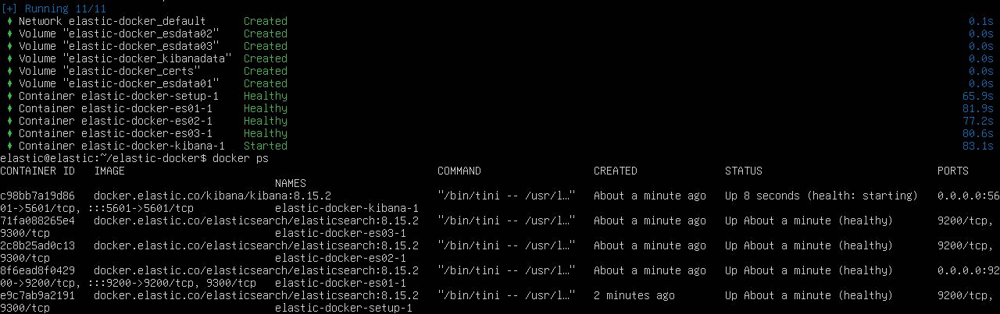
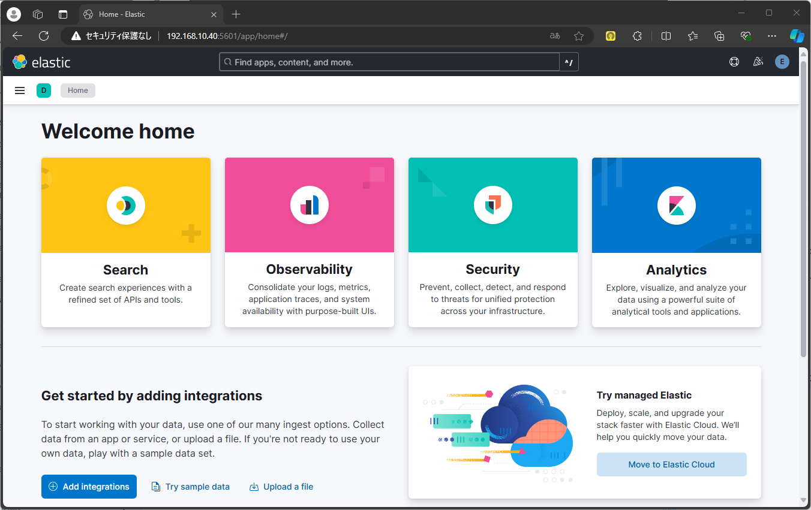
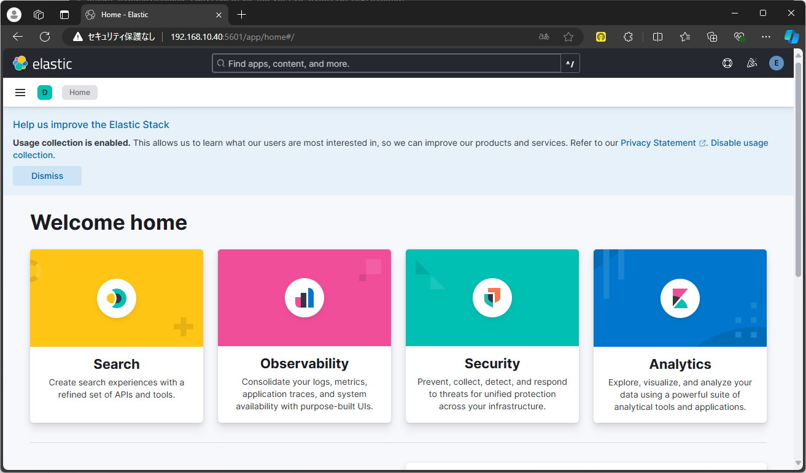

# Elasticsearch を Ubuntu Server に移植する

[Elasticsearch](../README.md) では Debian に Elasticsearch + Kibana を導入したが、GUI ということもありメモリ消費量が多かった。そこで、Ubuntu Server にインストールしなおす。

- [Elasticsearch を Ubuntu Server に移植する](#elasticsearch-を-ubuntu-server-に移植する)
  - [参考](#参考)
  - [Hardware](#hardware)
  - [Prerequisuite](#prerequisuite)
    - [Docker](#docker)
    - [NFS mount](#nfs-mount)
  - [Install (Docker)](#install-docker)
  - [Install (apt)](#install-apt)

## 参考
- [Install Elasticsearch with Docker](https://www.elastic.co/guide/en/elasticsearch/reference/current/docker.html)
- [Overview of installing Docker Compose](https://docs.docker.com/compose/install/)

## Hardware
以下のように設定する。

- Memory: 16GB
- Hard Disk: 128GB
- CPU: 4

インストール後は、LVM ディスク容量を最大まで増やす (参考：[LVM ディスクの容量拡張](../../../Usage/extend/))。

また、IPアドレスを以下のように変更する。

```yaml
network:
    ethernets:
        ens18:
            dhcp4: false
            addresses:
            - 192.168.10.40/24
            nameservers:
                addresses: [192.168.10.2, 192.168.10.1]
            routes:
            - to: default
              via: 192.168.10.1
        ens19:
            dhcp4: false
            dhcp6: false
            accept-ra: false
            link-local: [ ]
            addresses:
            - 192.168.50.40/24
            nameservers:
                addresses: [192.168.50.2]
    version: 2
```

## Prerequisuite
### Docker
[Install Docker Engine on Ubuntu](https://docs.docker.com/engine/install/ubuntu/) に従い、インストールする。

### NFS mount
```
$ sudo apt install nfs-common
```

`/etc/fstab` を以下のように編集する。

```
mercury.pve.home:/volume2/Mars  /mnt/Mars   nfs defaults    0   0
```

## Install (Docker)
GitHub から `.env` と `docker-compose.yml` をダウンロードする。

```
$ wget https://raw.githubusercontent.com/elastic/elasticsearch/refs/heads/8.15/docs/reference/setup/install/docker/.env
$ wget https://raw.githubusercontent.com/elastic/elasticsearch/refs/heads/8.15/docs/reference/setup/install/docker/docker-compose.yml
```

`.env` を編集する。

```
# Password for the 'elastic' user (at least 6 characters)
ELASTIC_PASSWORD=changeme

# Password for the 'kibana_system' user (at least 6 characters)
KIBANA_PASSWORD=changeme

...
# Version of Elastic products
STACK_VERSION=8.15.2
...
```

```
$ docker compose up -d
```



インストール後、ブラウザから Kibana にアクセスできる。



比較的容易にインストールできた。

## Install (apt)
Docker でのインストールは楽だが、設定の変更が少し大変なので、`apt` でインストールする。

[Debianでのインストール](../README.md) と同様にインストールした。ただし、

```
server.ssl.enabled: false
```

とした。



---

[Elasticsearch](../README.md)
