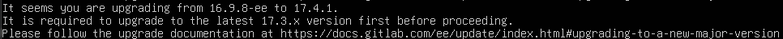

# GitLab サーバの更新
GitLab のインスタンスを [16.9.8-ee.0](https://hub.docker.com/layers/gitlab/gitlab-ee/16.9.8-ee.0/images/sha256-f9f8a4ffb10919c28f46ea820e852c0011e90c934377adf68c927c8ba2fbe410?context=explore) から [17.4.1-ee.0](https://hub.docker.com/layers/gitlab/gitlab-ee/17.4.1-ee.0/images/sha256-8ba38701f01d1882ce11d924a2e60a31f510b701f879eeaf22a0369405af75db?context=explore) に更新する。

## 作業ログ
```yaml
image: 'gitlab/gitlab-ee:17.4.1-ee.0'
```

とした場合、以下のエラーが出た。



直接 17.4.1 にアップグレードできず、17.3.x にアップグレードする必要がある。また、`17.3.4` にアップグレードしようとしたところ、`16.11.x` にアップグレードするように警告が出た。

`v16.9.8-ee` から `v16.11.10-ee` へのアップグレードは成功した。


次に、`v16.11.10-ee` から `v17.3.4-ee` にアップグレードした。


次に、`v17.3.4-ee` から `v17.4.1-ee.0` にアップグレードした。


---

[GitLab](../README.md)
