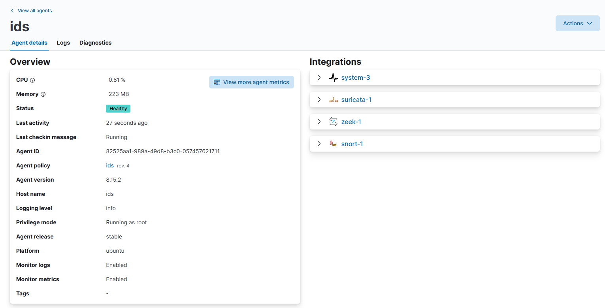

# IDS の導入

オープンソースの IDS の設定を行う。

- [IDS の導入](#ids-の導入)
  - [参考](#参考)
  - [導入する IDS](#導入する-ids)
  - [ポートミラーリング設定](#ポートミラーリング設定)
  - [IDS のインストール](#ids-のインストール)
  - [IDS の設定](#ids-の設定)
  - [Elasticsearch の設定](#elasticsearch-の設定)

## 参考
- [Configure Network Bonding](https://www.server-world.info/en/note?os=Ubuntu_22.04&p=bonding)

## 導入する IDS
- [Snort](Snort/)
- [Suricata](Suricata/)
- [Zeek](Zeek/)

## ポートミラーリング設定
[ポートミラーリング](../../Usage/port-mirror/) に従い設定を行い、ボンディングを行うことで1つの NIC で監視可能にする。

```yaml
    ens20:
      dhcp4: false
      dhcp6: false
      accept-ra: false
      link-local: [ ]
    ens21:
      dhcp4: false
      dhcp6: false
      accept-ra: false
      link-local: [ ]
  bonds:
    bond0:
      dhcp4: false
      dhcp6: false
      accept-ra: false
      link-local: [ ]
      interfaces:
        - ens20
        - ens21
      parameters:
        mode: balance-rr
        mii-monitor-interval: 100
```

## IDS のインストール
```
$ ./install_suricata.sh
$ ./install_snort.sh
$ ./install_zeek.sh
```

## IDS の設定
[Snort](Snort/)、[Suricata](Suricata/suricata-apt/)、[Zeek](Zeek/) を参考に設定する。

## Elasticsearch の設定
以下のようなポリシーを作成する。



---

[Application](../README.md)
