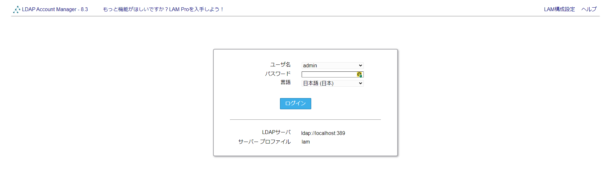
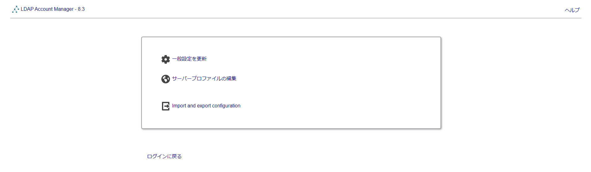
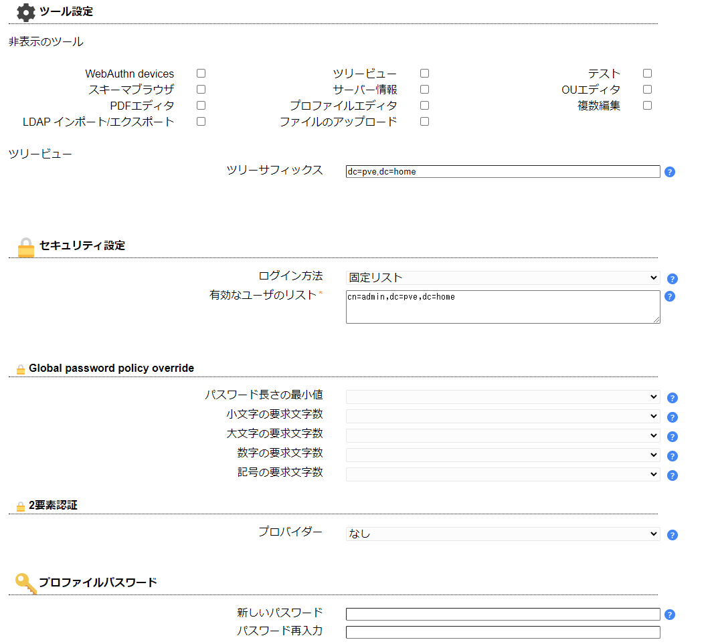
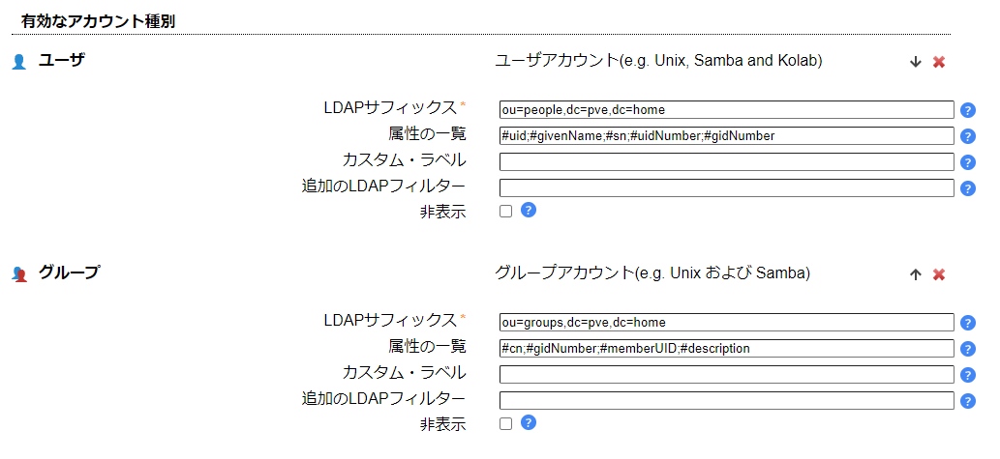

# LDAPサーバ
GitLab で LDAPアカウントを使うために、LDAPサーバを導入する。

- [LDAPサーバ](#ldapサーバ)
  - [参考](#参考)
  - [インストール](#インストール)
  - [設定](#設定)
    - [OpenLDAPの設定](#openldapの設定)
    - [サービスの再起動と自動起動](#サービスの再起動と自動起動)
    - [Base group の追加](#base-group-の追加)
    - [LDAPユーザアカウントの追加](#ldapユーザアカウントの追加)
      - [パスワード生成](#パスワード生成)
      - [ユーザ設定ファイルの作成](#ユーザ設定ファイルの作成)
      - [アカウントの追加](#アカウントの追加)
  - [LDAP Account Manager](#ldap-account-manager)
    - [インストール](#インストール-1)
    - [設定](#設定-1)
      - [PHP の設定ファイルの編集](#php-の設定ファイルの編集)
      - [Apache2 の設定ファイルの編集](#apache2-の設定ファイルの編集)
      - [LDAP Account Manager の設定](#ldap-account-manager-の設定)
  - [LDAPクライアントの設定](#ldapクライアントの設定)


## 参考
- [OpenLDAP : LDAP サーバーの設定](https://www.server-world.info/query?os=Debian_12&p=openldap&f=1)
- [How to Install OpenLDAP Server and LDAP Account Manager on Debian 12](https://www.howtoforge.com/how-to-install-openldap-server-on-debian-12/)


## インストール
```
# apt -y install slapd ldap-utils
```

管理者パスワードの設定が必要。

## 設定
### OpenLDAPの設定
```
# dpkg-reconfigure slapd
```

今回は以下のように設定する。

- Omit OpenLDAP server configuration -> No
- Input the domain name for OpenLDAP server
- Input the organization name
- Input admin password
- Remove old datebase -> No
- Move old datebase -> Yes

### サービスの再起動と自動起動
```
# systemctl restart slapd
# systemctl enable slapd
```

### Base group の追加
以下、作業ディレクトリを `/root/ldap` とする。`base.ldif` を作成し、[DNSサーバ](../DNS/README.md) で設定した `pve.home` を追加するように設定する。

```
dn: ou=people,dc=pve,dc=home
objectClass: organizationalUnit
ou: people

dn: ou=groups,dc=pve,dc=home
objectClass: organizationalUnit
ou: groups 
```

```
# ldapadd -x -D cn=admin,dc=pve,dc=home -W -f base.ldif
```

### LDAPユーザアカウントの追加
#### パスワード生成
```
# slappasswd
```

#### ユーザ設定ファイルの作成
`ldapuser.ldif` を作成する。

```
dn: uid=ktoda,ou=people,dc=pve,dc=home
objectClass: inetOrgPerson
objectClass: posixAccount
objectClass: shadowAccount
cn: ktoda
sn: debian
userPassword: {SSHA}xxxxxxxxxxxxxxxxx
loginShell: /bin/bash
uidNumber: 2000
gidNumber: 2000
homeDirectory: /home/ktoda

dn: cn=ktoda,ou=groups,dc=pve,dc=home
objectClass: posixGroup
cn: ktoda
gidNumber: 2000
memberUid: ktoda
```

#### アカウントの追加
```
# ldapadd -x -D cn=admin,dc=pve,dc=home -W -f ldapuser.ldif
```

## LDAP Account Manager
LDAP Account Manager を使うと GUI で管理可能。

### インストール
```
# apt -y install ldap-account-manager
```

### 設定
#### PHP の設定ファイルの編集
`/etc/php/8.2/apache2/php.ini` を編集し、`memory_limit` を `256M` にする。

```
memory_limit = 256M
```

#### Apache2 の設定ファイルの編集
`/etc/apache2/conf-enabled/ldap-account-manager.conf` を編集し、アクセス可能なサブネットを編集。

```
#Require all granted
Require ip 127.0.0.1 192.168.10.0/24
```

Apache2 を再起動する。

```
# systemctl restart apache2
```

`http://[address]/lam` でアクセス可能。

#### LDAP Account Manager の設定
LAM構成設定 > サーバープロファイルの編集 で、パスワードに `lam` を入力する。





一般設定で以下項目を編集する。

- ツール設定
  - OpenLDAPサーバのドメイン名を入力する
    - `dc=pve,dc=home`
- セキュリティ設定
  - ログイン方法と有効なユーザのリストを設定
    - ログイン方法：固定リスト
    - 有効なユーザのリスト：`cn=admin,dc=pve,dc=home`



アカウント種別で以下項目を編集する。

- ユーザ
  - LDAPサフィックス：`ou=people,dc=pve,dc=home`
- グループ
  - LDAPサフィックス：`ou=groups,dc=pve,dc=home`




## LDAPクライアントの設定
```
# apt -y install libnss-ldapd libpam-ldapd ldap-utils
```

インストール時に以下のような設定を行う。

1. LDAPサーバのURIを指定 > `ldap://ldap.pve.home/`
2. 識別名の指定 > `dc=pve,dc=home`
3. `/etc/nsswitch.conf` で LDAP を設定するサービスを選択 > `passwd, group, shadow` に `*` を指定
4. `/etc/pam.d/common-session` で、ログイン時にホームディレクトリを自動作成するように設定 (任意)
   ```
   session optional    pam_mkhomedir.so skel=/etc/skel umask=077
   ```
5. サービスを再起動
   ```
   # systemctl restart nscd nslcd
   ```

---

[Application](../README.md)
