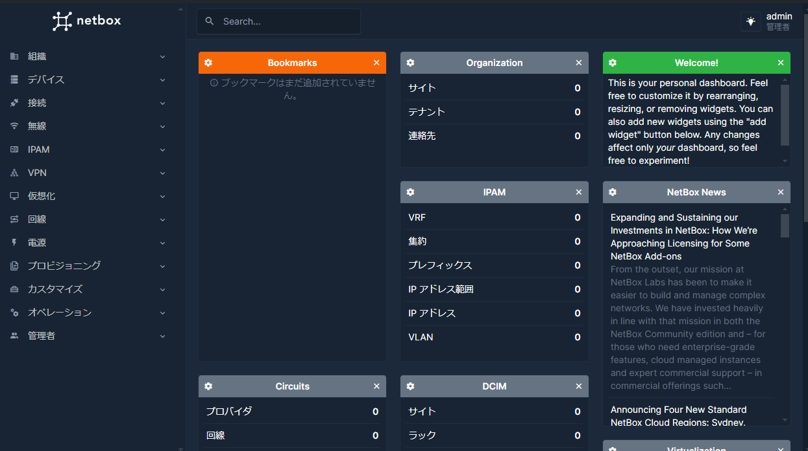

# NetBox
検証用環境に NetBox を導入する。

- [NetBox](#netbox)
  - [参考](#参考)
  - [インストール](#インストール)


## 参考
- [OSSを使用したNWリソース管理高度化への取り組み](https://www.nttpc.co.jp/technology/netbox.html)
- [Docker Compose で NetBox を起動する](https://sig9.org/blog/2024/02/12/)

## インストール
[netbox-docker](https://github.com/netbox-community/netbox-docker) を活用する。

1. VM を作成する
2. VM に docker をインストールする
   - [Docker の導入](../Docker/README.md) を参照
3. VM で以下コマンドを実行する
   ```
   git clone -b release https://github.com/netbox-community/netbox-docker.git
   cd netbox-docker
   tee docker-compose.override.yml <<EOF
   services:
   netbox:
       ports:
       - 8000:8080
   EOF
   docker compose pull
   docker compose up
   ```
4. スーパーユーザを作成する
   ```
   docker compose exec netbox /opt/netbox/netbox/manage.py createsuperuser
   ```

この状態で、`http://<netboxのアドレス>:8000` でログイン可能である。




---

[Application](../README.md)
