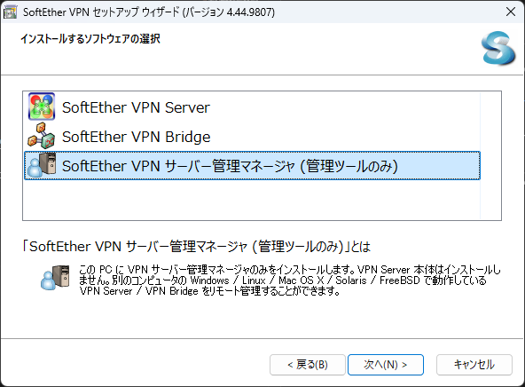

# SoftEther VPN

自宅サーバのリモートアクセスのために SoftEther VPN の環境を構築する。2025/8 時点の情報。

- [SoftEther VPN](#softether-vpn)
  - [参考](#参考)
  - [VPN Server](#vpn-server)
    - [準備](#準備)
    - [インストール用ファイルのダウンロード](#インストール用ファイルのダウンロード)
    - [実行可能ファイルの作成](#実行可能ファイルの作成)
    - [VPN Server の配置](#vpn-server-の配置)
    - [動作確認](#動作確認)
    - [スタートアップスクリプトへの登録](#スタートアップスクリプトへの登録)
    - [起動](#起動)
  - [VPN 管理ツール](#vpn-管理ツール)
    - [VPN Server Manager のインストール](#vpn-server-manager-のインストール)
    - [接続設定](#接続設定)
  - [外部からの接続](#外部からの接続)
    - [Windows](#windows)
    - [Linux](#linux)


## 参考

- [ホームユーザーのための VPN](https://ja.softether.org/4-docs/2-howto/5.VPN_for_Home)
- [7.2 Windows へのインストールと初期設定](https://ja.softether.org/4-docs/1-manual/7/7.2)
- [7.3 Linux へのインストールと初期設定](https://ja.softether.org/4-docs/1-manual/7/7.3)
- [【SoftEther VPN】自宅でカンタンにVPNサーバーを構築しちゃおうぜ！#1 構築編](https://www.nemnet-lab.net/?p=303)
- [VPN Azure Cloud](https://www.vpnazure.net/ja/)
- [Ubuntu(Linux)でSoftEther VPNクライアント構築 詳細メモ](https://cgbeginner.net/ubuntu-softether-vpn-client/)
- [SoftetherのVirtual NICをNetworkManagerで管理してDHCPから取得](https://unagidojyou.com/2025/06-14/softether_virtual-nic_with_networkmanager/)


## VPN Server

以下環境にインストールする。

- OS: Ubuntu 24.02.2 LTS
- Storage: 128GB
- RAM: 4GB

### 準備

```
# apt update
# apt install gcc make
```

### インストール用ファイルのダウンロード

https://www.softether-download.com/ja.aspx?product=softether

で、SoftEther VPN Server の最新版を検索し、ダウンロード、解凍した。

```
$ wget https://github.com/SoftEtherVPN/SoftEtherVPN_Stable/releases/download/v4.44-9807-rtm/softether-vpnserver-v4.44-9807-rtm-2025.04.16-linux-x64-64bit.tar.gz
$ tar -zxvf softether-vpnserver-v4.44-9807-rtm-2025.04.16-linux-x64-64bit.tar.gz
```

### 実行可能ファイルの作成

```
# cd vpnserver/
# make
```

### VPN Server の配置

```
# cd ..
# mv vpnserver /usr/local
# ls -l /usr/local/vpnserver/
total 16296
-rwxrwxr-x 1 management management      82 Apr 15 20:07 Authors.txt
drwx------ 2 root       root          4096 Aug 24 03:55 chain_certs
drwxrwxr-x 2 management management    4096 Aug 24 03:55 code
-rwxrwxr-x 1 management management 2015854 Apr 15 20:07 hamcore.se2
-rw------- 1 root       root           867 Aug 24 03:55 lang.config
drwxrwxr-x 2 management management    4096 Aug 24 03:55 lib
-rwxrwxr-x 1 management management    3577 Apr 15 20:07 Makefile
-rwxrwxr-x 1 management management   34694 Apr 15 20:07 ReadMeFirst_Important_Notices_cn.txt
-rwxrwxr-x 1 management management   40185 Apr 15 20:07 ReadMeFirst_Important_Notices_en.txt
-rwxrwxr-x 1 management management   55417 Apr 15 20:07 ReadMeFirst_Important_Notices_ja.txt
-rwxrwxr-x 1 management management    5570 Apr 15 20:07 ReadMeFirst_License.txt
-rwxr-xr-x 1 root       root       7246256 Aug 24 03:55 vpncmd
-rwxr-xr-x 1 root       root       7246328 Aug 24 03:55 vpnserver
```

`root` 権限でなければ読み書きできないようにパーミッションを変更

```
# cd /usr/local/vpnserver/
# chown root:root *
# chmod 600 *
# chmod 700 vpncmd
# chmod 700 vpnserver
# ls -l
# ls -l
total 16296
-rw------- 1 root root      82 Apr 15 20:07 Authors.txt
drw------- 2 root root    4096 Aug 24 03:55 chain_certs
drw------- 2 root root    4096 Aug 24 03:55 code
-rw------- 1 root root 2015854 Apr 15 20:07 hamcore.se2
-rw------- 1 root root     867 Aug 24 03:55 lang.config
drw------- 2 root root    4096 Aug 24 03:55 lib
-rw------- 1 root root    3577 Apr 15 20:07 Makefile
-rw------- 1 root root   34694 Apr 15 20:07 ReadMeFirst_Important_Notices_cn.txt
-rw------- 1 root root   40185 Apr 15 20:07 ReadMeFirst_Important_Notices_en.txt
-rw------- 1 root root   55417 Apr 15 20:07 ReadMeFirst_Important_Notices_ja.txt
-rw------- 1 root root    5570 Apr 15 20:07 ReadMeFirst_License.txt
-rwx------ 1 root root 7246256 Aug 24 03:55 vpncmd
-rwx------ 1 root root 7246328 Aug 24 03:55 vpnserver
```

### 動作確認

```
# ./vpncmd
vpncmd command - SoftEther VPN Command Line Management Utility
SoftEther VPN Command Line Management Utility (vpncmd command)
Version 4.44 Build 9807   (English)
Compiled 2025/04/16 04:50:46 by buildsan at crosswin with OpenSSL 3.0.9
Copyright (c) 2012-2025 SoftEther VPN Project. All Rights Reserved.

By using vpncmd program, the following can be achieved.

1. Management of VPN Server or VPN Bridge
2. Management of VPN Client
3. Use of VPN Tools (certificate creation and Network Traffic Speed Test Tool)

Select 1, 2 or 3: 3

VPN Tools has been launched. By inputting HELP, you can view a list of the commands that can be used.

VPN Tools>check
Check command - Check whether SoftEther VPN Operation is Possible
---------------------------------------------------
SoftEther VPN Operation Environment Check Tool

Copyright (c) SoftEther VPN Project.
All Rights Reserved.

If this operation environment check tool is run on a system and that system passes, it is most likely that SoftEther VPN software can operate on that system. This check may take a while. Please wait...

Checking 'Kernel System'...
              Pass
Checking 'Memory Operation System'...
              Pass
Checking 'ANSI / Unicode string processing system'...
              Pass
Checking 'File system'...
              Pass
Checking 'Thread processing system'...
              Pass
Checking 'Network system'...
              Pass

All checks passed. It is most likely that SoftEther VPN Server / Bridge can operate normally on this system.

The command completed successfully.

VPN Tools>exit
```

### スタートアップスクリプトへの登録
`/opt/vpnserver.sh` を以下のように作成。

```sh
#!/bin/sh
# chkconfig: 2345 99 01
# description: SoftEther VPN Server
DAEMON=/usr/local/vpnserver/vpnserver
LOCK=/var/lock/subsys/vpnserver
test -x $DAEMON || exit 0
case "$1" in
start)
$DAEMON start
touch $LOCK
;;
stop)
$DAEMON stop
rm $LOCK
;;
restart)
$DAEMON stop
sleep 3
$DAEMON start
;;
*)
echo "Usage: $0 {start|stop|restart}"
exit 1
esac
exit 0
```

```
# chmod 755 /opt/vpnserver.sh
```

次に、Systemd の設定ファイルを `/etc/systemd/system/vpnserver.service` に作成。

```
[Unit]
Description = vpnserver daemon

[Service]
ExecStart = /opt/vpnserver.sh start
ExecStop = /opt/vpnserver.sh stop
ExecReload = /opt/vpnserver.sh restart
Restart = always
Type = forking

[Install]
WantedBy = multi-user.target
```

```
# systemctl enable vpnserver
```

### 起動

```
# systemctl start vpnserver
# systemctl status vpnserver
● vpnserver.service - vpnserver daemon
     Loaded: loaded (/etc/systemd/system/vpnserver.service; enabled; preset: enabled)
     Active: active (running) since Sun 2025-08-24 04:04:19 UTC; 24s ago
    Process: 1031007 ExecStart=/opt/vpnserver.sh start (code=exited, status=0/SUCCESS)
   Main PID: 1031012 (vpnserver)
      Tasks: 32 (limit: 629145)
     Memory: 17.8M (peak: 23.1M)
        CPU: 1.332s
     CGroup: /system.slice/vpnserver.service
             ├─1031012 /usr/local/vpnserver/vpnserver execsvc
             └─1031013 /usr/local/vpnserver/vpnserver execsvc

Aug 24 04:04:19 management.pve.home systemd[1]: Starting vpnserver.service - vpnserver daemon...
Aug 24 04:04:19 management.pve.home vpnserver.sh[1031008]: The SoftEther VPN Server service has been started.
```

## VPN 管理ツール
Windows に管理ツールをインストールする。

https://www.softether-download.com/ja.aspx?product=softether

上記サイトで、SoftEther VPN Server and VPN Bridge の実行ファイルをダウンロードする。

### VPN Server Manager のインストール

セットアップウィザードで「管理ツールのみ」を選択してインストール。



### 接続設定
「新しい接続設定」で、接続設定名、ホスト名、ポート番号を変更。

初回接続時はパスワードの設定が要求されるので、任意にパスワードを設定。

- 簡易セットアップ
  - 「リモートアクセス VPN サーバー」を選択
- ダイナミック DNS 機能
  - ダイナミック DNS ホスト名を変更し、閉じる
- IPsec 設定
  - チェックを入れずに OK
- VPN Azure クラウド
  - 今回は有効にする
- ローカルブリッジ
  - VPN サーバに接続している適当なネットワークカード
- ユーザ
  - 適当に作成

## 外部からの接続
### Windows
Windows の設定から VPN 接続設定を追加

- VPN 接続: VPN を追加
  - VPN プロバーダー: Windows (ビルトイン)
  - 接続名: 任意
  - サーバー名またはアドレス: 設定した DDNS 名 (azure の方)
  - VPN の種類: 自動
  - サインイン情報の種類: ユーザ名とパスワード
  - ユーザ名: 作成したユーザ名
  - パスワード: 設定したパスワード

VPN 接続後、自宅内のリソースに接続。

### Linux
SoftEther VPN Client をインストール。

```
$ wget https://github.com/SoftEtherVPN/SoftEtherVPN_Stable/releases/download/v4.44-9807-rtm/softether-vpnclient-v4.44-9807-rtm-2025.04.16-linux-x64-64bit.tar.gz
$ tar -zxvf softether-vpnclient-v4.44-9807-rtm-2025.04.16-linux-x64-64bit.tar.gz
$ sudo -s -E
# cd vpnclient
# make
# cd ..
# mv vpnclient /usr/local
# cd /usr/local
# chown -R root:root vpnclient
# cd vpnclient
# chmod 600 *
# chmod 700 vpncmd
# chmod 700 vpnclient
# chmod 700 .install.sh
```

VPN Client をサービスにする。

```
# nano /etc/systemd/system/vpnclient.service
```

以下のように編集。

```
[Unit]
Description=SoftEther VPN Client
After=network.target network-online.target

[Service]
ExecStart=/usr/local/vpnclient/vpnclient start
ExecStop=/usr/local/vpnclient/vpnclient stop
WorkingDirectory=/usr/local/vpnclient/
#ExecStartPost=dhclient vpn_vpn
Type=forking
RestartSec=3s

[Install]
WantedBy=multi-user.target
```

サービスを起動する。

```
# systemctl daemon-reload
# systemctl enable vpnclient
# systemclt start vpnclient
```

クライアントに接続し、設定する。

```
$ sudo /usr/local/vpnclient/vpncmd
...
Select 1, 2 or 3: 2
...
Hostname of IP Address of Destination:
VPN Client> 
```

```
VPN Client> NicCreate vNIC-001
VPN Client> AccountCreate Connect-001 /SERVER:#{YOURSERVER}:443 /HUB:#{HUBNAME} /USERNAME:#{USERNAME} /NICNAME:vNIC-001
VPN Client> AccountPasswordSet Connect-001 /PASSWORD:#{PASSWORD} /TYPE:standard
VPN Client> AccountConnect Connect-001
VPN Client> AccountStartupSet Connect-001
VPN Client> quit
```

このままでは IPv4 アドレスがふられないことがある。

```
$ nmcli device show vpn_vnic-001
```

これで `GENERAL.TYPE` が `tun` になっていて、`GENERAL.STATE` が `10 (unmanaged)` になっている。

```
$ sudo nmcli connection add type tun con-name net-vpn_vnic-001 ifname vpn_vnic-001
$ sudo nmcli connection modify net-vpn_vnic-001 tun.mode 2
$ sudo nmcli connection up netplan-vpn_vnic-001
```

これで IPv4 アドレスもふられたが、疎通できない (未解決)。

