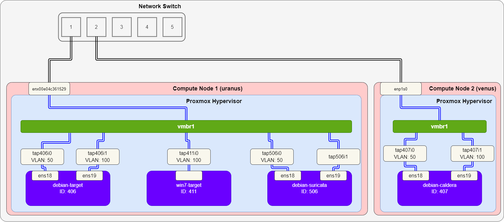
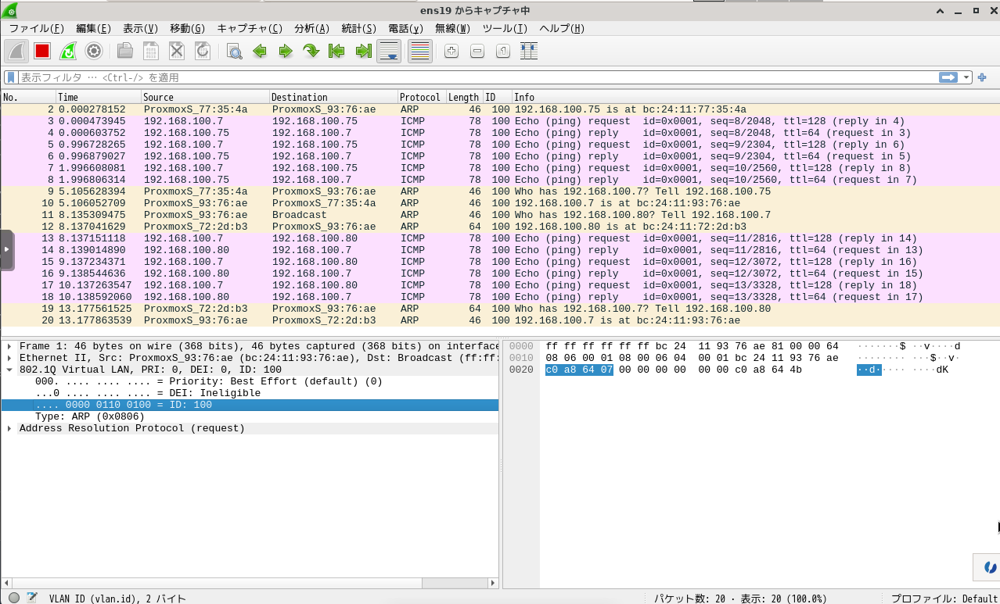
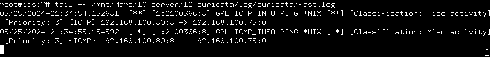
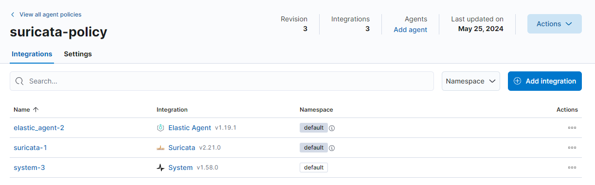
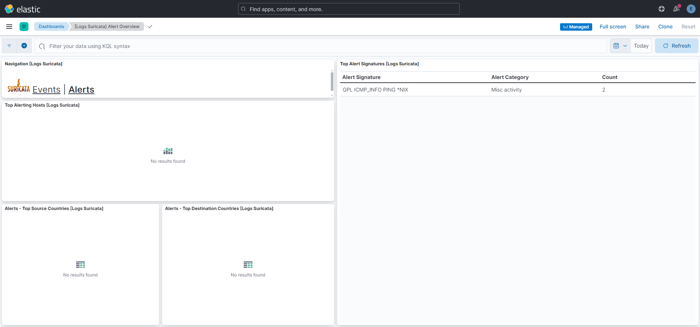

# Suricata
[Suricata](https://suricata.io/) を導入し、実験線を監視可能にする。

## インストール
Suricata Docs の [3. Installation](https://docs.suricata.io/en/suricata-6.0.19/install.html) を参照しながらインストールする。

### 依存関係にあるパッケージのインストール
```
# apt-get -y install build-essential cargo cbindgen clang git jq libbpf-dev \
                libcap-ng-dev libevent-dev libgeoip-dev libhiredis-dev \
                libhyperscan-dev libjansson-dev liblua5.1-dev liblz4-dev \
                libmagic-dev libmagic-dev libmaxminddb-dev libnet-dev \
                libnetfilter-queue-dev libnspr4-dev libnss3-dev \
                libpcap-dev libpcre3-dev libtool libyaml-dev make \
                pkg-config python3 python3-dev python3-yaml rustc zlib1g-dev
```

```
# apt-get -y install libnetfilter-queue-dev libnetfilter-queue1  \
                libnetfilter-log-dev libnetfilter-log1      \
                libnfnetlink-dev libnfnetlink0
```

### ダウンロードとインストール
2024/5 時点の v6 の stable version は v6.0.19 なので、v6.0.19 をインストールする。

```
# wget https://www.openinfosecfoundation.org/download/suricata-6.0.19.tar.gz
# tar -zxvf suricata-6.0.19.tar.gz
# cd suricata-6.0.19
# ./configure --prefix=/usr/ --sysconfdir=/etc --localstatedir=<local state dir>
# make
# make install
# make install-conf
```

ただし、`configure` のオプションは以下。

- `--prefix=/usr/`: Suricata のバイナリを `/usr/bin/` にインストールする
- `--sysconfdir=/etc`: Suricata の設定ファイルを `/etc/suricata` にインストールする
- `--localstatedir=<local state dir>`: Suricata のログファイルを `<local state dir>` に設定する
  - 今回は、マウントした外部ストレージ (`/mnt/Mars/10_server/12_suricata`) を指定した


### 設定
`/etc/default/suricata` の編集

```
RUN_AS_USER=<username>
LISTENMODE=pcap
IFACE=<interface>
```

`/etc/suricata/suricata.yaml` の編集

```yml
vars:
    address-groups:
        HOME_NET: "[<address>, <address>, ...]"
        EXTERNAL_NET: "!$HOME_NET"
pcap:
    - interface: <interface>
```


### ルールの作成
```
# mkdir -p <local state dir>/lib/suricata/rules
# mkdir -p <local state dir>/lib/suricata/update
# touch /etc/suricata/update.yaml
# touch /etc/suricata/enable.conf
# touch /etc/suricata/disable.conf
# touch /etc/suricata/drop.conf
# touch /etc/suricata/modify.conf
```

[Example Configuration Files](https://suricata-update.readthedocs.io/en/latest/update.html#example-configuration-files) を参考に、`update.yaml`, `enable.conf`, `disable.conf`, `modify.conf` を編集する。

### ルールの入手
```
# suricata-update
```

### 起動
```
# suricata -c /etc/suricata/suricata.yaml --pidfile /run/suricata.pid -i <interface>
```

## テスト
### テスト環境
以下のテスト環境を構築する。



各 VM の用途を以下に示す。

|VM|用途|
|---|---|
|`debian-target`|標的マシン (debian)|
|`win7-target`|標的マシン (Windows 7)|
|`debian-suricata`|IDS (Suricata)|
|`debian-caldera`|攻撃検証用マシン|

各 VM の IPアドレスは以下のように設定する。

|VM|vNIC|IPアドレス|
|---|---|---|
|`debian-target`|`ens18`|`192.168.50.75/24`|
|`debian-target`|`ens19`|`192.168.100.75/24`|
|`win7-target`|-|`192.168.50.7/24`|
|`debian-suricata`|`ens18`|`192.168.50.50/24`|
|`debian-suricata`|`ens19`|-|
|`debian-caldera`|`ens18`|`192.168.50.80/24`|
|`debian-caldera`|`ens19`|`192.168.100.80/24`|

### ミラーリング設定
[ポートミラーリング設定](../../Usage/port-mirror/README.md) を参考に設定する。今回は、VLAN 100 を攻撃検証用の VLAN ID とする。また、今回は、Compute Node 1 (uranus) 内でポートミラーリング設定を実施し、VLAN ID 100 の通信 (`tap406i1` と `tap411i0` を流れる通信) をすべて `debian-suricata` の `ens19` (`tap506i1`) にミラーリングするように設定する。

```
# ovs-vsctl -- set bridge vmbr1 \
> mirrors=@m -- \
> --id=@debian-target get Port tap406i1 -- \
> --id=@win7-target get Port tap411i0 -- \
> --id=@debian-ids get Port tap506i1 -- \
> --id=@m create Mirror name=attack-experiment \
> select-dst-port=@debian-target,@win7-target \
> select-src-port=@debian-target,@win7-target \
> output-port=@debian-ids \
> select-vlan=100
4bf6c463-a51a-401c-b3c1-c46875c76d55
```

設定を確認する。

```
# ovs-vsctl list Mirror
_uuid               : 4bf6c463-a51a-401c-b3c1-c46875c76d55
external_ids        : {}
name                : attack-experiment
output_port         : 191da150-9764-46cb-9810-55a15779e6e1
output_vlan         : []
select_all          : false
select_dst_port     : [cbd349a2-1ee3-4a5b-86bc-e39e02223468, db69cbfd-9cab-448d-8bb0-310028db975e]
select_src_port     : [cbd349a2-1ee3-4a5b-86bc-e39e02223468, db69cbfd-9cab-448d-8bb0-310028db975e]
select_vlan         : [100]
snaplen             : []
statistics          : {tx_bytes=0, tx_packets=0}
```

疎通確認する。



### Suricata の設定
`/etc/suricata/suricata.yaml` で `HOME_NET` を設定する。

```yml
vars:
    address-groups:
        HOME_NET: "[192.168.100.7,192.168.100.75]"
```

### Suricata 監視確認
Suricata を起動し、アラートを監視する。

```
# suricata -c /etc/suricata/suricata.yaml -i ens19
```

```
# tail -f /mnt/Mars/10_server/12_suricata/log/suricata/fast.log
```

問題なくアラートが発出されることが確認された。



## Elasticsearch との連携
Suricata をインストールした VM に Elastic Agent をインストールすることで、Suricata のアラートを Elasticsearch で管理する。

### Elastic Agent のインストール
[Elasticsearch の導入](../Elasticsearch/README.md) を参照しながらインストールする。今回は、以下のような policy を作成する。



Agent をインストールすると、Dashboards から Suricata のログを確認できる。




---

[Application](../README.md)
