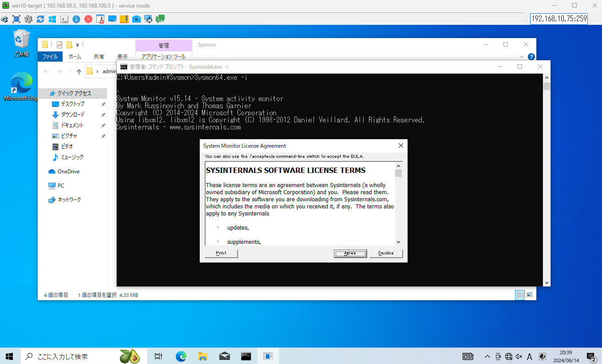
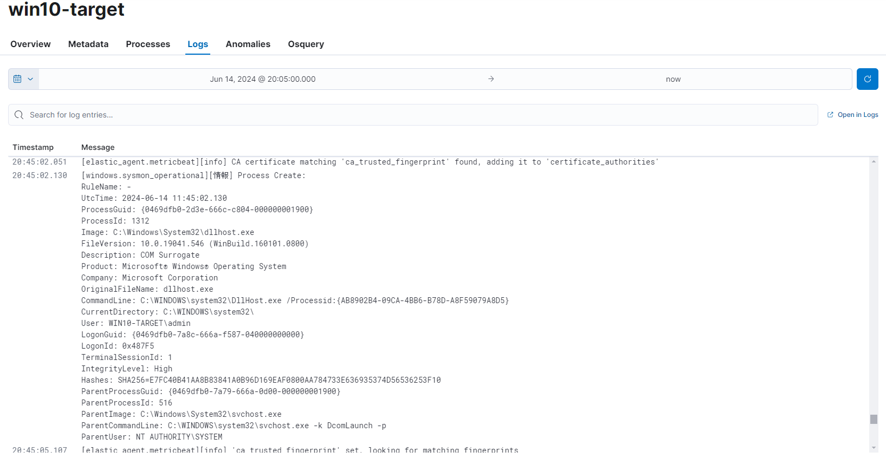

# Sysmon
Windows に Sysmon を導入する。

## 参考
- [Sysmon v15.14](https://learn.microsoft.com/ja-jp/sysinternals/downloads/sysmon)

## インストール
1. [Sysmon v15.14](https://learn.microsoft.com/ja-jp/sysinternals/downloads/sysmon) からダウンロードする。
2. Zip ファイルを解凍する
3. コマンドプロンプトで、`Sysmon64.exe -i` でインストール

## 補足
Windows に対して Elastic Agent をインストールし、Integration に Windows を追加すると、Sysmon のログを確認可能。

---

[Application](../README.md)
