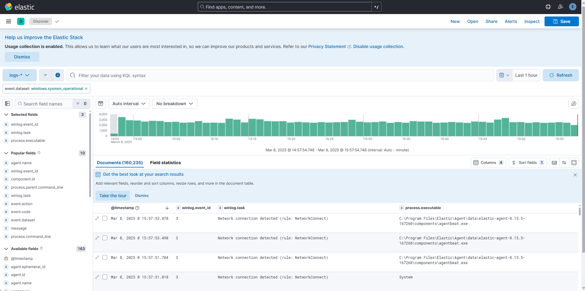

# Sysmon
Windows に Sysmon を導入する。

## 参考
- [Sysmon v15.14](https://learn.microsoft.com/ja-jp/sysinternals/downloads/sysmon)

## インストール
1. [Sysmon v15.14](https://learn.microsoft.com/ja-jp/sysinternals/downloads/sysmon) からダウンロードする。
2. Zip ファイルを解凍する
3. コマンドプロンプトで、`Sysmon64.exe -i` でインストール


## 補足
Windows に対して Elastic Agent をインストールし、Integration に Windows を追加すると、Sysmon のログを確認可能。


## ログ取得設定
設定ファイルを読み込ませることで Sysmon の設定が可能。

例えば、[olafhartong / sysmon-modular](https://github.com/olafhartong/sysmon-modular) をベースに設定した場合 (今回は [sysmonconfig-with-filedelete.xml](https://raw.githubusercontent.com/olafhartong/sysmon-modular/master/sysmonconfig-with-filedelete.xml) を例にする)

```
> .\Sysmon64.exe -c sysmonconfig-with-filedelete.xml
```

で設定できる。設定した際のログを1hほど取得した。



毎分2500~3000ほどログが出ていることが確認できた (設定しなければ毎分100未満)。

---

[Application](../README.md)
