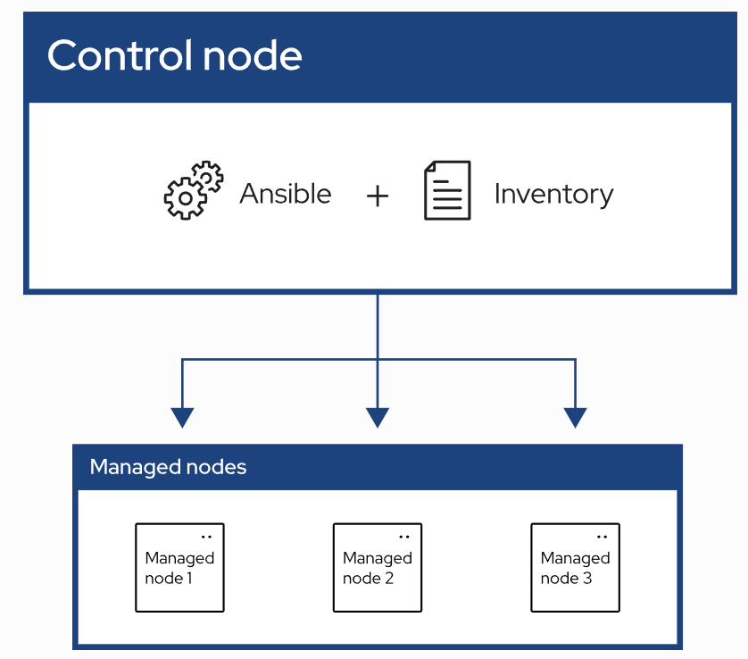

# Ansibleのインストール

Ansible をインストールする。

- [Ansibleのインストール](#ansibleのインストール)
  - [Ansible の概要](#ansible-の概要)
  - [環境](#環境)
  - [インストール](#インストール)
  - [設定](#設定)
    - [Managed node の登録](#managed-node-の登録)


## Ansible の概要
RedHat 社が開発するOSS構成管理ツール。サーバ構築の自動化が可能。



画像引用: [Ansible Community Documentation - Getting started with Ansible](https://docs.ansible.com/ansible/latest/getting_started/index.html)


多くの Ansible 環境は3つの主要なコンポーネントを持つ。

- Control Node
  - Ansible がインストールされているシステム
- Inventory
  - Managed nodes のリスト
- Managed node
  - Ansible がコントロールするリモートシステムまたはホスト

## 環境
本検証では、物理サーバ (Ubuntu 24) を Ansible の Control Node とし、Proxmox VE を Managed nodes とするような構成にする。

## インストール
参考: [Ansible Community Documentation - Installing Ansible](https://docs.ansible.com/ansible/latest/installation_guide/index.html)

Control Node に `pipx` で Ansible をインストールする。

```
$ sudo apt update
$ sudo apt -y install pipx
$ pipx ensurepath
$ pipx install --include-deps ansible
$ pipx inject --include-apps ansible argcomplete
```

インストール後、`ansible` コマンドを実行可能。

## 設定
参考:
- [Ansible Community Documentation - Configuring Ansible](https://docs.ansible.com/ansible/latest/installation_guide/intro_configuration.html)
- [Ansible Community Documentation - Ansible Configuration Settings](https://docs.ansible.com/ansible/latest/reference_appendices/config.html)


上記のように `pipx` で Ansible をインストールした場合、`ansible.cfg` ファイルを作成することでデフォルト設定を置き換えることができる。ここではインストール後に作成された `.ansible` ディレクトリ以下に `.ansible/ansible.cfg` を作成する方針にする。

```
$ cd .ansible
$ ansible-config init --disabled -t all > ansible.cfg
```

### Managed node の登録
`/etc/ansible/hosts` に管理対象としたいホストを記述する。

```
# mkdir /etc/ansible
# nano /etc/ansible/hosts
```

管理対象としたいホストを記述する。


---

[ansible](../README.md)
