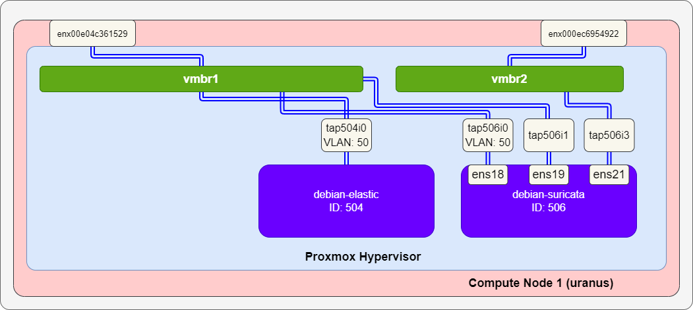

# Arkime

[Arkime](https://arkime.com/) を検証環境に導入する方法をまとめる。

- [Arkime](#arkime)
  - [環境](#環境)
  - [参考](#参考)
  - [インストール](#インストール)
    - [依存関係のインストール](#依存関係のインストール)
    - [本体のインストール](#本体のインストール)
  - [Arkime の設定](#arkime-の設定)
    - [Elasticsearch への Arkime の情報の登録](#elasticsearch-への-arkime-の情報の登録)


## 環境
以下環境の debian-suricata 上に導入する。



Arkime は内部データベースとして Elasticsearch を使うが、同一ホストではなく外部にある Elasticsearch と連携できないか検討する。

## 参考
- [低予算で始めるArkimeによるOT IDS運用 - 実践ガイド](https://io.cyberdefense.jp/entry/ot_ids_oss/)

## インストール
ユーザに sudo 権限を付与して再起動する。

```
# gpasswd -a <user name> sudo
# reboot
```

### 依存関係のインストール

```
$ sudo apt -qq install wget curl libpcre3-dev uuid-dev libmagic-dev \
 pkg-config g++ flex bison zlib1g-dev libffi-dev gettext libgeoip-dev make \
 libjson-perl libbz2-dev libwww-perl libpng-dev xz-utils libffi-dev libssl-dev \
 libreadline-dev libtool libyaml-dev dh-autoreconf \
 libsocket6-perl libtest-differences-perl
$ sudo apt install inotify-tools wireshark
```

### 本体のインストール

```
$ wget https://github.com/arkime/arkime/releases/download/v5.3.0/arkime_5.3.0-1.debian12_amd64.deb
$ sudo apt update
$ sudo apt install ./arkime_5.3.0-1.debian12_amd64.deb
```

## Arkime の設定
`/opt/arkime` 上にインストールされる。`/opt/arkime/bin/Configure` を実行することで初期設定する。

- Semicolon ';' separated list of interfaces to monitor: ens19;ens21
- Install Elasticsearch server locally: no
- Elasticsearch server URL: http[s]://192.168.50.40:9200
- Elasticsearch user: elastic
- Elasticsearch password: `<password>`
- Password to encrypt S2S and other things: `<password>`
- Download GEO files?: yes

### Elasticsearch への Arkime の情報の登録
```
$ sudo /opt/arkime/db/db.pl --insecure http[s]://192.168.50.40:9200 init
```

上記コマンドを実行したところ、以下エラーが出た。

```
Couldn't GET https://192.168.50.40:9200/_cluster/health  the http status code is 401 are you sure OpenSearch/Elasticsearch is running/reachable? at /opt/arkime/db/db.pl line 310.
```

これは、クラスタを構成していない場合に出るエラーである。クラスタを構成するように Elasticsearch をインストールしなおす必要がある。

---

[Application](../README.md)
