# Virtual Industrial Cybersecurity Lab
検証用環境に模擬制御システムを導入する。

- [Virtual Industrial Cybersecurity Lab](#virtual-industrial-cybersecurity-lab)
  - [参考](#参考)
  - [構成](#構成)
  - [構築](#構築)
    - [OpenPLC の構築](#openplc-の構築)
      - [マシン設定](#マシン設定)
      - [インストール](#インストール)
      - [NAPT 設定](#napt-設定)
      - [Elastic Agent のインストール](#elastic-agent-のインストール)
      - [ポートミラーリング設定](#ポートミラーリング設定)
    - [ScadaBR の構築](#scadabr-の構築)
      - [マシン設定](#マシン設定-1)
      - [インストール](#インストール-1)
      - [NAPT 設定](#napt-設定-1)
      - [Elastic Agent のインストール](#elastic-agent-のインストール-1)
      - [ポートミラーリング設定](#ポートミラーリング設定-1)
    - [Factory I/O の構築](#factory-io-の構築)
      - [Scene の作成](#scene-の作成)
      - [Driver の設定](#driver-の設定)
      - [OpenPLC との接続](#openplc-との接続)
  - [PLC のロジックの設計](#plc-のロジックの設計)
    - [OpenPLC Editor のダウンロード](#openplc-editor-のダウンロード)
    - [サンプルプログラムの作成](#サンプルプログラムの作成)
  - [動作確認](#動作確認)


## 参考
- [リアル感ある制御システムが無料で作れて勉強になった話](https://io.cyberdefense.jp/entry/ics_simulator1/)
- [Virtual Industrial Cybersecurity Lab](https://rodrigocantera.com/en/category/virtual-industrial-cybersecurity-lab/)
- [ModbusTool](https://github.com/ClassicDIY/ModbusTool)

## 構成
以下構成とする。

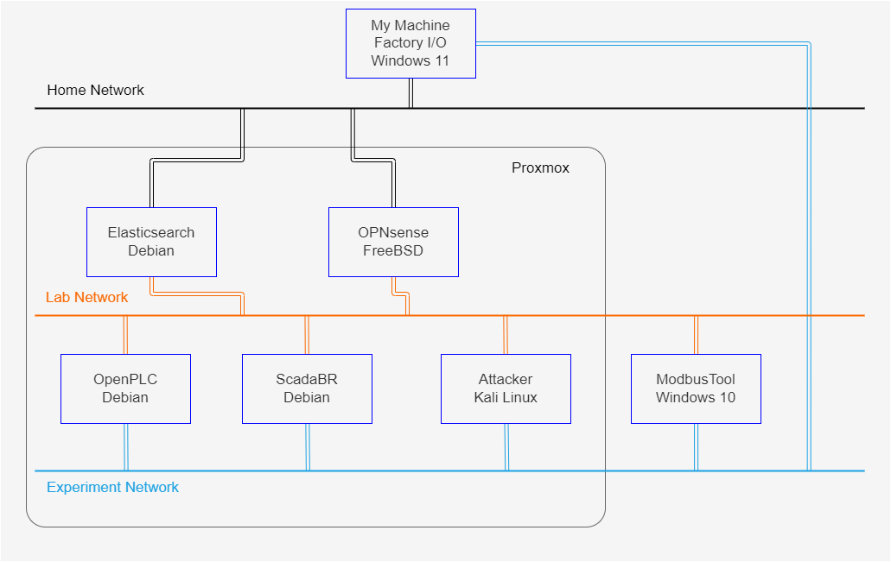

各機器の用途は以下。

|機器|用途|
|---|---|
|My Machine|アクセス用|
|Elasticsearch|ログ集約用|
|OPNsense|ファイアウォール|
|OpenPLC|PLC|
|ScadaBR|SCADA|
|Attacker|攻撃模擬端末|
|Factory I/O|工場の模擬|
|ModbusTool|Modbus Master/Slave|

ただし、OPNsense は [OPNsense の導入](../opnsense/README.md) で導入したものを使い、Elasticsearch は [Elasticsearch の導入](../Elasticsearch/README.md) で導入したものを使う。

## 構築

### OpenPLC の構築
#### マシン設定
アドレスを以下のように設定する。

- Lab Network
  - Address: `192.168.50.11/24`
  - Gateway: `192.168.50.1`
  - DNS server: `192.168.50.2`
- Experiment Network
  - Address: `192.168.100.11/24`

また、ホスト名を以下のように設定する。

```
# hostnamectl set-hostname openplc.pve.lab
```

#### インストール
OpenPLC をインストールする。一時的に Home Network に接続する。

```
# apt update
# apt install git auditd
# git clone https://github.com/thiagoralves/OpenPLC_v3.git /opt/OpenPLC_v3
# cd /opt/OpenPLC_v3
# ./install.sh linux
```

インストール後、動作確認のために `htt[p]://localhost:8080` にアクセスする。

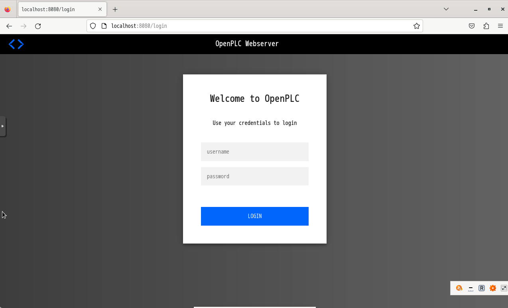

#### NAPT 設定
Home Network 上の機器からアクセスできるように、OPNsense で NAPT の設定をする。OPNsense の Firewall > NAT > Port Forward でルールを追加する。

- Interface: WAN
- TCP/IP Version
- Protocol: TCP
- Source: WAN net
- Source port range
  - from: any
  - to: any
- Destination: WAN address
- Destination port range
  - from: (other) `38080`
  - to: (other) `38080`
- Redirect target IP: Single host or Network `192.168.50.11`
- Ridirect target port: `8080`
- Pool Options: Default
- Log: Log packets that are handled by this rule
- Description: OpenPLC
- NAT reflection: Enable
- Filter rule association: Add associated filter rule

上記ルールを適用すると、Home Network 上の `My Machine` から `<opnsenseのアドレス>:38080` でアクセス可能。

#### Elastic Agent のインストール
[Elasticsearch の導入](../Elasticsearch/README.md) を参考にインストールする。`elastic-agent-*.tar.gz` は転送済とする。

```
# tar -zxvf elastic-agent-8.13.4-linux-x86_64.tar.gz
# cd elastic-agent-8.13.4-linux-x86_64
# ./elastic-agent install --insecure --url=<fleet url> --enrollment-token=<token>
```

#### ポートミラーリング設定
[ポートミラーリング設定](../../Usage/port-mirror/README.md) で作成したスクリプトを実行する。

```
# ./port-mirror.sh vmbr1 506 1 301 1
```

### ScadaBR の構築
#### マシン設定
アドレスを以下のように設定する。

- Lab Network
  - Address: `192.168.50.12/24`
  - Gateway: `192.168.50.1`
  - DNS server: `192.168.50.2`
- Experiment Network
  - Address: `192.168.100.12/24`

また、ホスト名を以下のように設定する。

```
# hostnamectl set-hostname scadabr.pve.lab
```

#### インストール
ScadaBR をインストールする。一時的に Home Network に接続する。

```
# apt update
# apt install git auditd
# git clone https://github.com/thiagoralves/ScadaBR_Installer.git /opt/ScadaBR_Installer
# cd /opt/ScadaBR_Installer
# ./install_scadabr.sh
# ./update_scadabr.sh
```

インストール後、動作確認のために起動して `htt[p]://localhost:9090/ScadaBR` にアクセスする。

```
# /opt/tomcat6/apache-tomcat-6.0.53/bin/startup.sh
```

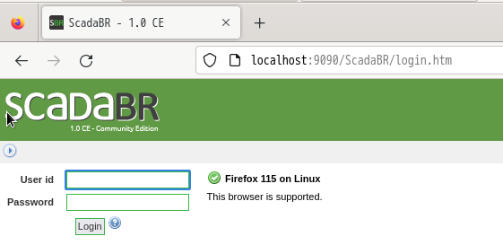

自動起動の設定をする。`crontab -e` で再起動後に起動用スクリプトを実行するように設定する。

```
@reboot /opt/tomcat6/apache-tomcat-6.0.53/bin/startup.sh
```

#### NAPT 設定
Home Network 上の機器からアクセスできるように、OPNsense で NAPT の設定をする。OPNsense の Firewall > NAT > Port Forward でルールを追加する。

- Interface: WAN
- TCP/IP Version
- Protocol: TCP
- Source: WAN net
- Source port range
  - from: any
  - to: any
- Destination: WAN address
- Destination port range
  - from: (other) `39090`
  - to: (other) `39090`
- Redirect target IP: Single host or Network `192.168.50.12`
- Ridirect target port: `9080`
- Pool Options: Default
- Log: Log packets that are handled by this rule
- Description: ScadaBR
- NAT reflection: Enable
- Filter rule association: Add associated filter rule

上記ルールを適用すると、Home Network 上の `My Machine` から `<opnsenseのアドレス>:39090/ScadaBR` でアクセス可能。

#### Elastic Agent のインストール
[Elastic Agent のインストール](#elastic-agent-のインストール) と同様なので、具体的な手順は省略。

#### ポートミラーリング設定
[ポートミラーリング設定](../../Usage/port-mirror/README.md) で作成したスクリプトを実行する。

```
# ./port-mirror.sh vmbr1 506 1 302 1
```

### Factory I/O の構築
[ダウンロードサイト](https://factoryio.com/) から無料版 (30日) をダウンロードする。氏名とメールアドレスを入力すると、exe ファイルをダウンロードできる。Trial 期間は最初に起動してから30日である。

exe ファイルをダブルクリックしてインストールウィザードの通りにインストールする。

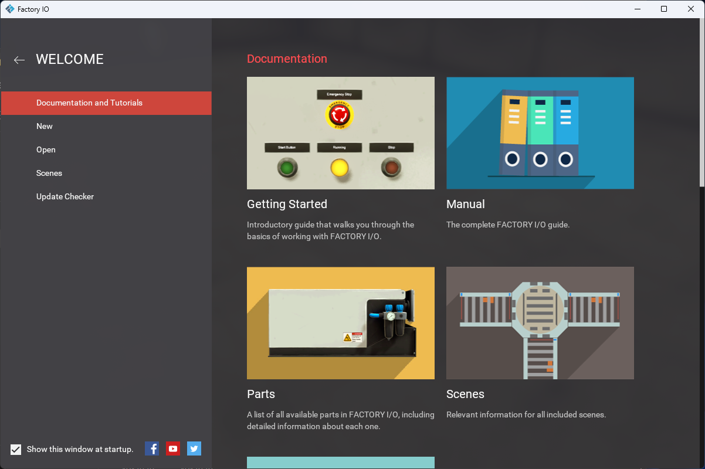

※ Windows10の方に導入予定だったが、スペック不足のため動作が不安定。今回は Windows11 を Experiment Network に接続した上で Factory I/O を導入する。

#### Scene の作成
[Virtual Industrial Cybersecurity Lab – Part 3: Simulating the Physical Process with Factory IO](https://rodrigocantera.com/en/virtual-industrial-cybersecurity-lab-part-3-simulating-the-physical-process-with-factory-io/) を参考に scene を作成する。

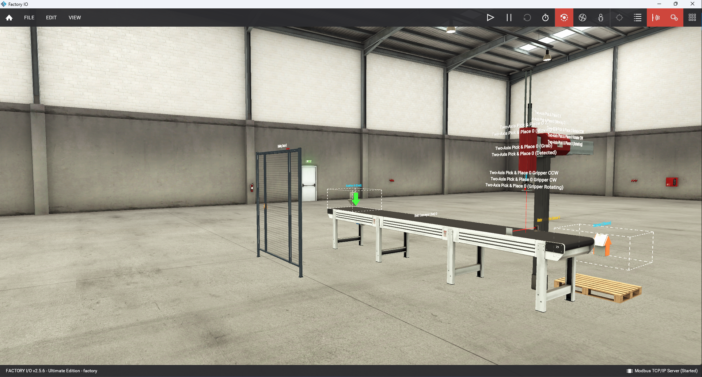

#### Driver の設定
F4 でメニューを表示し、Modbus TCP/IP Server を設定する。Configuration で以下のように設定する。

- Server
  - Network Adapter: PLC と接続可能なIPアドレスを付与したアダプタ
  - Host: Network Adapter を選択すると自動的に設定される
  - Port: 502 (Default)
  - Slave ID: 任意
- I/O Config: default
- I/O Points: 今回は以下のように設定

||Offset|Count|
|---|---|---|
|Digital Inputs|0|5|
|Digital Outputs|0|5|
|Register Inputs|0|0|
|Register Outputs|0|0|

また、Sensors と Actuators を以下のように設定する。

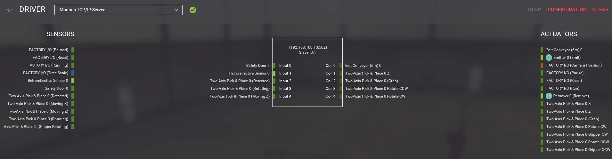

#### OpenPLC との接続
OpenPLC で、Slave Device を設定する。

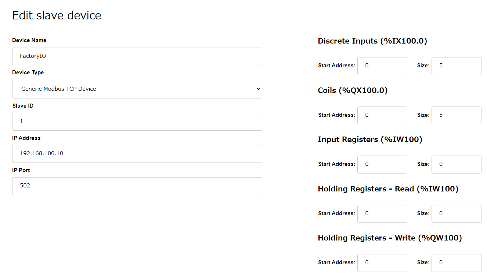

## PLC のロジックの設計
### OpenPLC Editor のダウンロード
[ダウンロードサイト](https://autonomylogic.com/download) からダウンロードする。今回は、Home Network 上の My Machine にダウンロードする。

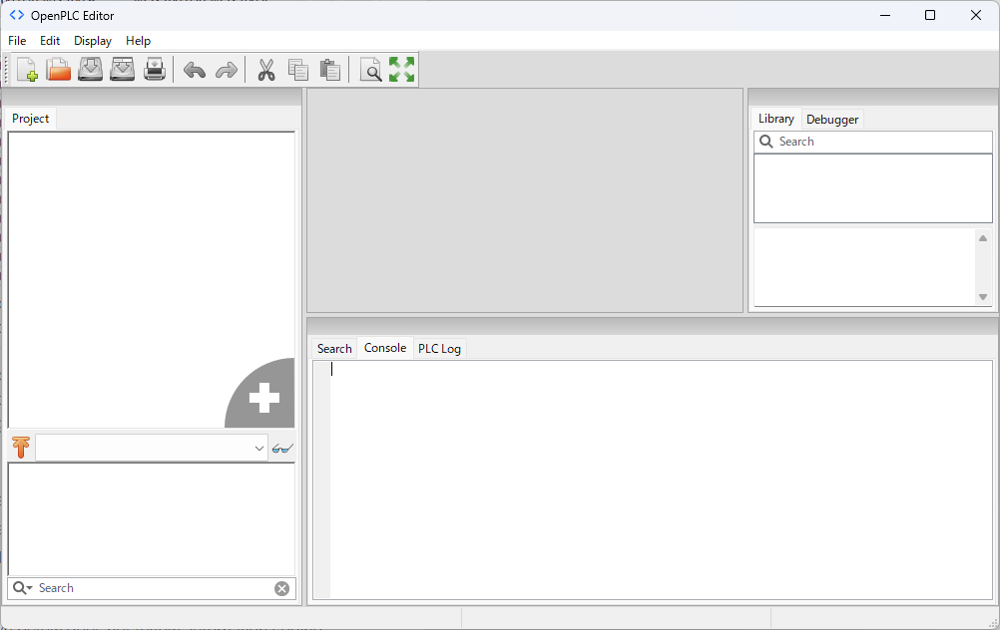

### サンプルプログラムの作成
[Virtual Industrial Cybersecurity Lab – Part 4: Programming the Control Logic](https://rodrigocantera.com/en/virtual-industrial-cybersecurity-lab-part-4-program-the-control-logic/) をベースにサンプルプログラムを作成する。

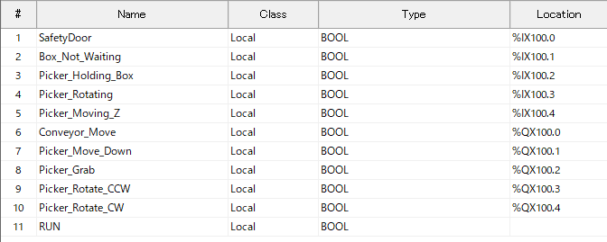

上図のように、11個の変数を用意し、以下のラダーロジックを作成する。

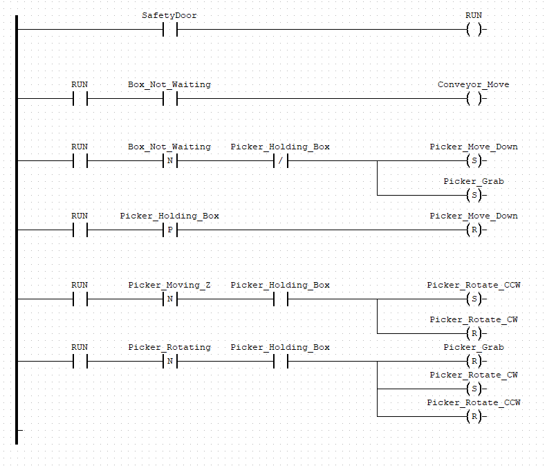

このラダープログラムをビルドし、OpenPLC Program (`*.st`) を作成する。作成したプログラムを OpenPLC にアップロードする。

## 動作確認
以下の手順で動作確認する。

- Factory I/O で Play ボタンを押す
- OpenPLC で PLC を Start する
- OpenPLC の Monitoring タブを見る

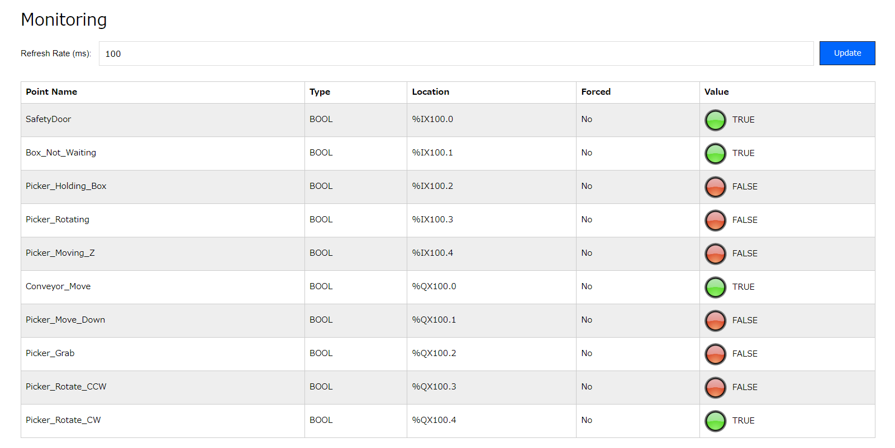

実際に動いている様子をキャプチャしたものを以下に示す。

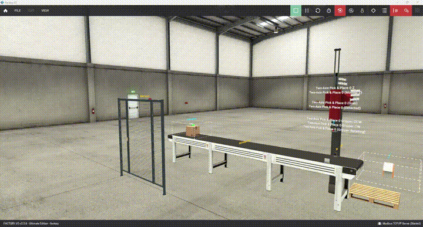

---

[Application](../README.md)
