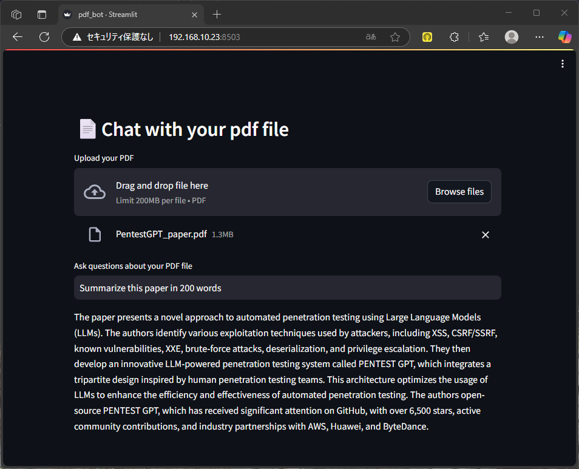

# genai-stack

[docker / genai-stack](https://github.com/docker/genai-stack) を用いた環境構築について整理する。

## 構成
Ollama server と genai-stack を立ち上げるホストを分ける。

- Ollama server (Windows 11)
- genai-stack (xUbuntu 24)

### Ollama server
[Download Ollama](https://ollama.com/download/windows) からダウンロード。

[🌐 【Windows】Ollamaをローカルネットワークからアクセス可能にする方法（環境変数GUI & CORS設定版）](https://qiita.com/FumiyaHr/items/43d27268633cd48cdca9) を参照し、以下のように環境変数を追加。

```
OLLAMA_HOST: 0.0.0.0
```

上記のように環境変数を設定する理由は、デフォルトでは Ollama Server にはローカルホスト以外のアクセスが許可されていないため。

### genai-stack
`.env` を作成し、`Ollama` 部分を以下のように編集。

```
OLLAMA_BASE_URL=http://#{YOUR OLLAMA SERVER'S IP}:11434
```

## 動作確認
genai-stack を立ち上げたホストにアクセスし、pdf 要約のタスクを依頼する。



問題なく動作した。

---

[llm](../README.md)
