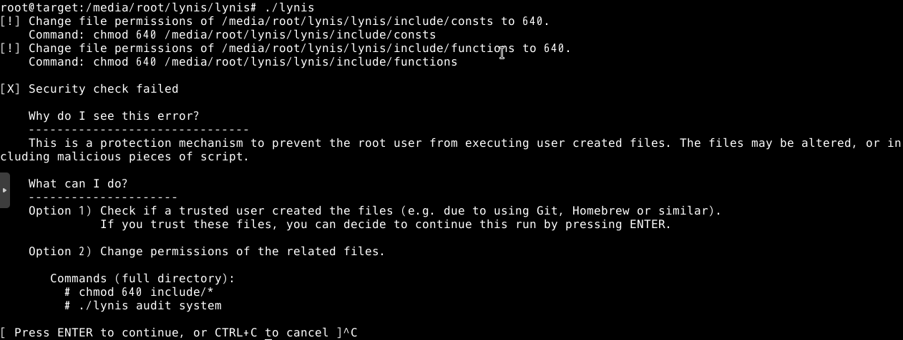
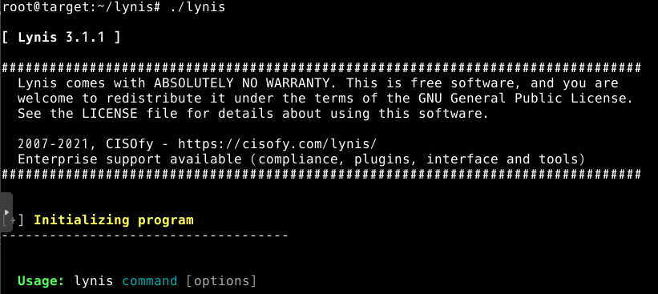

# Lynis
ハードニングツールの [`lynis`](https://github.com/CISOfy/lynis) を試す。

## ハードディスクの作成
今回は、VMが認識可能なハードディスクに lynis をインストールする。

[Clonezilla](../../Usage/p2v/clonezilla/) でとった方法と同じ方法で Hard Disk を作成する。

### lynis のダウンロード
```
$ wget https://downloads.cisofy.com/lynis/lynis-3.1.1.tar.gz
```

### ハードディスクへのコピー
ハードディスクは NTFS で初期化する。lynis 内にはシンボリックリンクがあるが、FAT32 ではシンボリックリンクができないためである (参考：[FAT32 では シンボリックリンク (symbolic link) が作れない](https://zondeel.hateblo.jp/entry/2014/10/07/031115))。

```
$ cp lynis-3.1.1.tar.gz /media/<user>/<mount point>
$ cd /media/<user>/<mount point>
$ tar -zxvf lynis-3.1.1.tar.gz
```

解凍後、ハードディスクをアンマウントし、Web UI で detach する。

## 使いたいVMへのインポート
次に、lynis を使いたい VM にハードディスクを追加する。

```
# qm importdisk <vmid> <path of qcow2 file> <storage> -format qcow2
```

インポート後、Web UI で Hardware > Unused disk を選択 > Add でハードディスクを追加する。

## 動作確認
ここでは、Hard Disk にインストールした lynis を起動できるかを確認する。ここでは、root でログインし、Hard Disk をマウントする。



起動をすることは確認できたが、ファイルのパーミッションを変えるように言われている。以下コマンドを実行する。

```
# chmod 640 include/*
```

このコマンドを実行しても `include/` 以下のパーミッションは変わらない (マウントしていることが原因)。

次に、一旦ファイルをローカルにコピーして実行できるか確認する。

```
# cp /media/<user>/<mount point>/lynis-3.1.1.tar.gz ./
# tar -zxvf lynis-3.1.1.tar.gz
# cd lynis
# ./lynis
```

問題なく起動することが確認できた。



---

[Application](../README.md)
