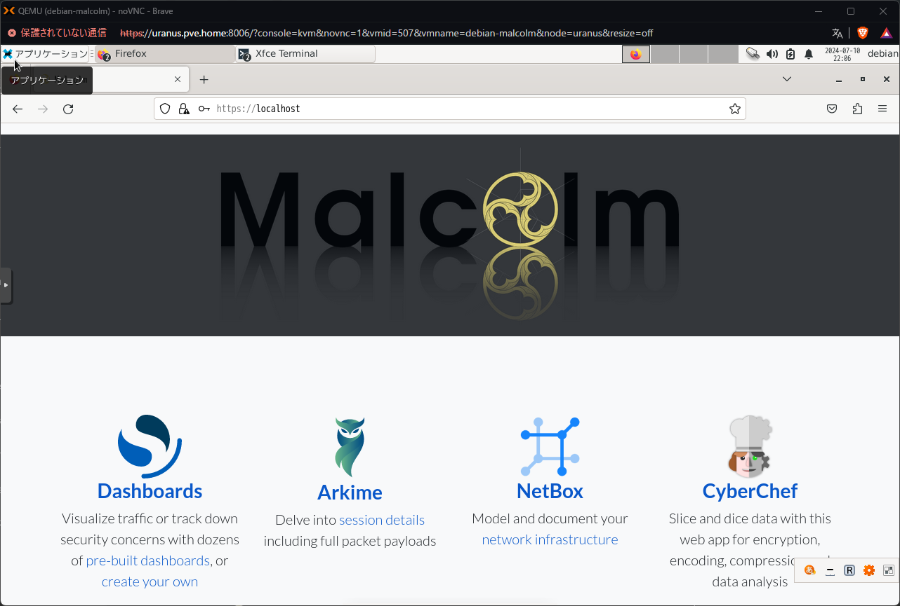

# Malcolm
[Malcolm](https://github.com/cisagov/Malcolm) を検証環境に導入する方法をまとめる。

- [Malcolm](#malcolm)
  - [参考](#参考)
  - [概要](#概要)
  - [インストール](#インストール)
  - [起動](#起動)
      - [NAPT 設定](#napt-設定)

## 参考
- [OT IDS比較検証：OSSのMalcolmと有償のNOZOMI Guardian - 1.Malcolm編 -](https://io.cyberdefense.jp/entry/ot_ids_malcolm/)

## 概要
- ネットワークトラフィックの分析のためのツール群
- Docker でインストール可能だが、[Installer ISO](https://github.com/cisagov/Malcolm/blob/main/docs/malcolm-iso.md) も提供している
- [最小要件](https://github.com/cisagov/Malcolm/blob/main/docs/system-requirements.md#SystemRequirements)は、8 CPU cores + 16 GB RAM

## インストール
[Installation example using Ubuntu 22.04 LTS](https://github.com/cisagov/Malcolm/blob/main/docs/ubuntu-install-example.md) を参考にインストールする。

```
# git clone https://github.com/cisagov/Malcolm.git /opt/Malcolm
# cd /opt/Malcolm
# ./script/install.py
```

基本はデフォルト。OT/ICS 関係の質問と、Pull Malcolm Docker images は Yes にする。

## 起動
`script/start` を実行する。一旦 `/opt/Malcolm` の所有者を `debian` (root 以外のユーザ) に変更する。

```
# chown -R debian:debian /opt/Malcolm
$ ./script/start
```

起動後、`http[s]://localhost` にアクセスすると以下のような画面が表示される。



RAM 16GB でもかなり重いので、32GB程度割り当てるのが良いと考えられる。

#### NAPT 設定
Home Network 上の機器からアクセスできるように、OPNsense で NAPT の設定をする。OPNsense の Firewall > NAT > Port Forward でルールを追加する。

- Interface: WAN
- TCP/IP Version
- Protocol: TCP
- Source: WAN net
- Source port range
  - from: any
  - to: any
- Destination: WAN address
- Destination port range
  - from: (other) `10443`
  - to: (other) `10443`
- Redirect target IP: Single host or Network `192.168.50.65`
- Ridirect target port: `HTTPS`
- Pool Options: Default
- Log: Log packets that are handled by this rule
- Description: Malcolm
- NAT reflection: Enable
- Filter rule association: Add associated filter rule

上記ルールを適用すると、Home Network から `http[s]://<opnsenseのアドレス>:10443` でアクセス可能。

かなり重くて動作が不安定になったので自宅環境への導入は保留。

---

[Application](../README.md)
