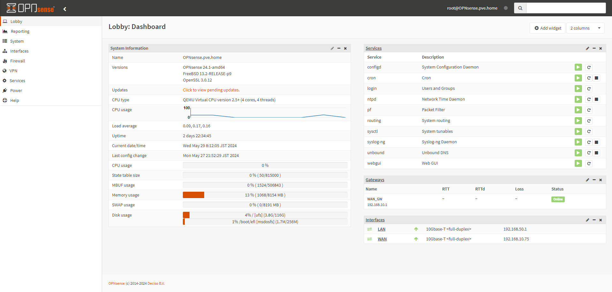

# OPNsense
実験線構築のために、OPNsense を導入する。

## 参考
- [FreeBSDベースのファイアウォールOS「OPNsense」（インストール編）](https://knowledge.sakura.ad.jp/16674/)

## インストール
基本的にはインストーラの指示に従う。

- DVDマウント
- root で入ってインターフェースのIPアドレスを設定する
- installer で入ってインストールする

という手順でインストールする。

インストール後は以下のようなGUIから操作可能。

## トラブルシューティング
デフォルト設定ではWAN側から入れない。これは、Default Deny となっているため。以下ルールを追加するとWAN側からも入れる。

- Action: Pass
- Interface: WAN
- Direction: in
- TCP/IP Version: IPv4
- Protocol: TCP
- Source: WAN net
- Destination: WAN address
- Destination port range: from HTTPS to HTTPS
- Gateway: default

---

[Application](../README.md)
