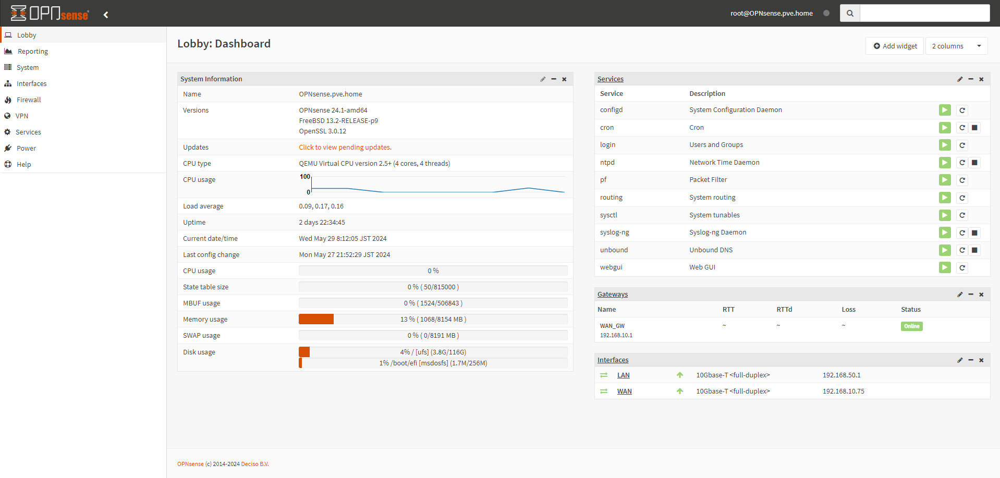

# OPNsense
実験線構築のために、OPNsense を導入する。

- [OPNsense](#opnsense)
  - [参考](#参考)
  - [インストール](#インストール)
  - [設定](#設定)
  - [トラブルシューティング](#トラブルシューティング)
  - [環境構築例](#環境構築例)

## 参考
- [FreeBSDベースのファイアウォールOS「OPNsense」（インストール編）](https://knowledge.sakura.ad.jp/16674/)

## インストール
基本的にはインストーラの指示に従う。

- DVDマウント
- root で入ってインターフェースのIPアドレスを設定する
- installer で入ってインストールする

という手順でインストールする。

インストール後は以下のようなGUIから操作可能。

## 設定
[OPNsense の設定](settings/) に記載。

## トラブルシューティング
[OPNsense のトラブルシューティング](troubleshoot/) に記載。

## 環境構築例
[OPNsense を用いた環境構築例](example/) に記載。

---

- [Application](../README.md)
- [OPNsense の設定](settings/)
- [OPNsense のトラブルシューティング](troubleshoot/)
- [OPNsense を用いた環境構築例](example/)
