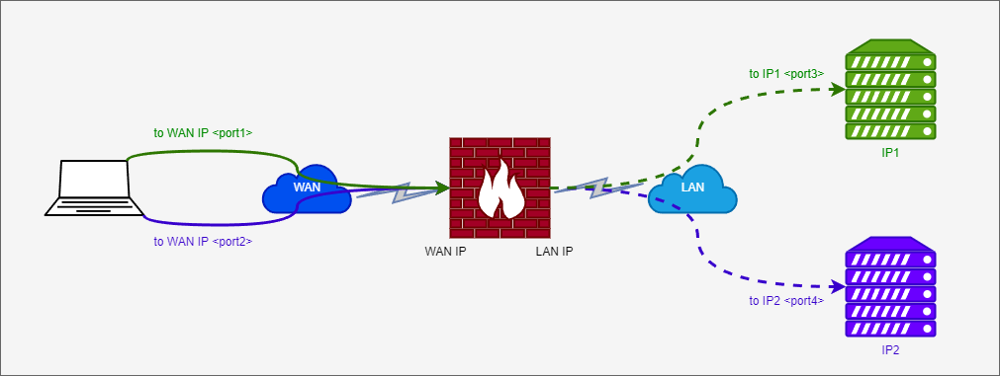
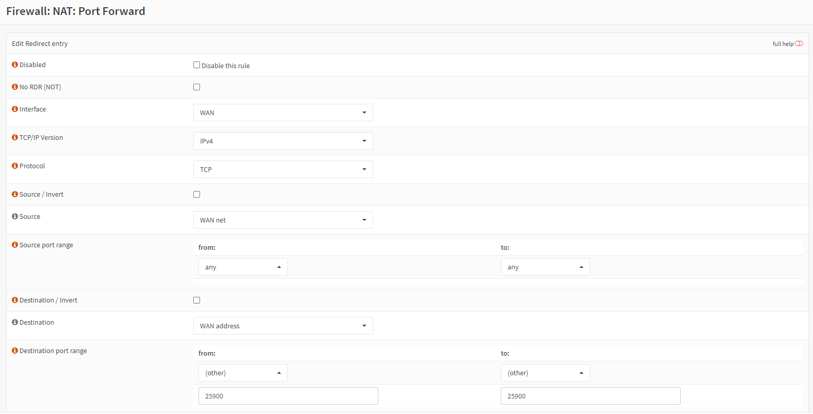
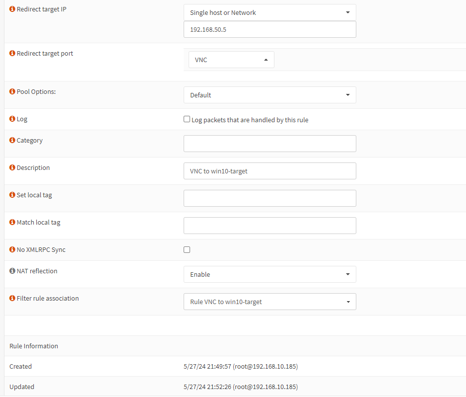

# OPNsense の設定
自宅環境における OPNsense の設定についてまとめる。

- [OPNsense の設定](#opnsense-の設定)
  - [NAPT](#napt)
    - [参考](#参考)
    - [方法](#方法)
    - [実際に行った設定](#実際に行った設定)
  - [Outbound NAT](#outbound-nat)
    - [参考](#参考-1)

## NAPT
WAN 側の機器から LAN 側の機器に接続するために NAPT を使う。

### 参考
- [How to Configure Port Forwarding For SSH and RDP Services on Custom Ports](https://www.zenarmor.com/docs/network-security-tutorials/how-to-configure-opnsense-nat#how-to-configure-port-forwarding-for-ssh-and-rdp-services-on-custom-ports)

### 方法

OPNsense の Firewall > NAT > Port Forward でルールを追加する。

- Interface: WAN
- TCP/IP Version
- Protocol: TCP
- Source: WAN net
- Source port range
  - from: any
  - to: any
- Destination: WAN address
- Destination port range
  - from: (other) `<WAN port>`
  - to: (other) `<WAN port>`
- Redirect target IP: Single host or Network `<LAN IP>`
- Ridirect target port: `<LAN port>`
- Pool Options: Default
- Description: `<Description>`
- NAT reflection: Enable
- Filter rule association: Add associated filter rule

### 実際に行った設定
- [VNC](../../vnc/README.md)
  - Home Network から Lab Network にある VNC サーバに接続する
- [Caldera](../../Caldera/README.md)
  - Home Network から Lab Network にある Caldera サーバに接続する

## Outbound NAT
### 参考
- [Outbound NAT For Accessing a Remote Service Via Specific External IP Address](https://www.zenarmor.com/docs/network-security-tutorials/how-to-configure-opnsense-nat#outbound-nat-for-accessing-a-remote-service-via-specific-external-ip-address)

---

[OPNsense](../README.md)
