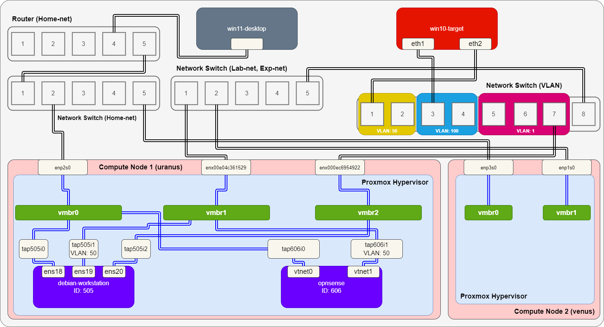
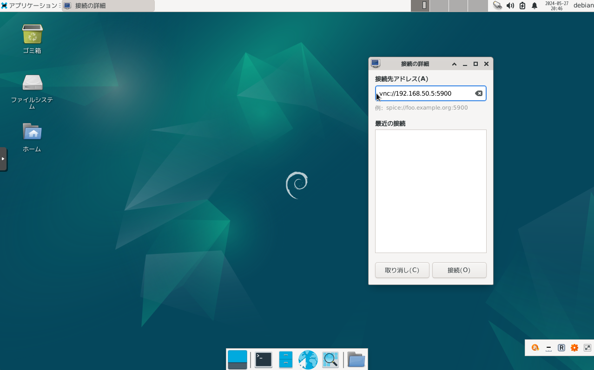
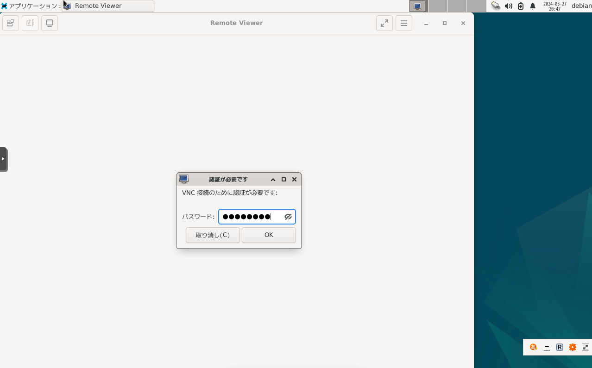
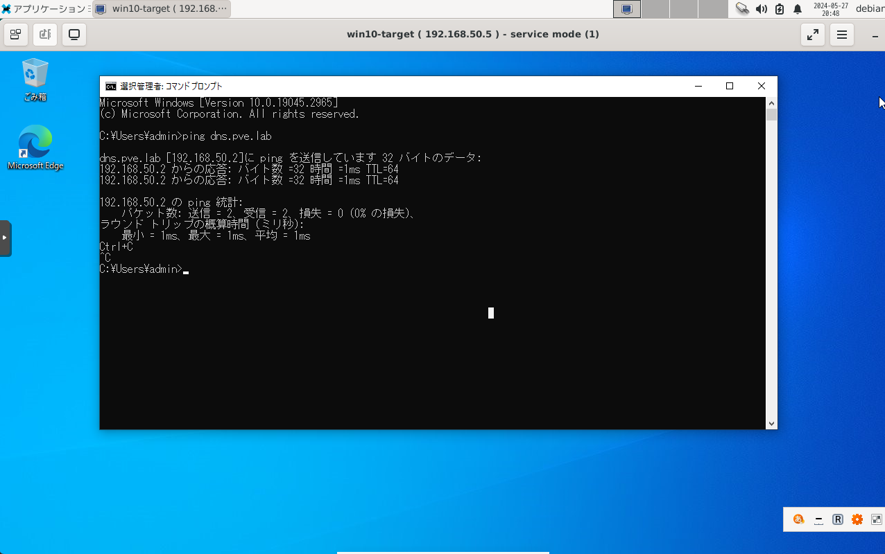
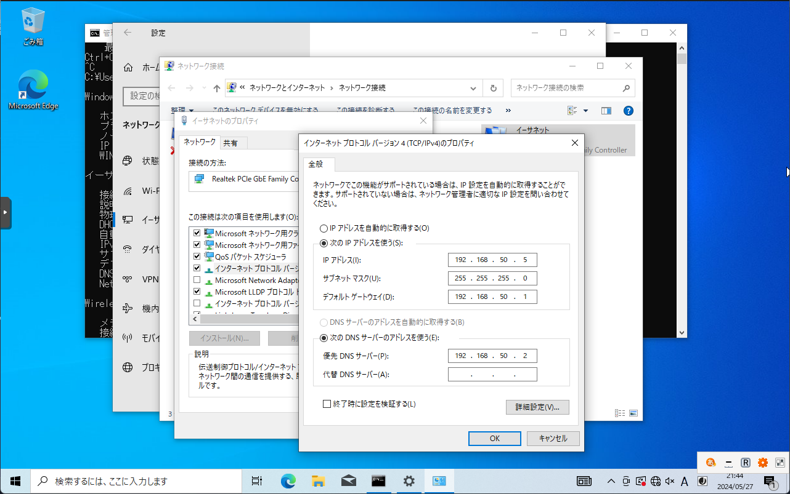
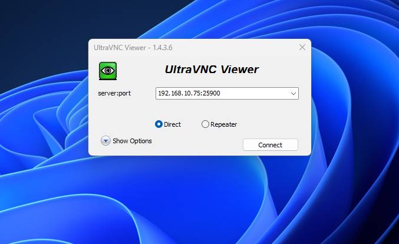
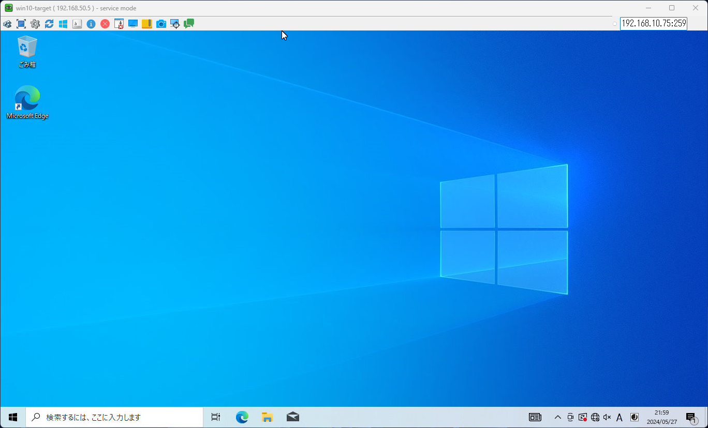

# VNC
Windows に VNC サーバを導入し、リモートから操作可能にする。

- [VNC](#vnc)
  - [参考](#参考)
  - [検証環境](#検証環境)
  - [VNC サーバ](#vnc-サーバ)
    - [インストール](#インストール)
    - [設定](#設定)
  - [VNC クライアント](#vnc-クライアント)
    - [インストール](#インストール-1)
    - [接続](#接続)
  - [OPNsense を使って自宅ネットワークからアクセスできるように設定](#opnsense-を使って自宅ネットワークからアクセスできるように設定)
    - [テスト](#テスト)


## 参考
- [ネットワーク経由でWindows 10 / 11を操作する（VNC編）](https://pcmanabu.com/windows-10-vnc/)
- [KVM : VNC クライアント : Debian](https://www.server-world.info/query?os=Debian_12&p=kvm&f=7)

## 検証環境
今回は、以下検証環境を構築した。



ただし、図中の Home-net はインターネット接続可能なネットワークで、Lab-net, Exp-net は実験用に構築した内部ネットワークである。

`win11-desktop` は、普段使いしているデスクトップPC (物理機器) である。

`win10-target` は物理機器で、実験線用の Network Switch で、VLAN 50 (Lab-net) と VLAN 100 (Exp-net) のポートに接続している。各機器の NIC と IP アドレスの対応を以下に示す。

|機器|NIC|IPアドレス|
|---|---|---|
|`win10-target`|`eth1`|`192.168.100.5/24`|
|`win10-target`|`eth2`|`192.168.50.5/24`|
|`debian-workstation`|`ens18`|`192.168.10.85/24`|
|`debian-workstation`|`ens19`|`192.168.50.85/24`|
|`debian-workstation`|`ens20`|`192.168.75.85/24`|
|`opnsense`|`vtnet0`|`192.168.10.75/24`|
|`opnsense`|`vtnet1`|`192.168.50.1/24`|


## VNC サーバ
### インストール
[UltraVNC](https://forest.watch.impress.co.jp/library/software/ultravnc/) をダウンロードする。

インストールウィザードの通りにインストールする。UltraVNC Server にチェックを入れる。

### 設定
UltraVNC Server を右クリックして Admin Properties を開く。パスワードに任意の文字列を指定して OK。

## VNC クライアント
### インストール
```
# apt update
# apt install virt-viewer
```

### 接続
Remote Viewer を起動し、以下アドレスで接続。

`vnc://<VNCサーバのアドレス>:5900`



パスワードが要求されるのでパスワードを入力する。



認証に成功すると接続できる。



## OPNsense を使って自宅ネットワークからアクセスできるように設定
今回、`win10-target` は直接 Home-net に接続せず、Lab-net での実験用に使うのを想定しているが、Home-net の機器からもリモートで接続可能にしたい。そこで、[Caldera](../Caldera/README.md) でしたのと同様に OPNsense で Port Forward 設定をする。

まず、`win10-target` で IP アドレスを固定する際にデフォルトゲートウェイを OPNsense の Lab-net 側にする。



次に、OPNsense の Firewall > NAT > Port Forward でルールを追加する。今回は、以下のようにルールを設定する。

- Interface: WAN
- TCP/IP Version
- Protocol: TCP
- Source: WAN net
- Source port range
  - from: any
  - to: any
- Destination: WAN address
- Destination port range
  - from: (other) 28888
  - to: (other) 28888
- Redirect target IP: Single host or Network 192.168.50.5
- Ridirect target port: VNC to win10-target
- Pool Options: Default
- Description: Caldera
- NAT reflection: Enable
- Filter rule association: Add associated filter rule

### テスト
上記のように設定後、Home-net に接続している `win11-desktop` で接続テストを実施する。UltraVNC Viewer をインストールした。

UltraVNC Viewer で、`<OPNsense の IPアドレス>:<転送先ポート>` として接続する。



パスワードを入力すると接続できる。




---

[Application](../README.md)
