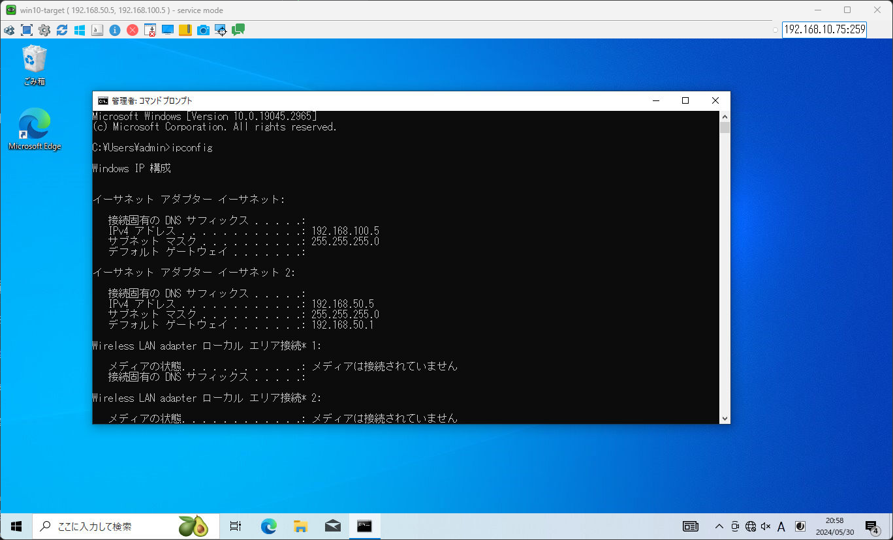

# 設計思想
検証環境の設計思想について。

## 全体像
### 論理構成
検証環境では、以下の3つのネットワークを用いる。

- Home-net: 自宅内LAN (外部接続可能)
- Lab-net: 実験線管理用 LAN (VLAN 50)
- Exp-net: 実験用 LAN (VLAN 100)

主要な部分の論理構成を以下に示す。

|マシン|P/V|概要|
|---|---|---|
|win11-desktop|P|普段使いしているデスクトップPC|
|NAS|P|Proxmoxのストレージ用のNAS|
|GitLab|V|[GitLab サーバ](../Application/GitLab/README.md)|
|Firewall|V|ファイアウォール用の VM ([OPNsense](../Application/opnsense/README.md))|
|DNS|V|[DNSサーバ](../Application/DNS/README.md)|
|IDS|V|実験用LAN 監視用の NIDS ([Suricata](../Application/Suricata/README.md))|
|Elasticsearch|V|ログ集約用のマシン ([Elasticsearch](../Application/Elasticsearch/README.md))|
|Caldera Server|V|攻撃用マシン ([Caldera](../Application/Caldera/README.md))|
|win10-target|P|攻撃対象マシン (Windows 10)|
|debian-target|V|攻撃対象マシン (Debian 11)|

ここで、IDS と Elasticsearch を Home-net に接続しているのは、NAS 上の NFS 共有のフォルダにアクセスするため (ログを NAS 上に保存するため) である。

### ポイント
本検証環境のポイントを以下に示す。

- ポイント(1): Home-net と直接接続していないマシンに対して Home-net からのアクセスを可能にする
  - Firewall の NAPT によって実現 ([Caldera](../Application/Caldera/README.md), [Windows10](../Application/vnc/README.md))
- ポイント(2): 実験で用いる機器のログを集約する
  - [Elasticsearch + Elastic Agent](../Application/Elasticsearch/README.md) によって実現
- ポイント(3): 実験時のネットワークトラフィックを IDS に集約する
  - ポートミラーリング ([Proxmox側](../Usage/port-mirror/README.md)、[ネットワークスイッチ側](../Usage/Switch/README.md)) によって実現

#### ポイント(1)
直接 Home-net に接続していない win10-target に対して VNC 接続可能にするため、Firewall で NAPT の設定をしている。具体的な設定は [VNC](../Application/vnc/README.md) に記載している。

#### ポイント(2)
実験線に接続した機器のログを Elasticsearch に集約するように設定した。実験中に発生したログを一元管理するのが目的である。

#### ポイント(3)
Exp-net (VLAN 100) に接続したホスト間の通信を IDS でキャプチャ可能にした。VM間の通信も物理機器とVMの間の通信もキャプチャ可能にしたのがポイントである。

### 物理構成
次に、上記ポイントを実現するための実験線の物理構成を述べる。

この構成および実施した設定のポイントを以下に示す。

- 攻撃者マシンを Node2 に集約
- Node1 の vmbr1 (OVS Bridge) でポートミラーリング設定をすることで、Node1 の VM の VLAN100 の通信 (送信元、送信先) を `tap506i1` に転送するように設定
  - Node1 内のホストを送信元、送信先とする VLAN100 の通信を Suricata の `ens19` でキャプチャ可能
- VLAN 設定可能なネットワークスイッチ内でポート3からポート7にミラーリングするように設定
  - win10-target の VLAN100 の通信を Node1 の物理 NIC でキャプチャ可能
- Node2 の vmbr2 (OVS Bridge) でポートミラーリング設定をすることで、物理NIC で受け取った「ネットワークスイッチのポート7にミラーリングされた通信」(= win10-target の VLAN100 の通信) を `tap506i3` に転送するように設定
  - win10-target を送信元、送信先とする VLAN100 の通信を Suricata の `ens21` でキャプチャ可能

つまり、この構成および設定にすることで上記のポイント(3)を実現している。

---

[Home](../README.md)
