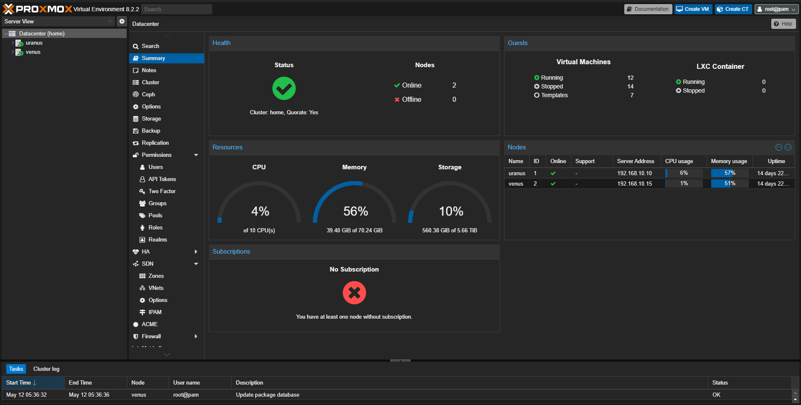

# Environment
自宅に構築した検証用環境について。

## 概要
自宅の検証用環境は [Proxmox](https://www.proxmox.com/en/) で構築している。

2024/8時点では、3台のホストでクラスタを構成している。

## リンク
- [免責事項](policy/)
- [設計思想](Philosophy/)
- [利用方法](Usage/)
- [アプリケーション](Application/)
- [全体像](overview/)
- [リモートからの接続](remote/)
