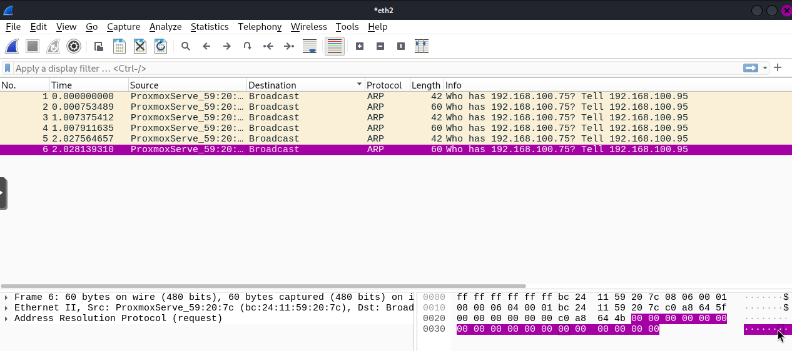

# ネットワークのトラブルシューティング

## 実験線トラブルシューティング (2024/10/13)
### 事象
- VLAN 50 は別のホストにも疎通可能だが、VLAN 100 は不可
  - VLAN 100 は、同一ホスト内では疎通可能

### 状況
ほかのホストに ping を送ろうとすると、ARP Request が送られるが受信はできない。

疎通できるもの (VLAN 50) では、ARP Request に対して ARP Reply が返ってくる。

### 解決策 (?)
VLAN を 100 から別の値に変更したところ疎通できた (原因不明)。

スイッチ側が悪影響していると予想。VLAN 100 を消して再起動して再設定したところ疎通確認できた。

---

[Top](../../README.md)
