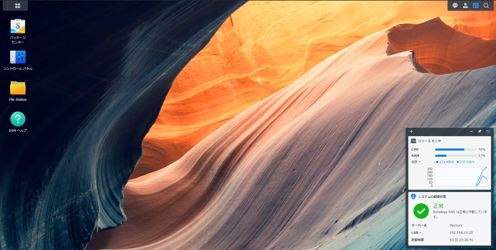
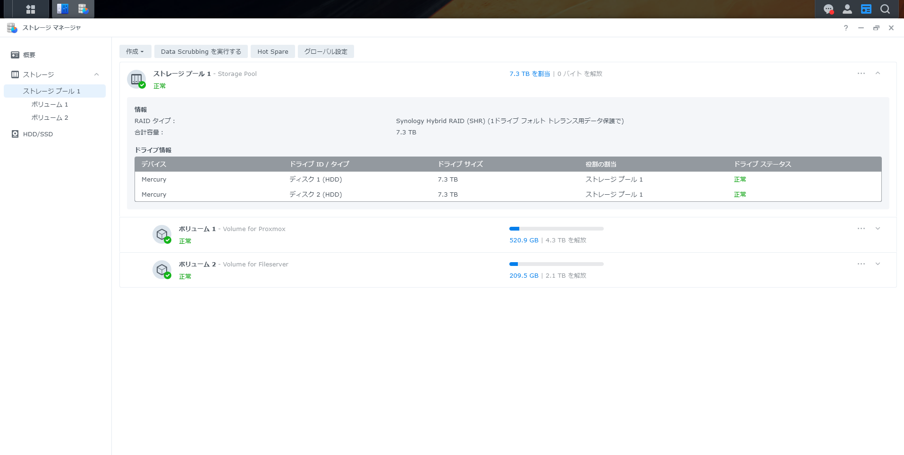
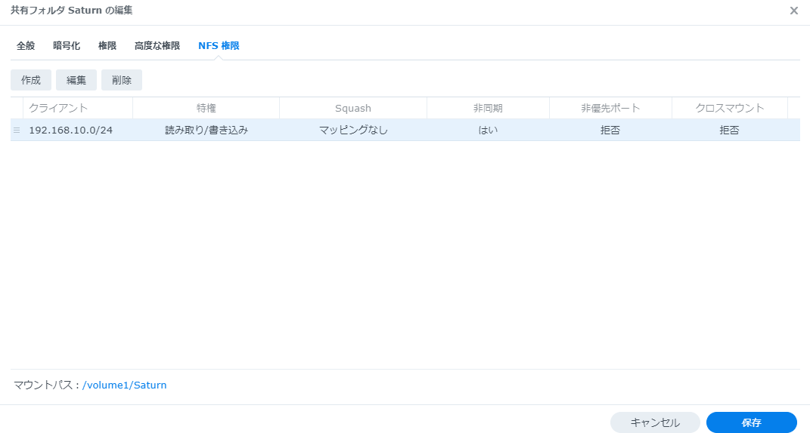
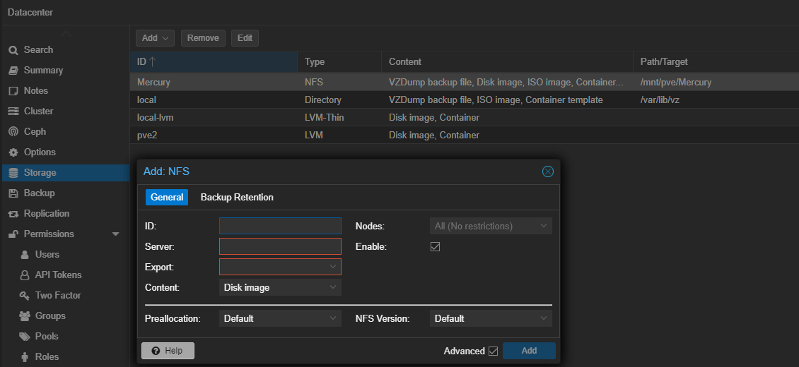
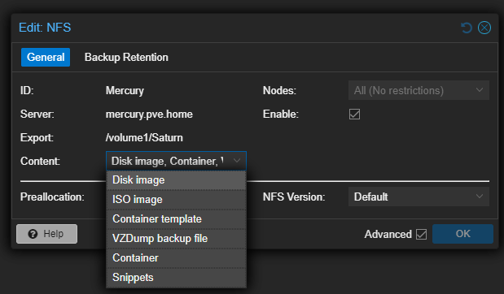

# NAS の導入
今回は、Synology の NAS で NFS 共有を用いる。



## ストレージの作成
### 手順
1. ストレージマネージャ > ストレージ でストレージプールを作成
2. ストレージプールの下にボリュームを作成



今回は、Proxmox のストレージ用とファイル保存用の2つのボリュームを作成した。

## 共有設定
作成したボリュームに対して共有設定をする。

### 手順

1. コントロールパネル > 共有フォルダ > 作成
   - 名前、説明、場所を指定
2. 作成した共有フォルダに対して NFS 権限を設定する
   - クライアントに対して、読み取り/書き込み権限を与える



## Proxmox 側でストレージとして使うための設定
### 手順
1. Datacenter > Storage > Add > NFS で NFS ストレージを追加する
   - ID, Server (IPアドレス/FQDN), Export (サーバの共有ディレクトリのパス) を指定
2. Edit で Content を編集





## VM で NFS をマウントするための方法
### 参考
- [ローカル ネットワーク (NFS) 内の Synology NAS のファイルにアクセスする方法](https://kb.synology.com/ja-jp/DSM/tutorial/How_to_access_files_on_Synology_NAS_within_the_local_network_NFS)
- [NFS : NFS クライアントの設定](https://www.server-world.info/query?os=Ubuntu_20.04&p=nfs&f=2)

### 手順

1. NFSクライアントをインストール
   ```
   # apt -y install nfs-common
   ```
2. 共有フォルダをマウントする
   ```
   # mount -t nfs <NASのアドレス (FQDN)>:<共有フォルダのマウントパス> /<NFSクライアント上のマウントポイント>
   ```
3. 起動時の自動マウント設定 > `/etc/fstab` の末尾に以下を追加
   ```
   <NASのアドレス (FQDN)>:<共有フォルダのマウントパス>   /<NFSクライアントのマウントポイント>   nfs defaults    0   0
   ```

---

[Usage](../README.md)
