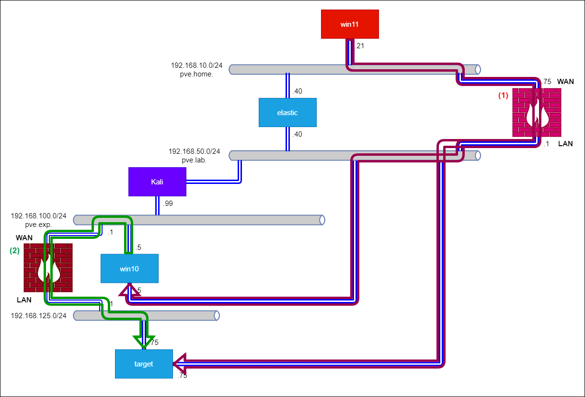
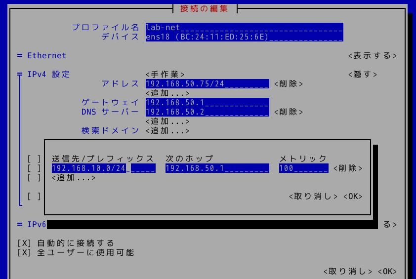

# NetworkManager での設定メモ
NetworkManager の設定で少し詰まったところをまとめる。

## 複数の NIC にそれぞれゲートウェイを設定してルーティング設定する
以下構成の環境を考える。



当該環境において、下記要件を満たすように FW の Port Forwarding の設定をしたとする。

- FW (1) で、Home Network (WAN) 上の機器 (例: win11) から Lab Network (LAN) 上の win10 および target に対して VNC および SSH でアクセス可能にする
- FW (2) で、Exp. Network (WAN) 上の win10 から 192.168.125.0/24 (LAN) 上の target に対して HTTP でアクセス可能にする
- FW (1) および (2) では、LAN から WAN への通信は許可される

このとき、win10 および target ではGWの設定を複数行う必要がある。特に、NetworkManager で設定する場合に GW の設定を複数個行う場合を想定して、設定方法をまとめる。

### 方法
- `nmtui` コマンドを実行 > 接続の編集で該当するプロフィールを選択
- IPv4 設定 > ルーティング > 編集 で以下のように編集
  - 送信先/プレフィックス: WAN 側のネットワークアドレス
  - 次のホップ: FW のネットワークアドレス
  - メトリック: 任意

例えば、FW (1) の LAN 側の NIC では以下のように設定している。



FW (2) の LAN 側の NIC についても同様に設定する。

この状態ではルーティングテーブルの状態は以下。

```
$ ip route
default via 192.168.50.1 dev ens18 proto static metric 100
default via 192.168.125.1 dev ens20 proto static metric 101
192.168.10.0/24 via 192.168.50.1 dev ens18 proto static metric 100
192.168.50.0/24 dev ens18 proto kernel scope link src 192.168.50.75 metric 100
192.168.100.0/24 via 192.168.125.1 dev ens20 proto static metric 200
192.168.125.0/24 dev ens20 proto kernel scope link src 192.168.125.75 metric 101
```

### 確認
以下項目を確認する。

- (1) target から Home Network 上の機器への疎通 (FW (1) の設定 + Lab Network 側のルーティング設定)
- (2) target から Exp. Network 上の機器への疎通 (FW (2) の設定 + 192.168.125.0/24 ネットワーク側のルーティング設定)

#### 項目 (1)
疎通確認できた。

```
$ ping -c 3 192.168.10.40
PING 192.168.10.40 (192.168.10.40) 56(84) bytes of data.
64 bytes from 192.168.10.40: icmp_seq=1 ttl=64 time=0.760 ms
64 bytes from 192.168.10.40: icmp_seq=2 ttl=64 time=0.925 ms
64 bytes from 192.168.10.40: icmp_seq=3 ttl=64 time=0.834 ms

--- 192.168.10.40 ping statistics ---
3 packets transmitted, 3 received, 0% packet loss, time 2034ms
rtt min/avg/max/mdev = 0.760/0.839/0.925/0.067 ms
```

経路確認すると、FW (1) を経由して elastic と疎通していることが分かる。

```
$ traceroute 192.168.10.40
traceroute to 192.168.10.40 (192.168.10.40), 30 hops max, 60 byte packets
 1  opnsense.pve.lab (192.168.50.1)  1.222 ms  1.194 ms  1.178 ms
 2  elastic.pve.home (192.168.10.40)  0.811 ms  0.857 ms  0.845 ms
```

#### 項目 (2)
疎通確認できた。

```
$ ping -c 3 192.168.100.99
PING 192.168.100.99 (192.168.100.99) 56(84) bytes of data.
64 bytes from 192.168.100.99: icmp_seq=1 ttl=63 time=1.63 ms
64 bytes from 192.168.100.99: icmp_seq=2 ttl=63 time=1.77 ms
64 bytes from 192.168.100.99: icmp_seq=3 ttl=63 time=1.93 ms

--- 192.168.100.99 ping statistics ---
3 packets transmitted, 3 received, 0% packet loss, time 2002ms
rtt min/avg/max/mdev = 1.634/1.776/1.930/0.121 ms
```

経路確認すると、FW (2) を経由して kali と疎通していることが分かる。

```
$ traceroute 192.168.100.99
traceroute to 192.168.100.99 (192.168.100.99), 30 hops max, 60 byte packets
 1  192.168.125.1 (192.168.125.1)  0.395 ms  0.348 ms  0.334 ms
 2  192.168.100.99 (192.168.100.99)  1.462 ms  1.452 ms  1.445 ms
```


---

[Usage](../README.md)
