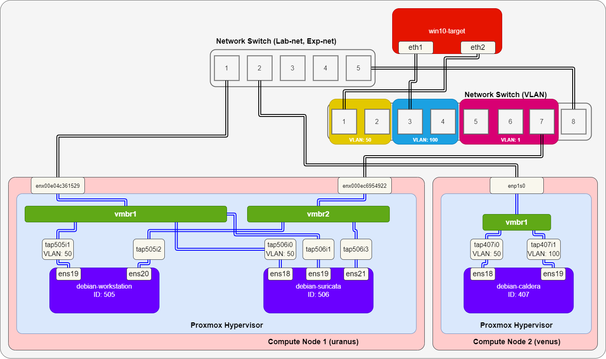

# スイッチングハブ
実験線用にスイッチングハブを設定する。

VLAN 対応のネットワークスイッチとして、[NETGEAR ギガビット (GS108E)](https://www.netgear.com/jp/business/wired/switches/plus/gs108e/) を用いている。

## 参考
- [タグ VLAN を設定したスイッチ同士の接続](https://www.downloads.netgear.com/files/answer_media/jp/support/switch/VLAN_trunk_setting_ex.pdf)

## 構成
以下のような構成の実験線を実現する。



`win10-target` は物理機器で、実験線用の Network Switch で、VLAN 50 と VLAN 100 のポートに接続している。各機器の NIC と IP アドレスの対応を以下に示す。

|機器|NIC|IPアドレス|
|---|---|---|
|`win10-target`|`eth1`|`192.168.100.5/24`|
|`win10-target`|`eth2`|`192.168.50.5/24`|
|`debian-workstation`|`ens19`|`192.168.50.85/24`|
|`debian-workstation`|`ens20`|`192.168.75.85/24`|
|`debian-suricata`|`ens18`|`192.168.50.50/24`|
|`debian-suricata`|`ens19`|-|
|`debian-suricata`|`ens21`|-|
|`debian-caldera`|`ens18`|`192.168.50.80/24`|
|`debian-caldera`|`ens19`|`192.168.100.80/24`|

`debian-suricata` は [Suricata](../../Application/Suricata/README.md) でインストールした IDS で、`ens19` と `ens21` で通信をキャプチャするように、IPアドレスを割り当てない。

## Proxmox 側の設定
[VLANの設定](../VLAN/README.md) の Open vSwitch を使う方法で設定する。今回は、Compute Node 1 および Compute Node 2 の vmbr1 は OVS Bridge である。

## ネットワークスイッチ側の設定
IEEE 802.1Q のタグVLANを設定する。

上図のように、ポート8をトランクポート、ポート5～7を VLAN 1 (スイッチ管理用)、ポート3～4を VLAN 100 (実験用)、ポート1～2を VLAN 50 (実験線管理用) となるように設定する。

### VLAN作成
VLAN > 802.1Q > 拡張 > VLANポートメンバーで、VLAN ID を作成する。


### VLANメンバーシップ
各 VLAN に属するポート番号を指定する。今回は以下のように設定する。

- VLAN 1
  - ポート5～7をUに、ポート8をTに変更
  - VLAN 1 のメンバーポートからポート1～4を削除
- VLAN 50
  - ポート1～2をUに、ポート8をTに変更
- VLAN 100
  - ポート3～4をUに、ポート8をTに変更

ここで、U は VLAN タグなし (Untagged) で、T は VLAN タグあり (Tagged) を表す。トランクポートは T で、それ以外のポートは U とする。

### Port VLAN ID (PVID) の設定
PC などから VLAN タグが付与されない通信をスイッチが受信した場合に転送する VLAN ID を設定する。今回は以下のように設定する。


## ポートミラーリング (スイッチ側)
### ポートミラーリングの設定
今回は、スイッチングハブのポート3をポート7にミラーリングするように設定する。

システム > モニタリング > ミラーリング から、以下のように設定する。

- ミラーリング：有効
- ミラーリング先ポート：7
- ミラーリング元ポート：3


### ポートミラーリングのテスト (1)
#### 物理 NIC
まず、Proxmox Node の物理NICでキャプチャ可能か確認する。

```
# tcpdump -i enx000ec6954922 -v
tcpdump: listening on enx000ec6954922, link-type EN10MB (Ethernet), snapshot length 262144 bytes
20:54:11.898992 IP (tos 0x0, ttl 128, id 10359, offset 0, flags [none], proto ICMP (1), length 60)
    192.168.100.5 > 192.168.100.80: ICMP echo request, id 1, seq 56, length 40
20:54:11.900096 IP (tos 0x0, ttl 64, id 26368, offset 0, flags [none], proto ICMP (1), length 60)
    192.168.100.80 > 192.168.100.5: ICMP echo reply, id 1, seq 56, length 40
20:54:12.916858 IP (tos 0x0, ttl 128, id 10360, offset 0, flags [none], proto ICMP (1), length 60)
    192.168.100.5 > 192.168.100.80: ICMP echo request, id 1, seq 57, length 40
20:54:12.917349 IP (tos 0x0, ttl 64, id 26503, offset 0, flags [none], proto ICMP (1), length 60)
    192.168.100.80 > 192.168.100.5: ICMP echo reply, id 1, seq 57, length 40
20:54:13.941406 IP (tos 0x0, ttl 128, id 10361, offset 0, flags [none], proto ICMP (1), length 60)
    192.168.100.5 > 192.168.100.80: ICMP echo request, id 1, seq 58, length 40
20:54:13.942118 IP (tos 0x0, ttl 64, id 26550, offset 0, flags [none], proto ICMP (1), length 60)
    192.168.100.80 > 192.168.100.5: ICMP echo reply, id 1, seq 58, length 40
20:54:14.959618 IP (tos 0x0, ttl 128, id 10362, offset 0, flags [none], proto ICMP (1), length 60)
    192.168.100.5 > 192.168.100.80: ICMP echo request, id 1, seq 59, length 40
20:54:14.960386 IP (tos 0x0, ttl 64, id 26576, offset 0, flags [none], proto ICMP (1), length 60)
    192.168.100.80 > 192.168.100.5: ICMP echo reply, id 1, seq 59, length 40
20:54:16.509955 ARP, Ethernet (len 6), IPv4 (len 4), Request who-has 192.168.100.80 (bc:24:11:72:2d:b3 (oui Unknown)) tell 192.168.100.5, length 46
20:54:16.510484 ARP, Ethernet (len 6), IPv4 (len 4), Reply 192.168.100.80 is-at bc:24:11:72:2d:b3 (oui Unknown), length 46
20:54:16.937674 ARP, Ethernet (len 6), IPv4 (len 4), Request who-has 192.168.100.5 tell 192.168.100.80, length 46
20:54:16.937847 ARP, Ethernet (len 6), IPv4 (len 4), Reply 192.168.100.5 is-at 68:1d:ef:2b:3e:ca (oui Unknown), length 46
^C
12 packets captured
12 packets received by filter
0 packets dropped by kernel
```

物理 NIC では問題なくキャプチャできていることが確認される。

#### VM
次に、VM (`debian-suricata`) でキャプチャ可能か確認する。


VM では `win10-target` から `debian-caldera` への ICMP echo request しか受け取れていない。全くキャプチャできないこともある。物理 NIC で受け取ったパケットをすべて bridge に転送したいので、OVS Bridge 側でもポートミラーリング設定を行う。

## ポートミラーリング (OVS Bridge 側)
[ポートミラーリング設定](../port-mirror/README.md) で実施したのと同様に、`vmbr2` に対してポートミラーリング設定を行う。今回は以下のように設定する。

- 転送元ポート
  - 物理 NIC (`enx000ec6954922`)
- 転送先ポート
  - `tap506i3`

```
# ovs-vsctl -- set bridge vmbr2 \
> mirrors=@m -- \
> --id=@nic get Port enx000ec6954922 -- \
> --id=@ids get Port tap506i3 -- \
> --id=@m create Mirror name=switch-mirror \
> select-dst-port=@nic \
> select-src-port=@nic \
> output-port=@ids
aa637ff8-b46c-4804-adc4-21317f195309
```

### ポートミラーリングのテスト (2)
上記のようにミラーリング設定を行った後に、もう一度 VM 側でキャプチャ可能か確認する。


問題なくキャプチャされていることが確認された。

---

[Usage](../README.md)
