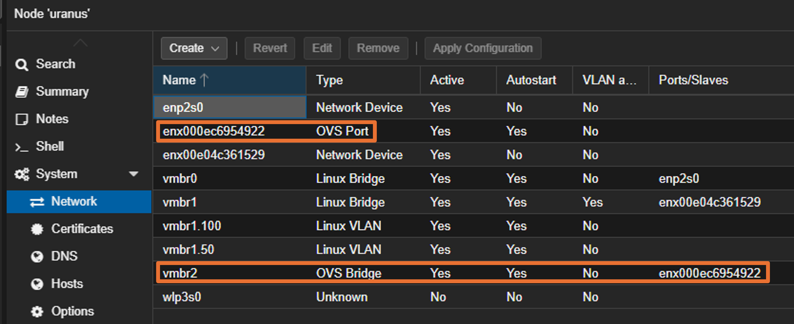
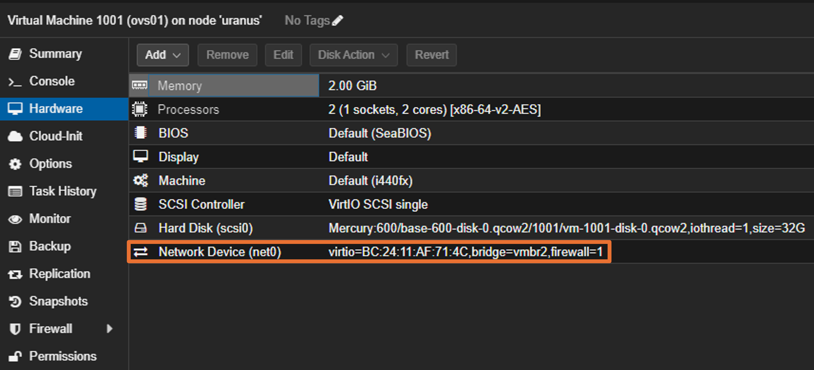
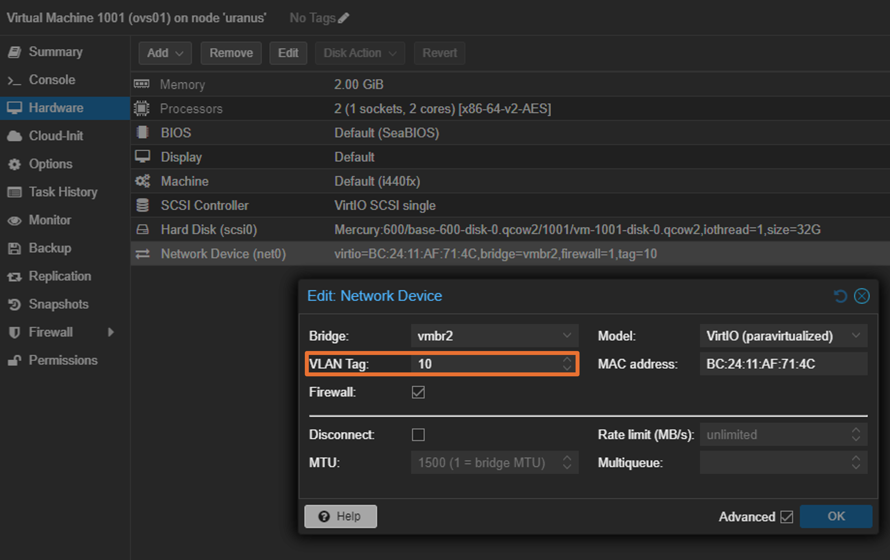

# VLANの設定
## Linux Bridge を使う
### 参考
[](https://www.youtube.com/watch?v=stQzK0p59Fc)

### 手順
1. トランクポートを設定する
   - Linux Bridge の VLAN aware にチェックを入れる
2. アクセスポートを作成する
   - Create: Linux VLAN で Name に `<bridge name>.<tag>` を設定する。このように作成すると、VLAN Raw Device が `<bridge name>` でVLANタグが `<tag>` の VLAN を作成できる


## Open vSwitch を使う
### 参考
- [Open vSwitch](https://pve.proxmox.com/wiki/Open_vSwitch)

### 手順
1. Open vSwitch のインストール
   ```
   # apt update
   # apt install openvswitch-switch
   ```
2. OVS Bridgeの作成
   - Network > Create から OVS Bridge を選択。Portに物理NICを割り当てる
   - VMには該当するBridgeを割り当てる
3. VLAN設定
   - 各VMの Network Device の VLAN Tag にタグを指定する








### 設定確認方法
設定の確認は、`ovs-vsctl` コマンドから行う。

```
# ovs-vsctl show
abb8ae84-ce2c-40d7-9ae2-7b618f57d543
    Bridge vmbr2
        Port fwln1001o0
            Interface fwln1001o0
                type: internal
        Port enx000ec6954922
            Interface enx000ec6954922
        Port vmbr2
            Interface vmbr2
                type: internal
        Port fwln2001o0
            Interface fwln2001o0
                type: internal
        Port fwln1002o0
            Interface fwln1002o0
                type: internal
    ovs_version: "3.1.0"
```

ここで、VM上に割り当てた Network Device と OVS Bridge 上のポートは `fwln<vm id>o<device number>` のような対応になっている。例えば、VM ID 1001 の VM の net0 に OVS Bridge を割り当てたとき、ポートは `fwln1001o0` となっている。

(注) 上記の命名規則は Firewall にチェックが入っているため。

---

[Usage](../README.md)
