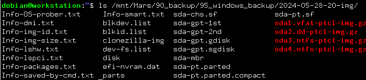

# バックアップ
Clonezilla を使って実験用の Windows10 をバックアップする。

- バックアップ対象：Windows10
- バックアップ先：NAS

## ライブUSBの作成
[ダウンロードページ](https://clonezilla.org/downloads/download.php?branch=stable) から ISO をダウンロードする。

1. Select CPU architecture: amd64
2. Select file type: iso

Live USB を作成する。Live USB の作成には、[Rufus](https://forest.watch.impress.co.jp/library/software/rufus/) を使う。

## Live USB からの起動
### BIOS 設定
F12 等を押して BIOS に入る。

以下設定をする。

- Security
  - Secure Boot: Disable
- Boot
  - Boot Priorities
    - Boot Option #1 を UEFI USB Device に変更

Save and Exit で BIOS から抜ける。

### Clonezilla を用いたフルバックアップ
Clonezilla live (VGA 800x600) で起動。CLIの画面で操作していく。

- Choose language: Japanese
- キーボード設定：Keep
- Clonezilla を開始します：Start_Clonezilla
- OCS: device-image
- Clonezilla イメージディレクトリのマウント：nfs_server
- 設定したいネットワークデバイスの選択：`eth0` (自分の環境に合わせる)
- ネットワーク設定：dhcp
- NFS version: nfs
- Mount NFS server: `<NASのIPアドレス>`
  - 保存先：`<NAS上のディレクトリ>`
  - 今回： `/volume2/Mars/90_backup/95_windows_backup`
- 拡張パラメータ：Beginner
- モード：savedisk
- 保存名：任意 ()
- コピー元のローカルディスク：sda (自分の環境に合わせる)
- 圧縮オプション：`z1p`
- チェック・修復：`-sfsck`
- リストア可能かチェック：はい
- 暗号化：`-senc`
- モード：`-p choose`
- 本当に続けてもよろしいですか：y
- 終了後、Enter > reboot

バックアップ後、NAS のディレクトリを確認するとバックアップがとれていることがわかる。

---

[Usage](../README.md)
