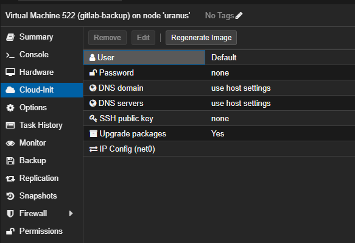

# Cloud-init

Cloud-init で Proxmox の VM 作成を自動化したい。

- [Cloud-init](#cloud-init)
  - [参考](#参考)
  - [Proxmox ノードの設定](#proxmox-ノードの設定)
    - [インストール](#インストール)
    - [イメージのダウンロード](#イメージのダウンロード)
    - [テンプレートの作成](#テンプレートの作成)
    - [CD-ROM ドライブの設定](#cd-rom-ドライブの設定)
    - [テンプレートへの変換](#テンプレートへの変換)
  - [テンプレートから VM の作成](#テンプレートから-vm-の作成)


## 参考
- [Cloud-Init Support](https://pve.proxmox.com/wiki/Cloud-Init_Support)
- [ProxmoxのVM作成をCloud-initにやらせてみた](https://qiita.com/karugamosenpai/items/7abdccc5a9169bade182)
- [お家で始める仮想化環境 Proxmox VE Cloud-init編](https://blog.nishi.network/2020/11/05/proxmox-part3/)

## Proxmox ノードの設定
### インストール
```
# apt install -y cloud-init libguestfs-tools
```

### イメージのダウンロード
Ubuntu 24.04 Server LTS の Cloud-init image をダウンロードする。

```
# wget https://cloud-images.ubuntu.com/noble/current/noble-server-cloudimg-amd64.img
```

### テンプレートの作成
```
# qm create 9000 --memory 2048 --net0 virtio,bridge=vmbr0 --scsihw virtio-scsi-pci
# qm importdisk 9000 noble-server-cloudimg-amd64.img local-lvm
# qm set 9000 --scsihw virtio-scsi-pci --scsi0 local-lvm:vm-9000-disk-0
```

### CD-ROM ドライブの設定
Cloud-init が利用する CD-ROM ドライブを設定する。

```
# qm set 9000 --ide2 local-lvm:cloudinit
# qm set 9000 --boot c --bootdisk scsi0
# qm set 9000 --serial0 socket --vga serial0
```

### テンプレートへの変換
```
# qm template 9000
```

## テンプレートから VM の作成
テンプレートをクローンする。クローン後に Cloud-init の設定が可能。



VM を起動すると、cloud-init が走り設定される。

---

[Usage](../README.md)
