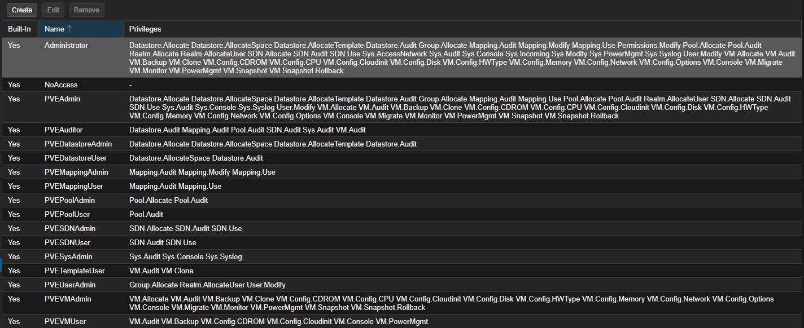

# Proxmox のユーザ管理について

- [Proxmox のユーザ管理について](#proxmox-のユーザ管理について)
  - [参考](#参考)
  - [目的](#目的)
  - [Proxmox のユーザ管理の理解](#proxmox-のユーザ管理の理解)
    - [Users](#users)
    - [Groups](#groups)
    - [API Tokens](#api-tokens)
    - [Resource Pools](#resource-pools)
    - [Authentication Realms](#authentication-realms)
      - [LDAP](#ldap)
    - [権限管理](#権限管理)
      - [Roles](#roles)
      - [Privileges](#privileges)
      - [Objects and Paths](#objects-and-paths)
      - [Pools](#pools)

## 参考
- [Proxmox VE Administration Guide - 14. User Management](https://pve.proxmox.com/pve-docs/pve-admin-guide.html#user_mgmt)
- [【初心者】Proxmoxのユーザー権限管理が最高に使いやすかった件](https://qiita.com/minoden_works/items/b579382d9101625c21fd)

## 目的
本資料の目的は以下3点。

- Proxmox のユーザ管理、権限管理について理解する：本ページ
- Proxmox での実際の権限設定：[Proxmoxの権限設定](permissions/)
  - Proxmox に LDAP 認証を設定する
  - Proxmox 上の仮想マシン、もしくはフォルダを特定のユーザのみがアクセスできる設定にする

## Proxmox のユーザ管理の理解
Proxmox は複数の認証方法をサポートしている。例としては以下。

- Linux PAM
- integreted Proxmox VE authentication server
- LDAP
- Microsoft Active Directory
- OpenID Connect

### Users
- Proxmox VE では、ユーザの属性を `/etc/pve/user.cfg` に保存する
- ユーザは後述する authenticated realms に関連付けられる
  - ユーザは内部的には `#{USERID}@#{REALM}` の形式で識別される
- 各ユーザは以下の情報を持つ
  - First name
  - Last name
  - E-mail address
  - Group memberships
  - An optional expiration date
  - A comment or note about this user
  - Whether this user is enabled or disabled
  - Optional two-factor authentication keys
- 各ホストの root ユーザは Linux PAM realms でログインでき、管理者として認識される
  - このユーザは削除できない

### Groups
- 各ユーザは複数のグループに属することができる
- グループ単位で権限を与えることができる

### API Tokens
- 他のシステムからの REST API を許可する

### Resource Pools
- 仮想マシン、コンテナ、ストレージデバイスの集合
- リソースプール単位で権限管理できる

### Authentication Realms
- Proxmox のユーザは外部の realm に対応する
- Realms は `/etc/pve/domains.cfg` で設定される

以下の realms (authentication methods) が有効である。

|Realms|概要|
|---|---|
|Linux PAM Standard Authentication| `adduser` などによって Host system に作成されたユーザによる認証   ユーザが各ノードに存在する必要がある |
|Proxmox VE Authentication Server|ユーザが Proxmox VE によって管理され、GUI でパスワード変更できる   `/etc/pve/priv/shadow.cfg` にパスワードハッシュが保存|
|LDAP|LDAP を使った認証|
|Microsoft AD|Microsoft AD を使った認証|
|OpenID Connect|OAUTH 2.0 をベースに構築された認証|

以下、LDAP について補足する。

#### LDAP
外部の LDAP サーバを使うことができる。

- ユーザは Base Domain Name (`base_dn`) 以下で検索される
- ユーザ名は User Attribute Name (`user_attr`) フィールドで特定される
- Proxmox VE が LDAP サーバに対して認証する必要がある場合、ユーザのクエリと認証が必要なドメイン名は `/etc/pve/domain.cfg` の `bind_dn` プロパティで設定する
  - パスワードは `/etc/pve/priv/ldap/#{REALMNAME}.pw` に保存する

LDAP server の realm の主な設定オプションは以下。

|オプション|意味|
|---|---|
|Realm (`realm`)|Proxmox VE のユーザの realm identifier|
|Base Domain Name (`base_dn`)|ユーザが検索されるディレクトリ|
|User Attribute Name (`user_attr`)|ユーザ名が格納されている LDAP attribute|
|Server (`server1`)|LDAP directory をホストしているサーバ|
|Fallback Server (`server2`)|プライマリサーバに届かなかったときのためのフォールバックサーバ|
|Port (`port`)|LDAP サーバがリッスンするポート|

### 権限管理
- Proxmox は role と path をベースにした権限管理システムを採用している
- 権限は、(path, user, role), (path, group, role), または (path, token, role) のトリプレットとして表現される
  - role: 許可されたアクションの集合
  - path: これらのアクションのターゲット

#### Roles
Role は権限のリストである。事前定義された role に以下がある。

|Role|説明|
|---|---|
|`Administrator`|すべての権限を持つ|
|`NoAccess`|何も権限を持たない|
|`PVEAdmin`|ほとんどのタスクを実行できるが、システムの設定 (`Sys.PowerMgmt, Sys.Modify, Realm.Allocate`) やパーミッション (`Permissions.Modify`) の変更はできない |
|`PVEAuditor`|Read only access のみ持つ|
|`PVEDatastoreAdmin`|バックアップスペースやテンプレートの作成や割当が可能|
|`PVEDatastoreUser`|バックアップスペースやビューストレージの割当が可能|
|`PVEMappingAdmin`|リソースマッピングが可能|
|`PVEMappingUser`|リソースマッピングの監視と使用が可能|
|`PVEPoolAdmin`|プールの割当が可能|
|`PVEPoolUser`|プールの監視が可能|
|`PVESDNAdmin`|SDNの設定の管理が可能|
|`PVESDNUser`|ブリッジや仮想ネットワークへのアクセスが可能|
|`PVESysAdmin`|audit やシステムコンソール、システムログへのアクセスが可能|
|`PVETemplateUser`|テンプレートを見たりクローンしたりが可能|
|`PveUserAdmin`|ユーザの管理が可能|
|`PVEVMAdmin`|VMの管理が可能|
|`PVEVMUser`|VMの利用や電源管理などが可能|

実際の Proxmox VE では、Datacenter > Permissions > Roles で作成、設定できる。上記の事前定義された role は以下のように表示されている。

これを考慮すると、VM を使って実験をするユーザには `PVEVMAdmin` と `PVESDNAdmin` のロールを付与するのが良いと考えられる。

#### Privileges
上図では各 role に対して権限が付与されている。各権限の意味を以下に示す。

Node / System related privileges:

|権限|意味|
|---|---|
|`Group.Allocate`|グループの作成、変更、削除|
|`Mapping.Audit`|リソースマッピングを見る|
|`Mapping.Modify`|リソースマッピングの管理|
|`Mapping.Use`|リソースマッピングの使用|
|`Permissions.Modify`|アクセス許可の変更|
|`Pool.Allocate`|プールの作成、変更、削除|
|`Pool.Audit`|プールを見る|
|`Realm.AllocateUser`|ユーザを realm に追加する|
|`Realm.Allocate`|realms の作成、変更、削除|
|`SDN.Allocate`|SDN の設定変更|
|`SDN.Audit`|SDNの設定を見る|
|`Sys.Audit`|ノードの状態、設定、Corosync cluster の設定、HA config を見る|
|`Sys.Console`|ノードのコンソールへのアクセス|
|`Sys.Incoming`|他のクラスタからの入力データを許可する|
|`Sys.Modify`|ノードのネットワークパラメータの作成、変更、削除|
|`Sys.PowerMgmt`|ノードの電源管理|
|`Sys.Syslog`|Syslogを見る|
|`User.Modify`|ユーザのアクセスや詳細を作成、変更、修正|

Virtual machine related privileges

|権限|意味|
|---|---|
|`SDN.Use`|SDN vnets やローカルネットワークブリッジへのアクセス|
|`VM.Allocate`|サーバへのVMの作成、削除|
|`VM.Audit`|VM設定を見る|
|`VM.Backup`|VMのバックアップやリストア|
|`VM.Clone`|VMのクローンやコピー|
|`VM.Config.CDROM`|CD-ROM の変更|
|`VM.Config.CPU`|CPU設定の変更|
|`VM.Config.Cloudinit`|Cloud-init パラメータの変更|
|`VM.Config.Disk`|ディスクの追加、変更、削除|
|`VM.Config.HWType`|エミュレートされたハードウェアタイプの変更|
|`VM.Config.Memory`|メモリ設定の変更|
|`VM.Config.Options`|その他のVMの設定の変更|
|`VM.Console`|VMのコンソールへのアクセス|
|`VM.Migrate`|VMのマイグレーション|
|`VM.Monitor`|VM monitor (kvm) へのアクセス|
|`VM.PowerMgmt`|VMの電源管理|
|`VM.Snapshot.Rollback`|VMのスナップショットへのロールバック|
|`VM.Snapshot`|VMのスナップショットの作成、削除|

Storage related privileges

|権限|意味|
|---|---|
|`Datastore.Allocate`|データストアやボリュームのアクセス、変更、削除|
|`Datastore.AllocateSpace`|データストアへのスペースの割当|
|`Datastore.AllocateTemplate`|ISO image の割当、アップロード|
|`Datastore.Audit`|データストアのブラウズ|

#### Objects and Paths
- アクセス権はオブジェクト単位で割り当てられる
  - オブジェクトは、仮想マシン、ストレージ、リソースプールなどのこと
- ファイルシステムのようなパスで管理する

これらの設定は、Datacenter > Permissions で可能。

|パス|意味|
|---|---|
|`/nodes/{node}`|Proxmox VE のサーバへのアクセス|
|`/vms`|すべての VM をカバーする|
|`/vms/{vmid}`|特定の VM にアクセスする|
|`/storage/{storeid}`|特定のストレージにアクセスする|
|`/pool/{poolname}`|特定のプール内のリソースにアクセスする|
|`/access/groups`|グループの管理|
|`/access/realms/{realmid}`|realms へのアクセス|

パーミッションはツリー構造で管理するので、パーミッションの継承ができる。

#### Pools
- プールを使用して、一連の仮想マシンとデータストアをグルーピングできる
  - `/pool/{poolid}` に権限を設定する

---

[Usage](../README.md)
