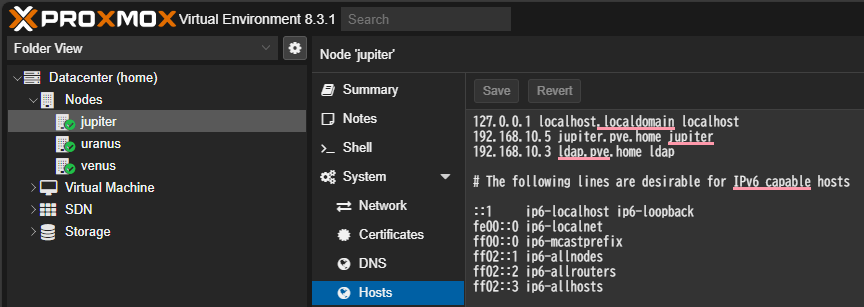

# Proxmox の権限設定

- [Proxmox の権限設定](#proxmox-の権限設定)
  - [参考](#参考)
  - [前提](#前提)
  - [LDAP 認証の設定](#ldap-認証の設定)
    - [ホストの設定](#ホストの設定)
    - [LDAP 認証の追加](#ldap-認証の追加)
  - [グループ・ユーザの設定](#グループユーザの設定)
    - [グループの作成](#グループの作成)
    - [ユーザの追加](#ユーザの追加)
  - [Pool 設定](#pool-設定)
    - [Pool の作成](#pool-の作成)
    - [Pool への Member の割り当て](#pool-への-member-の割り当て)
    - [権限設定](#権限設定)
  - [確認](#確認)
    - [確認 (1)](#確認-1)
    - [確認 (2)](#確認-2)
    - [確認 (3)](#確認-3)
    - [確認 (4)](#確認-4)
  - [まとめ](#まとめ)

## 参考
- [Proxmox VE Administration Guide - 14.5.3. LDAP](https://pve.proxmox.com/pve-docs/pve-admin-guide.html#user-realms-ldap)
- [Proxmox Virtual Environment で仮想化環境構築](https://engineers.fenrir-inc.com/entry/2018/12/06/110000)

## 前提
LDAP サーバを構築済とする。今回は、以下のような構成とする。

LDAP サーバの構築例は [LDAPサーバ](../../../Application/LDAP/) に記載。今回は、以下のようなユーザを作成した。

## LDAP 認証の設定
### ホストの設定
LDAP サーバのホストを設定する。Datacenter > #{NODE} > System > Hosts で LDAP サーバの IP アドレスおよびホスト名を追加。この設定を各ノードで実施する。

### LDAP 認証の追加
Datacenter > Permissions > Realms で LDAP Server を追加する。

- General
  - Realm: `<username>@<realm>` で LDAP にログインする
    - 今回は `ldap`
  - Base Domain Name: ユーザを検索するディレクトリ
    - 今回は `ou=people,dc=pve,dc=home`
  - User Attribute Name: ユーザーがログインする際に使用するユーザー名を含む LDAP 属性
    - 今回は `cn`
  - Default: チェック
  - Server: LDAP をホストするサーバ
    - 今回は `ldap.pve.home`
  - Fallback Server
  - Port: LDAP が listen するポート
    - 今回は `389`
  - Mode: モード
    - 今回は Default (LDAP)
- Sync Options
  - Bind User: LDAP サーバへの接続のための `bind_user`
    - 今回は `cn=admin,dc=pve,dc=home`
  - Bind Password: LDAP サーバへの接続に必要なパスワード

なお、これらの設定は各ノードの `/etc/pve/domains.cfg` に記載される。また、パスワードは `/etc/pve/priv/ldap/#{Realm}.pw` に平文で保存される。

## グループ・ユーザの設定
### グループの作成
Datacenter > Permissions > Groups から作成可能。

グループの情報は `/etc/pve/user.cfg` に記載される。

### ユーザの追加
Datacenter > Permissions > Users から追加可能。今回は LDAP ユーザを追加する。

- User name: LDAP ユーザ名
- Realm: 作成した Realm 名
- Group: 割り当てるグループ

ユーザの情報も `/etc/pve/user.cfg` に記載される。

## Pool 設定
### Pool の作成
Datacenter > Permissions > Pools > Create で Pool を作成する。今回は以下の Pool を作成した。

### Pool への Member の割り当て
Pool View に切り替え、#{POOL} > Members > Add で Virtual Machine と Storage を割り当てる。

### 権限設定
Pool View に切り替え、#{POOL} > Permissions > Add > Group Permission で各グループに対する role を割り当てる。例えば以下のように設定した。

## 確認
異なる group に属し、異なるアクセス権を付与した4ユーザでログインしたときにどうなるかを確認する。

|ユーザ|権限|
|---|---|
|user01|Team01 に属す   ExpServers は PVEVMAdmin/PVESDNAdmin、それ以外の pool は NoAccess|
|user02|Team02 に属す   SecServers は PVEVMAdmin/PVESDNAdmin、それ以外の pool は NoAccess|
|user03|Team01 と Team02 に属す |
|ktoda|Admin に属す   全部の Pool で PVEAdmin |

### 確認 (1)
user01 でログインすると以下。

- ExpServers に属する VM は表示されるが、それ以外の Pool に属する VM は表示されない
  - 表示される VM では、Hardware の変更やスナップショットの取得などの操作が可能

### 確認 (2)
user02 でログインすると以下。

- SecServers に属する VM は表示されるが、それ以外の Pool に属する VM は表示されない

### 確認 (3)
user03 でログインすると以下。

- どの Pool に属する VM も表示されない
  - NoAccess が優先されると推測される

### 確認 (4)
ktoda でログインすると以下。

- すべての Pool に属する VM が表示される
  - ただし、Pool に属すように設定しなかった Storage は表示されていない

## まとめ
以下の手順で実施すると LDAP 認証 + 権限管理ができた。

Proxmox VE 8.3 では Tag View も追加されたので、Tag の活用も検討したい。

---

[management](../README.md)
