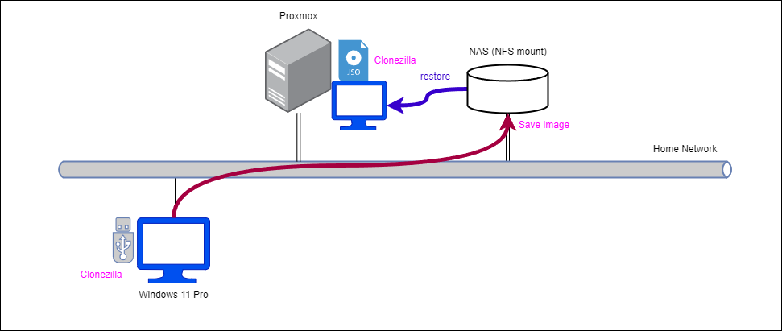
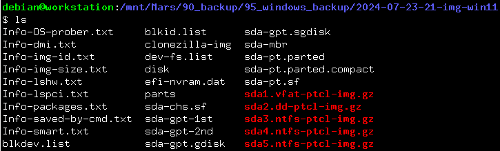
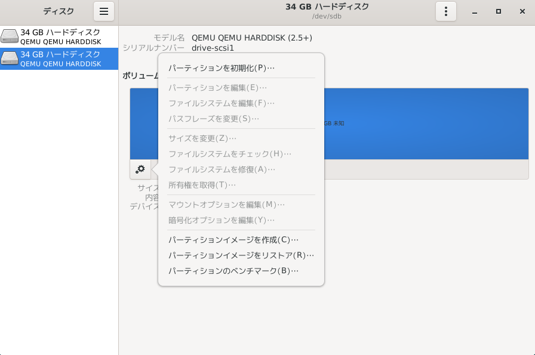
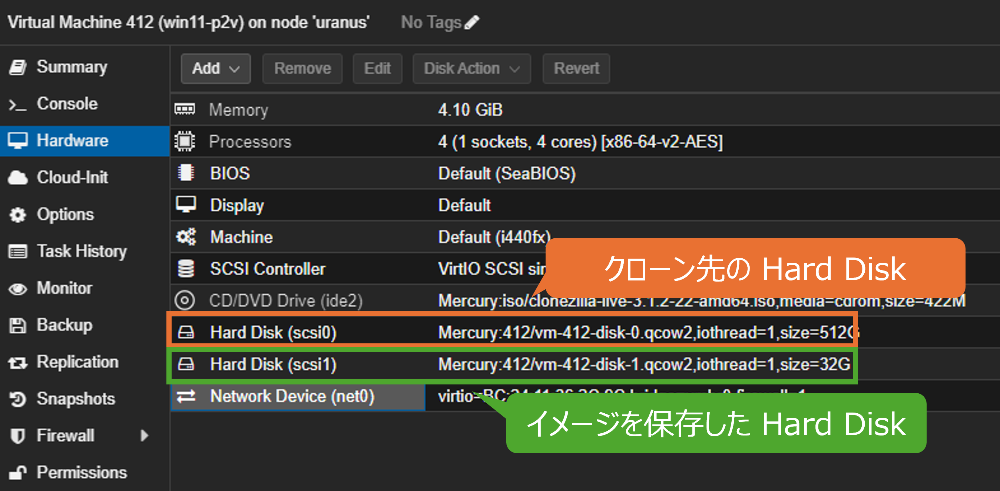
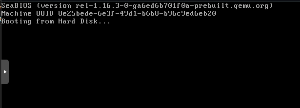
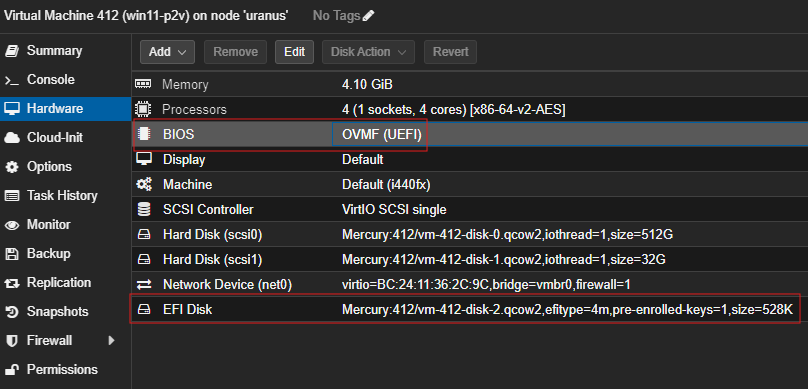
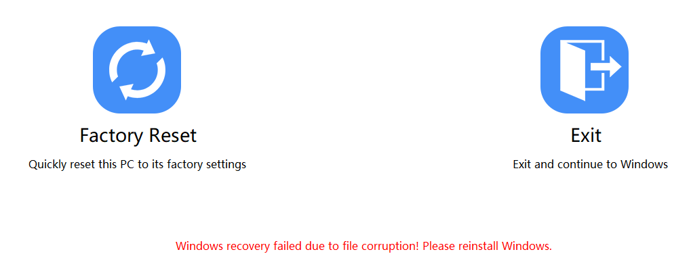
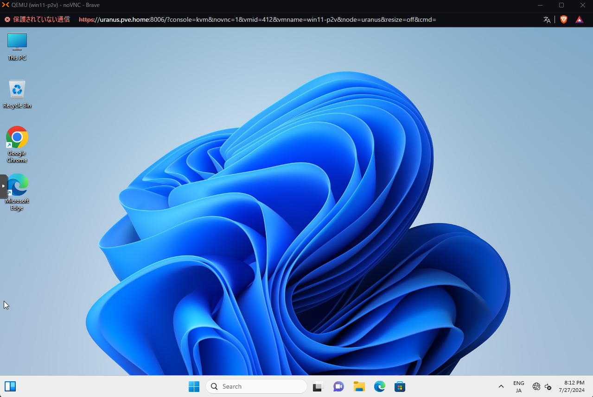
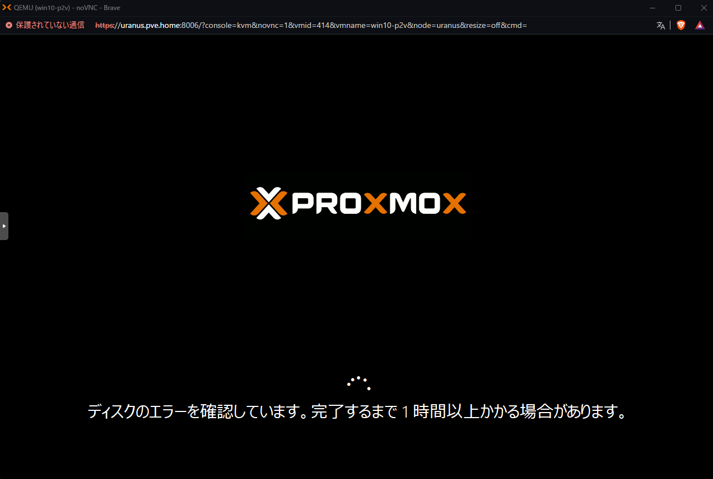
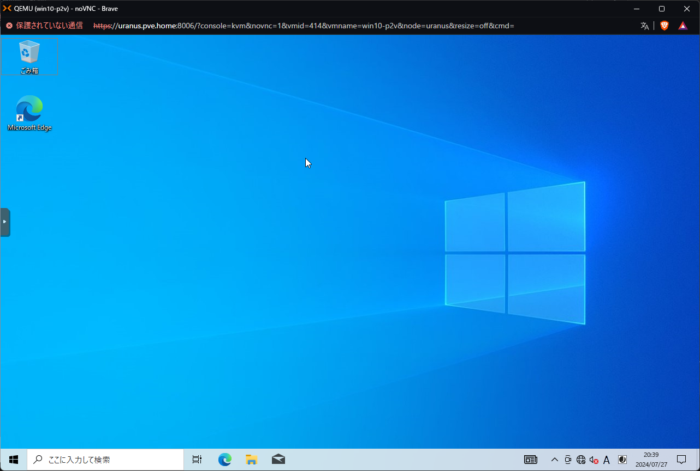

# P2V (Proxmox + Clonezilla)
Clonezilla で取得したイメージを用いて Proxmox 上に VM を構築可能か (P2V 可能か) 検証する。特に、Windows マシンの P2V について、試行錯誤的に検証した。

- [P2V (Proxmox + Clonezilla)](#p2v-proxmox--clonezilla)
  - [検証結果のまとめ](#検証結果のまとめ)
  - [参考](#参考)
  - [検証環境](#検証環境)
  - [手順](#手順)
    - [イメージの保存](#イメージの保存)
    - [保存したイメージのコピー](#保存したイメージのコピー)
      - [Hard Disk の追加](#hard-disk-の追加)
      - [Hard Disk のフォーマット](#hard-disk-のフォーマット)
      - [イメージのコピー](#イメージのコピー)
      - [Hard Disk の detach](#hard-disk-の-detach)
    - [VM の作成](#vm-の作成)
    - [Clonezilla を用いたリストア](#clonezilla-を用いたリストア)
  - [動作確認](#動作確認)
  - [原因の切り分け](#原因の切り分け)
    - [Windows 10 マシンでの P2V の確認](#windows-10-マシンでの-p2v-の確認)
    - [VM側の設定変更](#vm側の設定変更)

## 検証結果のまとめ
- Clonezilla のバックアップからリストアすることで P2V できる。ただし、VM側で以下のように設定しなおす必要がある
  - Hardware
    - BIOS: OVMF (UEFI)
    - EFI Disk を追加
    - Hard Disk は IDE にしておく
      - 執筆者の環境では SCSI ではブルースクリーンになったが、IDE に変更して解決した
  - Options
    - OS Type: Microsoft Windows の該当するバージョンに変更
- VM に Network Device を割り当てても認識されていないので、対処する必要がある
  - [Windows VirtIO Drivers](https://pve.proxmox.com/wiki/Windows_VirtIO_Drivers) をインストールする必要がある？

## 参考
- [Restore disk image](https://clonezilla.org/show-live-doc-content.php?topic=clonezilla-live/doc/02_Restore_disk_image)
- [Clonezilla を使った仮想環境へのマイグレーション](https://www.ospn.jp/osc2014-spring/pdf/OSC2014_spring_clonezillajp_jpn_1.pdf)
- [今更ですがディスククローンツールのCloneZillaをためします](https://qiita.com/minoden_works/items/f71d69fb1a74a512bb9e)
- [UEFIマシンからのP2Vで気を付けること（Proxmox）](https://qiita.com/minoden_works/items/8736aa0252563047d4ae)

## 検証環境
以下の環境で、Clonezilla で取得したイメージを用いて Proxmox 上に VM を構築可能かを確認する。



## 手順
1. Clonezilla で、NAS にイメージを保存
   - 参考：[バックアップ](../backup/README.md)
2. 保存したイメージをコピーしたハードディスクを作成
3. Proxmox で受け皿となる VM を作成
   - ディスクサイズはクローン元と同容量または大きいサイズに設定
   - ISO に Clonezilla を指定
   - 2 で作成したハードディスクを追加
4. VM を起動し、Clonezilla でリストアする

### イメージの保存
今回は、Proxmox のストレージとなっている NAS 上の `/volume2/Mars/90_backup/95_windows_backup/2024-07-23-21-img-win11` 以下にイメージを保存した。手順は [バックアップ](../../backup/README.md) と同じなので省略。



### 保存したイメージのコピー
作業用VM を使って以下作業を行う。これを行う理由は、Clonezilla でのリストアのときに `local_dev` からリストアする必要があるため、VM 側でバックアップをローカルのストレージ上にあるものとして認識させる必要があるためである。

1. Hard Disk を追加
2. 追加した Hard Disk のフォーマット
3. 追加した Hard Disk に、NAS に保存したイメージをコピー
4. 追加した Hard Disk の Detach

#### Hard Disk の追加
Proxmox の Web UI で、Add > Hard Disk により追加する

#### Hard Disk のフォーマット
この操作は `gnome-disk-utility` で行うとやりやすいのでインストール済でなければインストールする。

```
# apt update
# apt install gnome-disk-utility
```

また、以下操作は `root` 権限が必要なので、ユーザを `sudoer` に入れていない場合は下記コマンドを実行する。

```
# gpasswd -a <user name> sudo
# reboot
```

(Xfce の Debian の場合) アプリケーション > アクセサリ > ディスクでアプリケーションを開き、追加したディスクを開き、歯車マークをクリックして「パーティションを初期化」を選択する。



- ボリューム名：任意
- タイプ：NTFS
  - FAT はファイルサイズが 4GB まで、NTFS はファイルサイズが 2TB まで

#### イメージのコピー
ハードディスクをマウントし、マウントしたハードディスクに NAS 上にあるイメージをコピーする。今回は以下コマンドを実行。

```
# cp -r /mnt/Mars/90_backup/95_windows_backup/2024-07-23-21-img-win11/ /media/debian/backup
```

#### Hard Disk の detach
コピーが終わったらアンマウントし、Web UI で detach する。

### VM の作成
今回保存したのは SSD 512 GB の Windows11 なので、ストレージを 512GB にして VM を作成する。Proxmox 本体のコンソールで以下コマンドを実行して作成した VM にハードディスクを追加する (c.f. [既存の仮想マシンのインポート](../import/README.md))。

```
# qm importdisk <vmid> <path of disk> <storage> -format [raw|qcow2]
```

今回は以下コマンドを実行した。

```
# qm importdisk 412 /mnt/pve/Mercury/images/505/vm-505-disk-1.qcow2 Mercury -format qcow2
```

インポート後、Proxmox の Web UI で Hardware > Unused disk を選択 > Add でハードディスクを追加する。



### Clonezilla を用いたリストア
Clonezilla live (VGA 800x600) で起動し、CLI の画面で操作する。

- Choose language: Japanese
- キーボード設定：Keep
- Clonezilla を開始します：Start_Clonezilla
- OCS: device-image
- Clonezilla イメージディレクトリのマウント：local_dev
  - クローン先の Hard Disk が認識されたら Ctrl+C
- OCSモード：追加したストレージを選択
- OCS Repository: no-fsck
- Clonezilla イメージリポジトリ用のディレクトリブラウザ：作成したイメージが選択されていることを確認
  - 今回は、`2024-07-23-21-img-win11` を選択して Done
- 拡張パラメータ：Beginner
- OCSモード：restoredisk
- リストアするイメージファイル：作成したイメージファイルが選択されていることを確認
- コピー先：コピー先のハードディスクを選択
  - 今回は `scsi0` のハードディスクを選択
- モード：`-k0`
- リストア可能か確認するか：はい
- モード：`-p choose`

かなり時間がかかるので注意。

## 動作確認
起動できるか確認する。



のように起動しないことがある。これは、UEFIマシンの場合、Proxmox のゲスト側でもそのように設定する必要があるためと予想される (参考：[UEFIマシンからのP2Vで気を付けること（Proxmox）](https://qiita.com/minoden_works/items/8736aa0252563047d4ae))。

BIOS を UEFI に変更し、EFI Disk を追加する。




修正したところ起動はしたが Factory Reset が必要と表示され、なおかつ Factory Reset も失敗した。



## 原因の切り分け
### Windows 10 マシンでの P2V の確認
原因の切り分けのため、Windows10 マシンのバックアップからの restore でも VM の正常起動ができないかを確認する。

同様にブルースクリーンになり、回復もできなかった。


### VM側の設定変更
VM 側で OS のタイプを指定できるので設定を以下のように変更したところ、起動した。

- Hard Disk: SCSI -> IDE
- Options:
  - OS Type: Microsoft Windows 11/2022/2025



ただし、ネットワークドライバがインストールされていないのか、Network Device を割り当ててもネットワークに接続できなかった。

Windows 10 でも同様の問題で起動できなかった可能性があるため、設定を変更して確認した。ディスクエラーが発生していたが、確認後問題なく起動できた。ただし、Network Device を割り当ててもネットワークに接続できないのは同様。





---

[P2V](../README.md)
