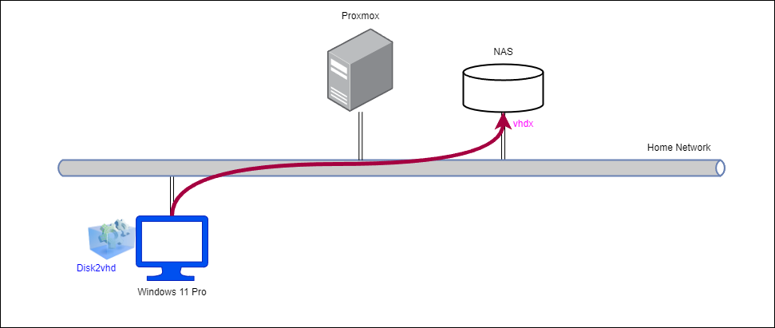
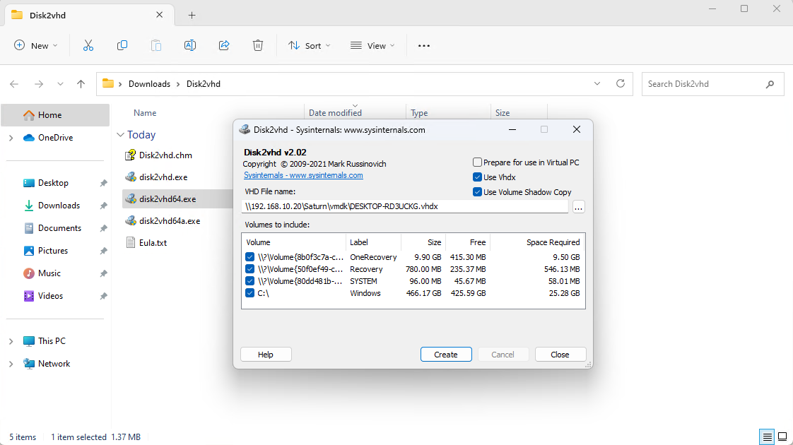
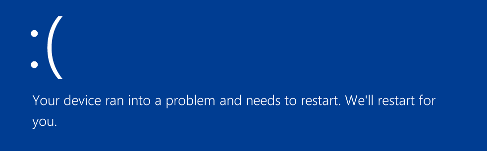
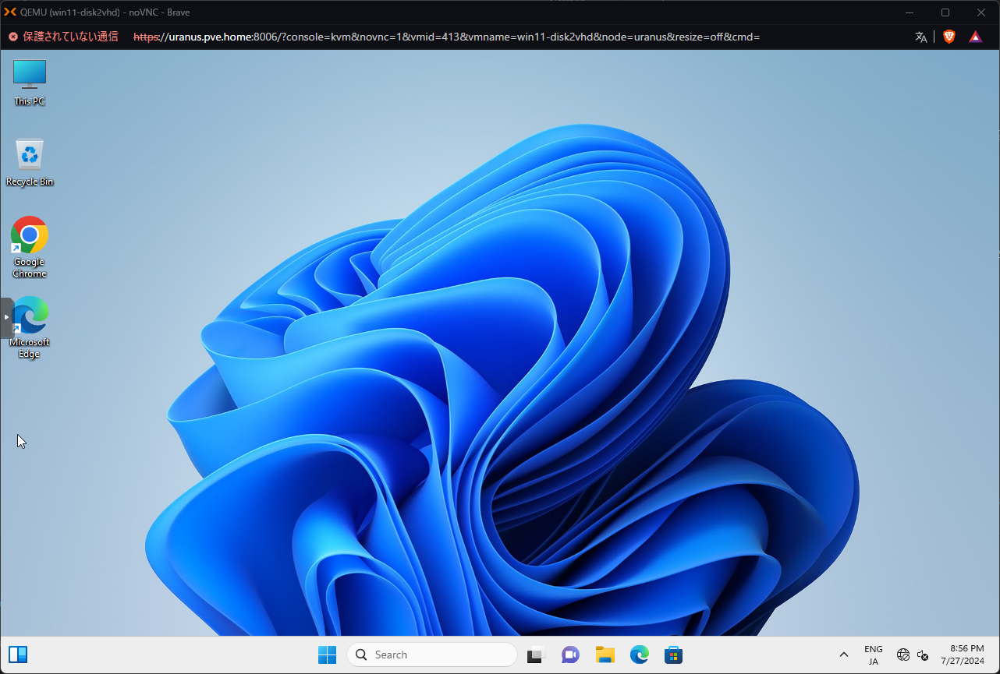

# P2V (Proxmox + Disk2vhd)
購入した Windows11 マシンの P2V を試す。

## 参考
- [物理マシンを効率的に仮想マシンに変換する（Proxmox）](https://qiita.com/minoden_works/items/b10150985518317c19af)
- [Disk2vhd ツールを利用した P2V 化](https://jpwinsup.github.io/mslog/other/tips-and-tricks/p2v/)
- [UEFIマシンからのP2Vで気を付けること（Proxmox）](https://qiita.com/minoden_works/items/8736aa0252563047d4ae)

## 構成
以下構成で、Windows 11 を仮想化する。




## 仮想化手順 (Disk2vhd)
1. 仮想化対象に [Disk2vhd](https://learn.microsoft.com/ja-jp/sysinternals/downloads/disk2vhd) をダウンロード
2. exe を実行し、以下オプションを設定
   - Prepare for use in Virtual PC のチェックは入れなくても良い
     - 参考：[[Hyper-V体験記]Disk2VHDで物理PCを仮想化環境に収容](https://news.mynavi.jp/techplus/article/20110530-inoue02/)
   - Use Volume Shadow Copy にチェックを入れる
     - [メモ.　手間はかかるが金いらずのV2V: VMwareのWindows VMをHyper-Vへ (その1)](https://www.say-tech.co.jp/contents/blog/yamanxworld/2024memo08)
   - VHD file は、NAS 上のディレクトリに保存する
    
3. VM を作成し、`vhdx` ファイルをインポートする
   - BIOS は UEFI で作成
   - 以下コマンドで `vhdx` ファイルをインポート
   ```
   # qm importdisk 413 /mnt/pve/Mercury/vmdx/DESKTOP-RD3UCKG.VHDX Mercury
   ```

## 動作確認
起動したところ、ブルースクリーンになった。



## 対処
[Clonezilla](../clonezilla/README.md) で行った対処で起動可能かを検証する。VM 側の設定を以下のように変更する。

- Hard Disk: SCSI -> IDE
- Options:
  - OS Type: Microsoft Windows 11/2022/2025

上記対応によって、OSが問題なく起動することを確認した。



---

[P2V](../README.md)
