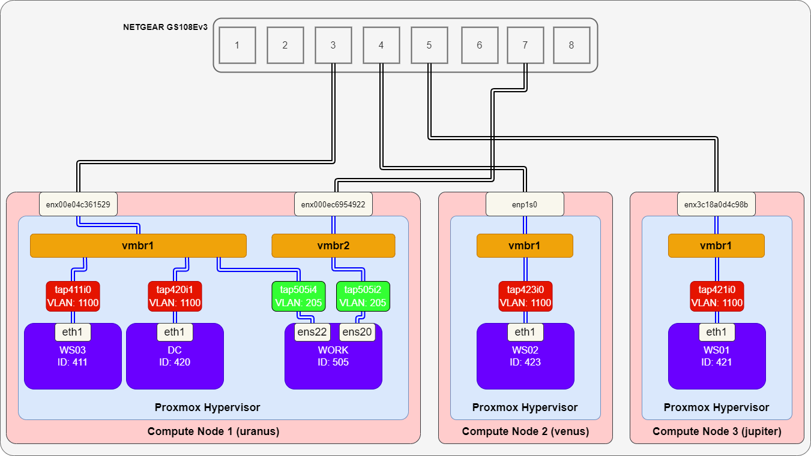

# Multiple Proxmox Nodes

複数の Proxmox ノード上の VM 間の通信のポートミラーリング設定を行う。

- [Multiple Proxmox Nodes](#multiple-proxmox-nodes)
  - [環境](#環境)
  - [方法](#方法)

## 環境
今回は、以下環境でポートミラーリング設定を行う。

ここでは、`WORK` 以外の VM 間の通信を `WORK` でキャプチャできるようにポートミラーリング設定を行う。

具体的には、以下のように設定したい。

- Proxmox Node 1 (uranus) 内 (`vmbr1` 内) のミラーリング
  - `DC` (`tap420i0`) - `WS03` (`tap411i0`) 間の通信 (VLAN: 1100) を `WORK` (`tap505i4`) にミラーリング
- Proxmox Node 外のミラーリング
  - スイッチングハブ (NETGEAR GS108Ev3) のポート 3, 4, 5 の通信をポート 6 にミラーリング
  - uranus の `vmbr2` でのミラーリング設定

## 方法
- vmbr1 でミラーリング
- スイッチでミラーリング
- vmbr2 でミラーリング

Proxmox のミラーリング設定は [scripts](../scripts/) のスクリプトを使う。

---

[port-mirror](../README.md)
