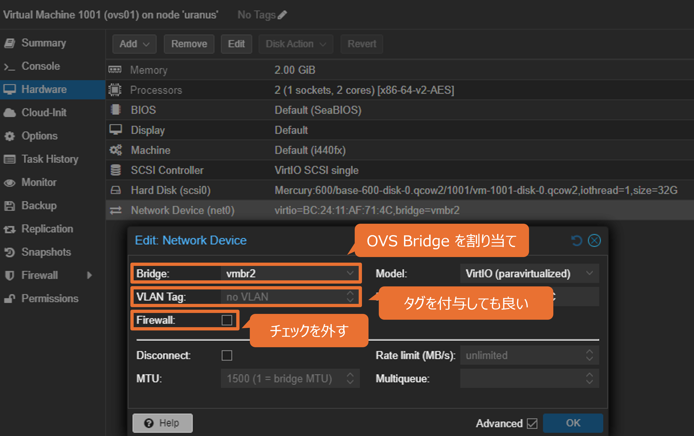

# ポートミラーリング設定 (旧設定)
Open vSwitch を使ってポートミラーリングする設定をまとめる。

- [ポートミラーリング設定 (旧設定)](#ポートミラーリング設定-旧設定)
  - [参考](#参考)
  - [検証環境](#検証環境)
  - [設定手順](#設定手順)
    - [1. Open vSwitch のインストール](#1-open-vswitch-のインストール)
    - [2. OVS Bridge の設定](#2-ovs-bridge-の設定)
    - [3. VM の Network Device への bridge の割り当て](#3-vm-の-network-device-への-bridge-の割り当て)
    - [4. ミラーリング設定](#4-ミラーリング設定)
  - [検証](#検証)
    - [(A) 1台のノード内の VM 間でポートミラーリングの設定は可能か](#a-1台のノード内の-vm-間でポートミラーリングの設定は可能か)
    - [(B) VLAN 設定をしたときに VLAN タグが付与されたパケットがキャプチャされるか](#b-vlan-設定をしたときに-vlan-タグが付与されたパケットがキャプチャされるか)
    - [(C) クラスタを構築している別のホストにある VM からのパケットもミラーリング可能か](#c-クラスタを構築している別のホストにある-vm-からのパケットもミラーリング可能か)
  - [設定用スクリプト](#設定用スクリプト)
  - [補足](#補足)


## 参考
- [Configuring a Port Mirror on Proxmox VE for Trisul NSM](https://www.trisul.org/devzone/doku.php/articles:proxmox_span)
- [Open vSwitch](https://pve.proxmox.com/wiki/Open_vSwitch)
- [Open vSwitchでポートミラーリング設定](https://knqyf263.hatenablog.com/entry/2014/01/02/202439)
- [Proxmox VM Bridge Port Mirror](https://codingpackets.com/blog/proxmox-vm-bridge-port-mirror/)
- [ntopngをセットアップして自宅のネットワークトラフィックを監視する (proxmoxのVM)](https://guetan.dev/setup-ntopng/)

## 検証環境
今回は、Proxmox 上に以下の検証環境を構築した。


なお、`tap1001i0` などは `ovs-vsctl` コマンドを使って調べられる。なお、環境構築の手順については後述。

```
# ovs-vsctl list-ports vmbr2
enx000ec6954922
tap1001i0
tap1002i0
tap2001i0
```

以下項目を検証する。

- (A) 1台のノード内の VM 間でポートミラーリングの設定は可能か
- (B) VLAN 設定をしたときに VLAN タグが付与されたパケットがキャプチャされるか
- (C) クラスタを構築している別のホストにある VM からのパケットもミラーリング可能か


## 設定手順
1. Open vSwitch のインストール
2. OVS Bridge の設定
3. VM の Network Device への bridge の割り当て
4. ミラーリング設定

### 1. Open vSwitch のインストール
Proxmox にはデフォルトでは Open vSwitch がインストールされていないので、インストールする。

```
# apt update
# apt install openvswitch-switch
```

### 2. OVS Bridge の設定
OVS Bridge を作成し、ポートを割り当てる。


上図の例では、`vmbr2` という OVS Bridge に `enx000ec6954922` という物理 NIC を割り当てている。

### 3. VM の Network Device への bridge の割り当て
VM の Network Device に bridge を割り当てる。



ここで、Firewall のチェックを外すようにする。

### 4. ミラーリング設定
ミラーリング設定は、`ovs-vsctl` コマンドで行う。

例えば、`tap1001i0` と `tap1002i0` を通るパケットをすべて `tap2001i0` にミラーリングするように設定するには、以下コマンドを Compute Node 上で実行する。

```
# ovs-vsctl -- set bridge vmbr2 \
> mirrors=@m -- \
> --id=@ovs01 get Port tap1001i0 -- \
> --id=@ovs02 get Port tap1002i0 -- \
> --id=@mirror01 get Port tap2001i0 -- \
> --id=@m create Mirror name=mirror_test \
> select-dst-port=@ovs01,@ovs02 \
> select-src-port=@ovs01,@ovs02 \
> output-port=@mirror01
1774bc1d-2a4f-47c5-bdd6-abc2a4323463
```

設定は、`ovs-vsctl list` コマンドで確認可能。

```
# ovs-vsctl list Mirror
_uuid               : 1774bc1d-2a4f-47c5-bdd6-abc2a4323463
external_ids        : {}
name                : mirror_test
output_port         : 0d9faa51-d6d8-4c86-a9d8-b8795cbfc4ab
output_vlan         : []
select_all          : false
select_dst_port     : [54931478-dcbf-4826-b52d-3b7e9a447058, b0f6f395-b27d-4296-b7e8-6749f5715dfc]
select_src_port     : [54931478-dcbf-4826-b52d-3b7e9a447058, b0f6f395-b27d-4296-b7e8-6749f5715dfc]
select_vlan         : []
snaplen             : []
statistics          : {tx_bytes=0, tx_packets=0}
```

## 検証
上に記載した検証項目 (A) - (C) を検証する。検証項目を再掲する。

- (A) 1台のノード内の VM 間でポートミラーリングの設定は可能か
- (B) VLAN 設定をしたときに VLAN タグが付与されたパケットがキャプチャされるか
- (C) クラスタを構築している別のホストにある VM からのパケットもミラーリング可能か

### (A) 1台のノード内の VM 間でポートミラーリングの設定は可能か

`ovs01`, `ovs02`, `mirror01` で IP アドレスを以下のように設定し、`mirror01` でキャプチャする。

|マシン|IPアドレス|
|---|---|
|`ovs01`|`192.168.5.10`|
|`ovs02`|`192.168.5.20`|
|`mirror01`|-|

問題なくパケットがキャプチャできることが確認された。


### (B) VLAN 設定をしたときに VLAN タグが付与されたパケットがキャプチャされるか
`ovs01`, `ovs02`, `mirror01` で IP アドレスと VLAN タグを以下のように設定し、`mirror01` でキャプチャする。

|マシン|IPアドレス|VLAN タグ|
|---|---|---|
|`ovs01`|`192.168.5.10`|`10`|
|`ovs02`|`192.168.5.20`|`10`|
|`mirror01`|-|-|

なお、VLAN タグを付与する方法については、[VLAN](../VLAN/README.md) を参照。

VLAN タグを付与する等、ネットワークまわりの設定を変えた際は VLAN の設定もやり直す必要がある。ミラーリングの設定を一旦削除してやり直すことにする (編集する方法もあると思う)。

```
# ovs-vsctl clear bridge vmbr2 mirrors
```

再度ミラーリングの設定をし直し、キャプチャする。


VLANタグ (802.1Q) も問題なくキャプチャされることが確認された。

### (C) クラスタを構築している別のホストにある VM からのパケットもミラーリング可能か
`ovs01`, `ovs02`, `ovs03`, `mirror01` で IP アドレスと VLAN タグを以下のように設定し、`mirror01` でキャプチャする。

|マシン|IPアドレス|VLAN タグ|
|---|---|---|
|`ovs01`|`192.168.5.10`|`10`|
|`ovs02`|`192.168.5.20`|`10`|
|`ovs02`|`192.168.5.30`|`10`|
|`mirror01`|-|-|


これも問題なくキャプチャされた。

## 設定用スクリプト
ミラーリング設定用のシェルスクリプトを作成した (参考：[Proxmox VM Bridge Port Mirror](https://codingpackets.com/blog/proxmox-vm-bridge-port-mirror/))。ミラーリング設定が消えていたらこのスクリプトを実行する方針にする。

```sh
#!/bin/bash

if [ $# -lt 5 ]; then
    echo "Error!"
    echo "/bin/bash port-mirror.sh <BRIDGE ID> <Mirror VMID> <Mirror Interface> <Input VMID> <Input Interface>"
    echo "Example: /bin/bash port-mirror.sh vmbr1 506 1 406 1"
    exit 1
fi

# Define variables
BRIDGE=$1
MIRRORVM=$2
MIRRORIF=$3
INVM=$4
INIF=$5
MIRRORPORT=tap"$MIRRORVM"i"$MIRRORIF"
INPORT=tap"$INVM"i"$INIF"

# Check if MIRRORPORT exists
LISTPORT=$(ovs-vsctl list-ports $BRIDGE)
if echo $LISTPORT | grep -qw $MIRRORPORT; then
    echo "$MIRRORPORT exists!"
else
    echo "$MIRRORPORT does not exists! Check VM ID and Interface."
    exit 1
fi
# Check if INPORT exists
if echo $LISTPORT | grep -qw $INPORT; then
    echo "$INPORT exists!"
else
    echo "$INPORT does not exists! Check VM ID and Interface."
    exit 1
fi

LOGGING=port-mirror.log

function create_mirror {
    date >> $LOGGING
    echo "Creating mirror on $BRIDGE for $INPORT ..." | tee -a $LOGGING
    ovs-vsctl \
    -- set bridge "$BRIDGE" \
    mirrors=@"$INPORT"m -- \
    --id=@"$INPORT" get Port "$INPORT" -- \
    --id=@"$MIRRORPORT" get Port "$MIRRORPORT" -- \
    --id=@"$INPORT"m create Mirror name="$INPORT"-mirror \
    select-dst-port=@"$INPORT" \
    select-src-port=@"$INPORT" \
    output-port=@"$MIRRORPORT" | tee -a $LOGGING
    RESULT=$?
    if [ $RESULT -ne 0 ]; then
        echo "Failed to create mirror!"
        exit 1
    fi

    echo "###################################" >> $LOGGING 
}

function show_mirrors {
    date >> $LOGGING
    echo "Show existing mirrors ..." | tee -a $LOGGING
    ovs-vsctl list Mirror | tee -a $LOGGING
    echo "###################################" >> $LOGGING 
}

function clear_mirror {
    date >> $LOGGING
    echo "Clearing mirror on $BRIDGE for $INPORT ..." | tee -a $LOGGING
    ovs-vsctl -- \
    --id=@"$INPORT"m get Mirror "$INPORT"-mirror -- \
    remove Bridge "$BRIDGE" mirrors @"$INPORT"m | tee -a $LOGGING
    RESULT=$?
    if [ $RESULT -ne 0 ]; then
        echo "Failed to clear mirror!"
        exit 1
    fi

    echo "###################################" >> $LOGGING 
}

clear_mirror
create_mirror
show_mirrors
```

## 補足
`ovs-vsctl show` コマンドの出力で、Port が `fwln<vm id>i<net number>` の場合は Network Device の Firewall にチェックが入っている。Firewall のチェックを外すと、Port が `tap<vm id>i<net number>` となる。

---

[port-mirror](../README.md)
