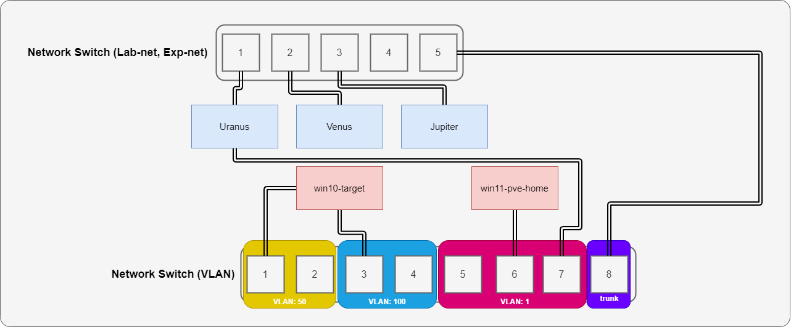
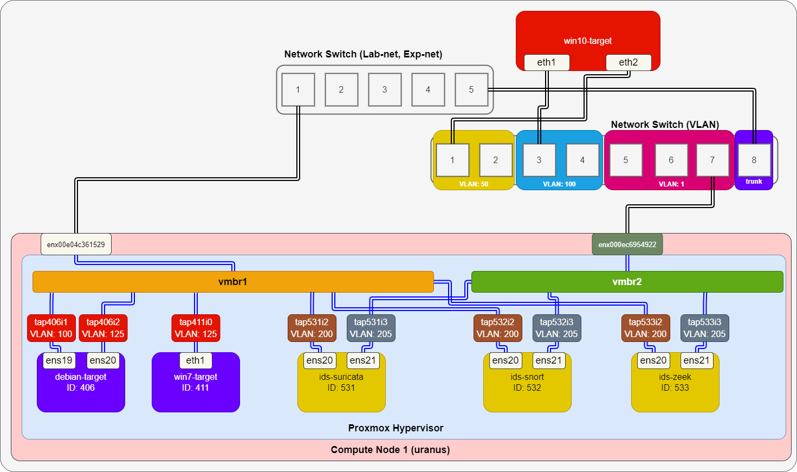

# ポートミラーリング設定 (2024/10/13 作成版)
Proxmox のポートミラーリングの設定を見直す。

- [ポートミラーリング設定 (2024/10/13 作成版)](#ポートミラーリング設定-20241013-作成版)
  - [実験線構成](#実験線構成)
  - [ポートミラーリング設定](#ポートミラーリング設定)
    - [スイッチ側](#スイッチ側)
    - [Proxmox側](#proxmox側)


## 実験線構成
実験線の物理構成を以下に示す。



ただし、以下表に構成要素の概要を示す。

|構成要素|概要|
|---|---|
|win10-target|実験用 Windows 10|
|win11-pve-home|作業用PC|
|Uranus|Proxmox Node (1)|
|Venus|Proxmox Node (2)|
|Jupiter|Proxmox Node (3)|

また、今回ミラーリング設定する対象を以下に示す。



vmbr1: 以下表に示す。

|VM ID|Port|target/output|
|---|---|---|
|406|tap406i1|target|
|406|tap406i2|target|
|411|tap411i0|target|
|531|tap531i2|output|
|532|tap532i2|output|
|533|tap533i2|output|

vmbr2: 以下表に示す。

|VM ID|Port|target/output|
|---|---|---|
|-|enx000ec6954922|target|
|531|tap531i3|output|
|532|tap532i3|output|
|533|tap533i3|output|

## ポートミラーリング設定
### スイッチ側
スイッチ側では、win10-target が接続されたポートへのパケットを Uranus が接続されたポートへミラーリングする。つまり、以下のように設定する。


### Proxmox側
同一ホスト内の通信を受け取れるようにするミラーリング設定 (`vmbr1` の設定) と、スイッチ側でミラーリングした通信を受け取れるようにするミラーリング設定 (`vmbr2` の設定) をする。

ポートミラーリングの設定コマンドを表示するためのスクリプトを作成した ([port-mirror.sh](scripts/port-mirror.sh))。

出力例：

```
# ./port-mirror.sh vmbr1.csv vmbr1
Execute the following 3 commands...
ovs-vsctl -- set bridge vmbr1 mirrors=@vmbr1-m-tap531i2 --  --id=@tap406i1 get Port tap406i1 -- --id=@tap406i2 get Port tap406i2 -- --id=@tap411i0 get Port tap411i0 -- --id=@tap531i2 get Port tap531i2 -- --id=@tap532i2 get Port tap532i2 -- --id=@tap533i2 get Port tap533i2 -- --id=@vmbr1-m-tap531i2 create Mirror name=vmbr1-mirror-tap531i2 select-dst-port=@tap406i1,@tap406i2,@tap411i0 select-src-port=@tap406i1,@tap406i2,@tap411i0 output-port=@tap531i2

ovs-vsctl -- set bridge vmbr1 mirrors=@vmbr1-m-tap532i2 --  --id=@tap406i1 get Port tap406i1 -- --id=@tap406i2 get Port tap406i2 -- --id=@tap411i0 get Port tap411i0 -- --id=@tap531i2 get Port tap531i2 -- --id=@tap532i2 get Port tap532i2 -- --id=@tap533i2 get Port tap533i2 -- --id=@vmbr1-m-tap532i2 create Mirror name=vmbr1-mirror-tap532i2 select-dst-port=@tap406i1,@tap406i2,@tap411i0 select-src-port=@tap406i1,@tap406i2,@tap411i0 output-port=@tap532i2

ovs-vsctl -- set bridge vmbr1 mirrors=@vmbr1-m-tap533i2 --  --id=@tap406i1 get Port tap406i1 -- --id=@tap406i2 get Port tap406i2 -- --id=@tap411i0 get Port tap411i0 -- --id=@tap531i2 get Port tap531i2 -- --id=@tap532i2 get Port tap532i2 -- --id=@tap533i2 get Port tap533i2 -- --id=@vmbr1-m-tap533i2 create Mirror name=vmbr1-mirror-tap533i2 select-dst-port=@tap406i1,@tap406i2,@tap411i0 select-src-port=@tap406i1,@tap406i2,@tap411i0 output-port=@tap533i2
```

補足：Proxmox ではミラーリングの output を複数のポートにできないと考えられる。

上記3つのコマンドをすべて実行したところ、最後のコマンドしか反映されていないことが分かった。そのため、1つのマシンに IDS を集約するのが良いと考えられる。

```
# ovs-vsctl list Mirror
_uuid               : 1550ce37-e0cb-4899-a600-d8b5a4162d9a
external_ids        : {}
name                : vmbr1-mirror-tap533i2
output_port         : 650d4eeb-7b54-427f-a710-2b77209f4c90
output_vlan         : []
select_all          : false
select_dst_port     : [7ba2f36d-1b8a-48f5-8a87-bdf579e57e72, 84ffe680-3ec1-45d4-9eb5-9eadfe83ba71, 8914e2d8-09bc-471e-a7e3-0e9347ec1ce2]
select_src_port     : [7ba2f36d-1b8a-48f5-8a87-bdf579e57e72, 84ffe680-3ec1-45d4-9eb5-9eadfe83ba71, 8914e2d8-09bc-471e-a7e3-0e9347ec1ce2]
select_vlan         : []
snaplen             : []
statistics          : {tx_bytes=0, tx_packets=0}
```

---

[port-mirror](../README.md)
