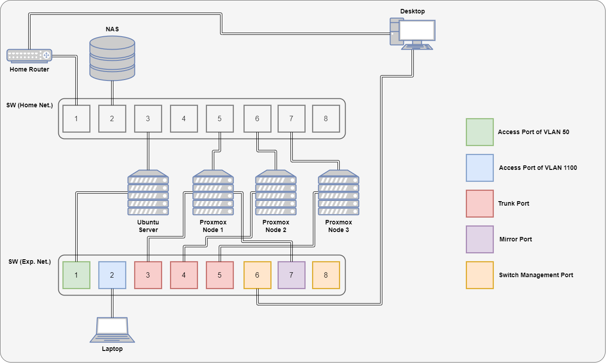

# 全体像

検証環境の全体像を整理する。

## 構成

物理構成の全体像は以下図の通り。

物理機器の概要は以下の通り。

|物理機器|用途|
|---|---|
|NAS|仮想サーバのストレージ兼データ保存用|
|Ubuntu Server|検証環境管理用 (DNS/LDAP) サーバ|
|Proxmox Node|仮想化基盤 (Proxmox) のノード (3台でクラスタ)|
|Desktop|作業用デスクトップ (Windows 11)|
|Laptop|実験用ノートPC (Kali Linux)|

以下で検証用ネットワーク (Exp. Net.) について触れる。

### ネットワーク構成
スイッチは NETGEAR の [GS108Ev3](https://www.netgear.com/jp/support/product/gs108ev3/) を使っている。比較的安価で VLAN (802.1Q) 対応しているスイッチだったため。

検証環境では、以下3種類の VLAN ID を使っている。

|VLAN ID|用途|
|---|---|
|1|Native VLAN|
|50|仮想環境管理用|
|1100|実験用|

- 検証環境管理用の Ubuntu Server は VLAN 50 のアクセスポートに接続
- Proxmox Node はトランクポートに接続
  - VLAN の設定は Proxmox Node 内で行う
- Proxmox Node 1 にはミラーポートを接続
  - ポート3,4,5の通信をポート7にミラーリング
  - 複数の Proxmox Node をまたいだポートミラーリング設定を行うため

Proxmox (Open vSwitch) での VLAN 設定は以前[ブログ](https://seekt.hatenablog.com/entry/2024/02/18/092841)に書いたので、ここでは省略する。

---

[Top](../README.md)
