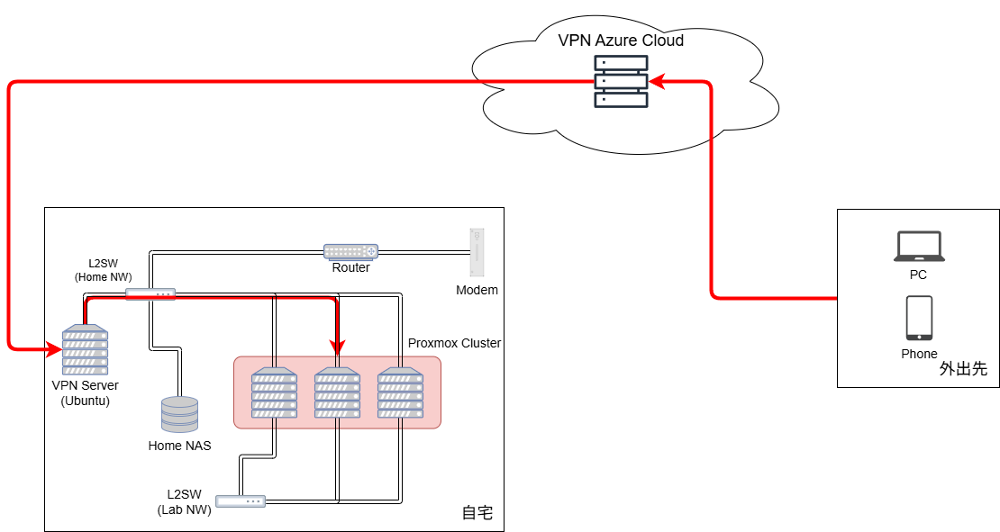

# 自宅外から接続

SoftEther を使って自宅外から接続する。

- [自宅外から接続](#自宅外から接続)
  - [参考](#参考)
  - [構成](#構成)

## 参考
- [VPN Azure Cloud](https://www.vpnazure.net/ja/)

## 構成

[SoftEther VPN](../Application/SoftEther/) で構築。

---

[Top](../README.md)
